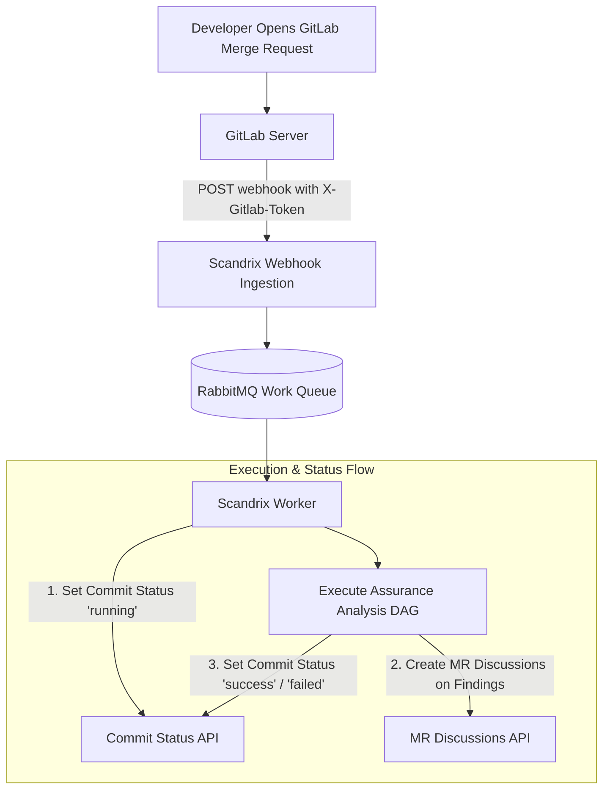

# GitLab Integration — Technical Specification

**Classification:** AUTHORITATIVE SPECIFICATION  
**Status:** APPROVED  
**Version:** 2.0.0  
**Integration Package:** `github.com/scandrix/scandrix/internal/integrations/gitlab`

---

## 1. Executive Summary & Supported Topologies

The Scandrix GitLab Integration provides bi-directional automated code assurance and security review across **GitLab.com** and **Self-Managed GitLab Enterprise Edition (EE/CE)** instances. Authenticating via Project Access Tokens, Group Access Tokens, or OAuth 2.0, Scandrix monitors merge requests, updates commit pipeline statuses, and publishes multiline review discussions with inline code fixes directly on changed lines.



---

## 2. Authentication & Webhook Security

### 2.1 Credential Tiers
1. **Group Access Token / Project Access Token**: Preferred for enterprise CI/CD. Requires scopes `api`, `read_repository`, `write_repository`.
2. **OAuth 2.0 Integration**: Used for self-service developer onboarding.
3. **Secret Token Verification**: GitLab webhooks include a pre-shared secret in the `X-Gitlab-Token` header, validated in constant time ($O(1)$) to prevent timing attacks.

---

## 3. Merge Request Discussions & Inline Comments

GitLab handles code review comments through the Discussions API (`/projects/:id/merge_requests/:mr_iid/discussions`). To anchor a finding to a specific line in a diff, Scandrix transmits the three-way merge position coordinates:

```json
{
  "body": "### 🛡️ Scandrix Security Finding: Path Traversal (`CWE-22`)\nUnsanitized input passed directly to `os.Open`.\n\n```suggestion\n\tcleanedPath := filepath.Clean(userInput)\n\tf, err := os.Open(cleanedPath)\n```",
  "position": {
    "position_type": "text",
    "base_sha": "d34e91...base",
    "start_sha": "d34e91...start",
    "head_sha": "b8a901...head",
    "new_path": "internal/files/reader.go",
    "new_line": 28
  }
}
```

---

## 4. Compilable Go 1.24+ GitLab Integration Client

```go
package gitlab

import (
	"bytes"
	"context"
	"crypto/subtle"
	"encoding/json"
	"errors"
	"fmt"
	"io"
	"net/http"
	"net/url"
	"time"
)

// Client handles GitLab REST v4 API communication.
type Client struct {
	baseURL    string
	token      string
	httpClient *http.Client
}

// NewClient initializes a GitLab client for SaaS or Self-Managed.
func NewClient(baseURL, token string) (*Client, error) {
	if baseURL == "" {
		baseURL = "https://gitlab.com/api/v4"
	}
	if token == "" {
		return nil, errors.New("gitlab token is required")
	}

	return &Client{
		baseURL:    baseURL,
		token:      token,
		httpClient: &http.Client{Timeout: 15 * time.Second},
	}, nil
}

// ValidateWebhookSecret performs constant-time comparison of X-Gitlab-Token.
func ValidateWebhookSecret(headerSecret, expectedSecret string) bool {
	return subtle.ConstantTimeCompare([]byte(headerSecret), []byte(expectedSecret)) == 1
}

// SetCommitStatus updates the build/pipeline state on a commit SHA.
func (c *Client) SetCommitStatus(ctx context.Context, projectID, commitSHA, state, desc, targetURL string) error {
	endpoint := fmt.Sprintf("%s/projects/%s/statuses/%s", c.baseURL, url.PathEscape(projectID), commitSHA)

	payload := map[string]string{
		"state":       state, // "running", "success", "failed", "canceled"
		"name":        "scandrix/assurance",
		"description": desc,
		"target_url":  targetURL,
	}

	raw, _ := json.Marshal(payload)
	req, err := http.NewRequestWithContext(ctx, http.MethodPost, endpoint, bytes.NewBuffer(raw))
	if err != nil {
		return err
	}

	req.Header.Set("PRIVATE-TOKEN", c.token)
	req.Header.Set("Content-Type", "application/json")

	resp, err := c.httpClient.Do(req)
	if err != nil {
		return err
	}
	defer resp.Body.Close()

	if resp.StatusCode < 200 || resp.StatusCode >= 300 {
		body, _ := io.ReadAll(resp.Body)
		return fmt.Errorf("gitlab status update failed (%d): %s", resp.StatusCode, string(body))
	}

	return nil
}

// CreateMRDiscussion anchors a finding to a specific line in a merge request.
func (c *Client) CreateMRDiscussion(ctx context.Context, projectID string, mrIID int, body, baseSHA, startSHA, headSHA, filePath string, newLine int) error {
	endpoint := fmt.Sprintf("%s/projects/%s/merge_requests/%d/discussions", c.baseURL, url.PathEscape(projectID), mrIID)

	payload := map[string]interface{}{
		"body": body,
		"position": map[string]interface{}{
			"position_type": "text",
			"base_sha":      baseSHA,
			"start_sha":     startSHA,
			"head_sha":      headSHA,
			"new_path":      filePath,
			"new_line":      newLine,
		},
	}

	raw, _ := json.Marshal(payload)
	req, err := http.NewRequestWithContext(ctx, http.MethodPost, endpoint, bytes.NewBuffer(raw))
	if err != nil {
		return err
	}

	req.Header.Set("PRIVATE-TOKEN", c.token)
	req.Header.Set("Content-Type", "application/json")

	resp, err := c.httpClient.Do(req)
	if err != nil {
		return err
	}
	defer resp.Body.Close()

	if resp.StatusCode != http.StatusCreated {
		respBody, _ := io.ReadAll(resp.Body)
		return fmt.Errorf("failed to create discussion (%d): %s", resp.StatusCode, string(respBody))
	}

	return nil
}
```
