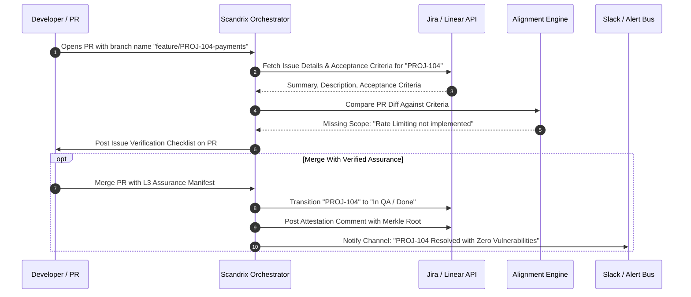
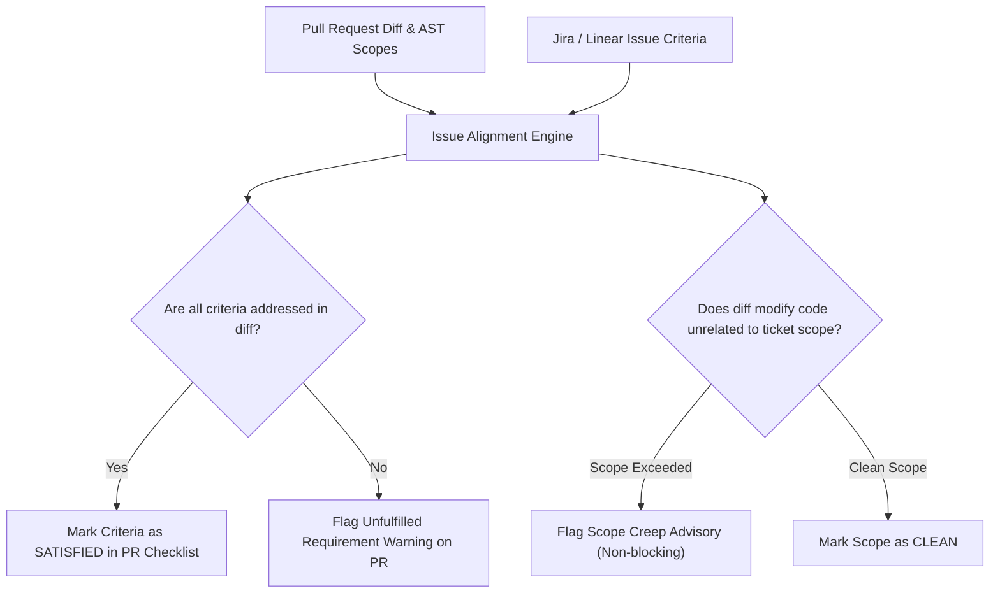

# Jira & Linear Project Management Integration — Technical Specification

**Classification:** AUTHORITATIVE ARCHITECTURAL SPECIFICATION  
**Status:** APPROVED FOR IMPLEMENTATION  
**Version:** 3.0.0  
**Integration Package:** `github.com/scandrix/scandrix/internal/integrations/pm`

---

## 1. Executive Summary & Two-Way Synchronization

The Scandrix Project Management Integration connects code review intelligence directly to **Jira Cloud**, **Jira Data Center**, and **Linear**. Moving beyond basic issue creation, the engine provides:

1. **Issue Alignment Verification**: Validates that PR code changes fulfill the acceptance criteria of linked tickets, flagging missing requirements or unapproved scope creep.
2. **Automated Vulnerability Ticket Lifecycle**: Automatically opens tracked Jira/Linear security tickets for unresolved `HIGH` and `CRITICAL` findings.
3. **Fingerprint Deduplication**: Guarantees that the same vulnerability across multiple branches or commits updates an existing ticket rather than creating ticket storms.
4. **SLA Countdown & Escalation**: Enforces organizational remediation deadlines ($24\text{ hours}$ for Critical, $7\text{ days}$ for High) with automated PagerDuty and Slack alerts.
5. **Automated Resolution on Merge**: Transitions linked issues to `In QA` or `Resolved` when a pull request carrying verified Proof-of-Fix attestations merges.



---

## 2. Issue Acceptance Criteria Verification Pipeline

When a pull request mentions a linked issue (e.g., `PROJ-882`), the engine extracts acceptance criteria and performs semantic alignment:



### Issue Checklist PR Markdown Rendering Example
```markdown
### 📋 Issue Verification: [PROJ-882](https://company.atlassian.net/browse/PROJ-882)
*Validating code changes against linked ticket requirements.*

- [x] **Criterion 1**: Add stripe webhook idempotency handling (`internal/webhooks/stripe.go:34`)
- [x] **Criterion 2**: Persist transaction IDs to `payments` table (`migrations/005_tx.sql:12`)
- [ ] **Criterion 3**: Return HTTP 409 on duplicate payload delivery (**Missing from implementation**)
```

---

## 3. Vulnerability Remediation SLA Matrix

For vulnerabilities that cannot be resolved in the current pull request and are granted a temporary exception, Scandrix opens an enterprise Jira/Linear ticket with an immutable SLA deadline:

| Severity | Jira Priority | Linear Priority | Resolution SLA | Automated Escalation |
| :--- | :--- | :--- | :--- | :--- |
| **CRITICAL** | `Highest` | `Urgent` (1) | **$24\text{ hours}$** | PagerDuty on-call alert at $12\text{h}$ remaining |
| **HIGH** | `High` | `High` (2) | **$7\text{ days}$** | Team Lead Slack notification at $5\text{d}$ |
| **MEDIUM** | `Medium` | `Medium` (3) | **$30\text{ days}$** | Weekly SecOps sprint backlog digest |
| **LOW** | `Low` | `Low` (4) | **$90\text{ days}$** | Standard grooming backlog |

### Deduplication Fingerprint Formulation
$$\text{TicketFingerprint} = \text{SHA256}(\text{TenantID} \parallel \text{RepoID} \parallel \text{RuleID} \parallel \text{NormalizedFilePath} \parallel \text{ASTSymbol})$$

---

## 4. Compilable Go 1.24+ Project Management Client

```go
package pm

import (
	"bytes"
	"context"
	"encoding/json"
	"errors"
	"fmt"
	"io"
	"net/http"
	"time"
)

// ProviderType identifies the external issue tracker.
type ProviderType string

const (
	ProviderJira   ProviderType = "JIRA"
	ProviderLinear ProviderType = "LINEAR"
)

// IssueMetadata packages retrieved ticket criteria.
type IssueMetadata struct {
	Key                string   `json:"key"`
	Title              string   `json:"title"`
	Description        string   `json:"description"`
	AcceptanceCriteria []string `json:"acceptance_criteria"`
	Status             string   `json:"status"`
}

// Client coordinates communication with Jira and Linear APIs.
type Client struct {
	jiraBaseURL    string
	jiraUsername   string
	jiraAPIToken   string
	linearAPIToken string
	httpClient     *http.Client
}

// NewClient initializes the PM client.
func NewClient(jiraURL, jiraUser, jiraToken, linearToken string) *Client {
	return &Client{
		jiraBaseURL:    jiraURL,
		jiraUsername:   jiraUser,
		jiraAPIToken:   jiraToken,
		linearAPIToken: linearToken,
		httpClient:     &http.Client{Timeout: 10 * time.Second},
	}
}

// FetchJiraIssue retrieves ticket summary and criteria from Jira Cloud API v3.
func (c *Client) FetchJiraIssue(ctx context.Context, issueKey string) (*IssueMetadata, error) {
	if c.jiraBaseURL == "" || c.jiraAPIToken == "" {
		return nil, errors.New("jira credentials not configured")
	}

	url := fmt.Sprintf("%s/rest/api/3/issue/%s", c.jiraBaseURL, issueKey)
	req, err := http.NewRequestWithContext(ctx, http.MethodGet, url, nil)
	if err != nil {
		return nil, err
	}
	req.SetBasicAuth(c.jiraUsername, c.jiraAPIToken)
	req.Header.Set("Accept", "application/json")

	resp, err := c.httpClient.Do(req)
	if err != nil {
		return nil, fmt.Errorf("failed to fetch jira issue: %w", err)
	}
	defer resp.Body.Close()

	if resp.StatusCode != http.StatusOK {
		return nil, fmt.Errorf("jira returned status %d", resp.StatusCode)
	}

	var raw struct {
		Key    string `json:"key"`
		Fields struct {
			Summary     string `json:"summary"`
			Description string `json:"description"`
			Status      struct {
				Name string `json:"name"`
			} `json:"status"`
		} `json:"fields"`
	}

	if err := json.NewDecoder(resp.Body).Decode(&raw); err != nil {
		return nil, err
	}

	return &IssueMetadata{
		Key:         raw.Key,
		Title:       raw.Fields.Summary,
		Description: raw.Fields.Description,
		Status:      raw.Fields.Status.Name,
	}, nil
}

// TransitionJiraIssue transitions a ticket to Resolved upon verified PR merge.
func (c *Client) TransitionJiraIssue(ctx context.Context, issueKey, transitionID string) error {
	url := fmt.Sprintf("%s/rest/api/3/issue/%s/transitions", c.jiraBaseURL, issueKey)
	payload := map[string]interface{}{
		"transition": map[string]string{"id": transitionID},
	}
	data, _ := json.Marshal(payload)

	req, err := http.NewRequestWithContext(ctx, http.MethodPost, url, bytes.NewReader(data))
	if err != nil {
		return err
	}
	req.SetBasicAuth(c.jiraUsername, c.jiraAPIToken)
	req.Header.Set("Content-Type", "application/json")

	resp, err := c.httpClient.Do(req)
	if err != nil {
		return err
	}
	defer resp.Body.Close()

	if resp.StatusCode != http.StatusNoContent && resp.StatusCode != http.StatusOK {
		return fmt.Errorf("transition failed with status %d", resp.StatusCode)
	}
	return nil
}
```
