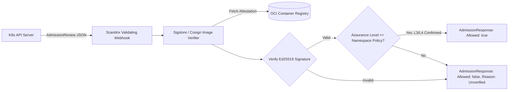

# Kubernetes Admission Controller Gateways — Technical Specification

**Classification:** AUTHORITATIVE SPECIFICATION  
**Status:** APPROVED  
**Version:** 2.0.0  
**Integration Package:** `github.com/scandrix/scandrix/internal/integrations/k8s`

---

## 1. Executive Summary & Zero-Trust Admission Architecture

The Scandrix Kubernetes Integration enforces runtime perimeter security by intercepting Pod creation and deployment requests before containers are scheduled on cluster nodes. Operating as a **Validating Admission Webhook**, or natively through **Kyverno** and **OPA Gatekeeper**, the admission gateway verifies that every container image has an authentic, cryptographically signed Scandrix Assurance Manifest meeting the target namespace's compliance level ($L_3$ or $L_4$).



---

## 2. Declarative Kyverno ClusterPolicy

Enterprise environments running Kyverno enforce Scandrix attestation verification using the following canonical policy:

```yaml
apiVersion: kyverno.io/v1
kind: ClusterPolicy
metadata:
  name: require-scandrix-assurance-manifest
  annotations:
    policies.kyverno.io/title: Require Verified Scandrix Assurance Manifest
    policies.kyverno.io/category: Software Supply Chain Security
    policies.kyverno.io/severity: critical
spec:
  validationFailureAction: Enforce
  webhookTimeoutSeconds: 15
  rules:
    - name: verify-scandrix-attestation
      match:
        any:
          - resources:
              kinds:
                - Pod
              namespaces:
                - production
                - payment-gateway
      verifyImages:
        - imageReferences:
            - "registry.scandrix.internal/*"
          attestations:
            - predicateType: "https://scandrix.dev/assurance/v1"
              conditions:
                - all:
                    - key: "{{ predicate.assurance_level }}"
                      operator: In
                      values: ["L3", "L4"]
                    - key: "{{ predicate.risk_vector.composite_score }}"
                      operator: LessThan
                      value: 10.0
              attestors:
                - entries:
                    - keys:
                        publicKeys: |-
                          -----BEGIN PUBLIC KEY-----
                          MCowBQYDK2VwAyEA9s0fM7FwE11gqZ55JkM3t5F3i5eO6fD1J4x5K8y7P0E=
                          -----END PUBLIC KEY-----
```

---

## 3. Compilable Go 1.24+ Kubernetes Admission Webhook Handler

```go
package k8s

import (
	"context"
	"encoding/json"
	"errors"
	"fmt"
	"io"
	"net/http"

	admissionv1 "k8s.io/api/admission/v1"
	corev1 "k8s.io/api/core/v1"
	metav1 "k8s.io/apimachinery/pkg/apis/meta/v1"
)

// ManifestVerifier defines the verification logic against OCI registry.
type ManifestVerifier interface {
	VerifyImageAssurance(ctx context.Context, imageRef, namespace string) (bool, string, error)
}

// AdmissionHandler processes K8s AdmissionReview payloads.
type AdmissionHandler struct {
	verifier ManifestVerifier
}

// NewAdmissionHandler creates an admission handler.
func NewAdmissionHandler(v ManifestVerifier) *AdmissionHandler {
	return &AdmissionHandler{verifier: v}
}

// ServeHTTP implements the standard HTTP handler for the admission webhook.
func (h *AdmissionHandler) ServeHTTP(w http.ResponseWriter, r *http.Request) {
	if r.Method != http.MethodPost {
		http.Error(w, "method not allowed", http.StatusMethodNotAllowed)
		return
	}

	body, err := io.ReadAll(r.Body)
	if err != nil {
		http.Error(w, "failed to read request body", http.StatusBadRequest)
		return
	}

	var admissionReviewReq admissionv1.AdmissionReview
	if err := json.Unmarshal(body, &admissionReviewReq); err != nil {
		http.Error(w, "invalid AdmissionReview JSON", http.StatusBadRequest)
		return
	}

	pod := corev1.Pod{}
	if err := json.Unmarshal(admissionReviewReq.Request.Object.Raw, &pod); err != nil {
		http.Error(w, "failed to deserialize Pod object", http.StatusBadRequest)
		return
	}

	allowed := true
	message := "Pod images meet Scandrix assurance levels"

	// Validate all containers within the Pod specification
	for _, container := range pod.Spec.Containers {
		valid, reason, err := h.verifier.VerifyImageAssurance(r.Context(), container.Image, admissionReviewReq.Request.Namespace)
		if err != nil || !valid {
			allowed = false
			message = fmt.Sprintf("Image %s denied: %s", container.Image, reason)
			break
		}
	}

	admissionReviewResp := admissionv1.AdmissionReview{
		TypeMeta: metav1.TypeMeta{
			APIVersion: "admission.k8s.io/v1",
			Kind:       "AdmissionReview",
		},
		Response: &admissionv1.AdmissionResponse{
			UID:     admissionReviewReq.Request.UID,
			Allowed: allowed,
			Result: &metav1.Status{
				Message: message,
			},
		},
	}

	respBytes, _ := json.Marshal(admissionReviewResp)
	w.Header().Set("Content-Type", "application/json")
	w.WriteHeader(http.StatusOK)
	w.Write(respBytes)
}
```
