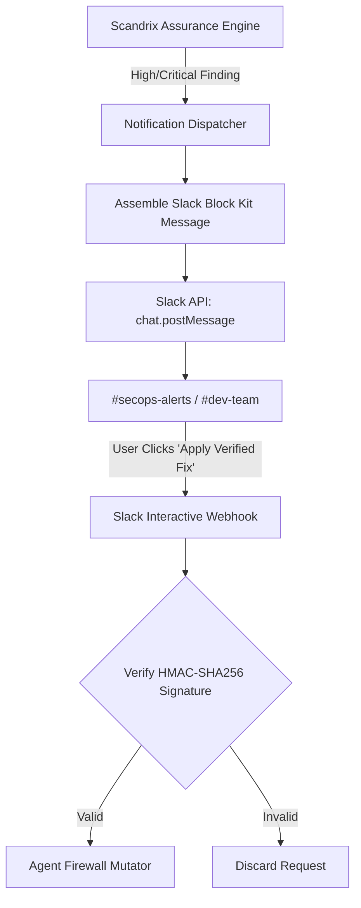

# Slack & Teams Messaging Integration — Technical Specification

**Classification:** AUTHORITATIVE SPECIFICATION  
**Status:** APPROVED  
**Version:** 2.0.0  
**Integration Package:** `github.com/scandrix/scandrix/internal/integrations/slack`

---

## 1. Executive Summary & Interactive Notification Flows

The Scandrix Messaging Integration delivers real-time vulnerability notifications, SLA countdown warnings, and interactive approval cards directly to engineering and SecOps teams via **Slack (Block Kit)** and **Microsoft Teams (Adaptive Cards)**. Rather than passive text alerts, Scandrix messages provide interactive controls enabling authorized engineers to view attack graph traces, dismiss verified false positives, or approve automated remediation PRs with a single click.



---

## 2. Webhook Security & Verification Algorithm

All incoming Slack interactions (button clicks, modal submissions) must be verified against the tenant's Slack Signing Secret:

1. Extract headers `X-Slack-Request-Timestamp` and `X-Slack-Signature`.
2. Ensure $|t_{\text{current}} - t_{\text{request}}| \le 300\text{ seconds}$ to defeat replay attacks.
3. Compute expected signature:
   $$\text{Sig} = \text{"v0="} \parallel \text{HMAC-SHA256}\left( K_{\text{signing}}, \text{"v0:"} \parallel t_{\text{request}} \parallel \text{RawRequestBody} \right)$$
4. Validate in $O(1)$ constant time against `X-Slack-Signature`.

---

## 3. Compilable Go 1.24+ Slack Integration Client

```go
package slack

import (
	"bytes"
	"context"
	"crypto/hmac"
	"crypto/sha256"
	"crypto/subtle"
	"encoding/hex"
	"encoding/json"
	"errors"
	"fmt"
	"io"
	"math"
	"net/http"
	"strconv"
	"time"
)

// Client coordinates Slack API communications.
type Client struct {
	botToken      string
	signingSecret string
	httpClient    *http.Client
}

// NewClient initializes a Slack client.
func NewClient(botToken, signingSecret string) *Client {
	return &Client{
		botToken:      botToken,
		signingSecret: signingSecret,
		httpClient:    &http.Client{Timeout: 10 * time.Second},
	}
}

// VerifyRequestSignature verifies the authenticity of incoming interactive payloads.
func (c *Client) VerifyRequestSignature(timestampHeader, signatureHeader string, body []byte) bool {
	ts, err := strconv.ParseInt(timestampHeader, 10, 64)
	if err != nil {
		return false
	}

	// Replay defense: verify within 5 minutes
	if math.Abs(float64(time.Now().Unix()-ts)) > 300 {
		return false
	}

	baseString := fmt.Sprintf("v0:%d:%s", ts, string(body))
	mac := hmac.New(sha256.New, []byte(c.signingSecret))
	mac.Write([]byte(baseString))
	expected := "v0=" + hex.EncodeToString(mac.Sum(nil))

	return subtle.ConstantTimeCompare([]byte(expected), []byte(signatureHeader)) == 1
}

// PostCriticalAlert sends an actionable Block Kit message to a target channel.
func (c *Client) PostCriticalAlert(ctx context.Context, channelID, title, repo, ruleID, severity string, deepLink string) error {
	payload := map[string]interface{}{
		"channel": channelID,
		"blocks": []map[string]interface{}{
			{
				"type": "header",
				"text": map[string]string{
					"type": "plain_text",
					"text": "🚨 Scandrix Security Alert: " + title,
				},
			},
			{
				"type": "section",
				"fields": []map[string]string{
					{"type": "mrkdwn", "text": "*Repository:*\n" + repo},
					{"type": "mrkdwn", "text": "*Severity:*\n`" + severity + "`"},
					{"type": "mrkdwn", "text": "*Rule:*\n`" + ruleID + "`"},
					{"type": "mrkdwn", "text": "*Status:*\nBlocked in CI"},
				},
			},
			{
				"type": "actions",
				"elements": []map[string]interface{}{
					{
						"type":  "button",
						"text":  map[string]string{"type": "plain_text", "text": "View Attack Trace"},
						"url":   deepLink,
						"style": "primary",
					},
				},
			},
		},
	}

	raw, _ := json.Marshal(payload)
	req, err := http.NewRequestWithContext(ctx, http.MethodPost, "https://slack.com/api/chat.postMessage", bytes.NewBuffer(raw))
	if err != nil {
		return err
	}

	req.Header.Set("Authorization", "Bearer "+c.botToken)
	req.Header.Set("Content-Type", "application/json")

	resp, err := c.httpClient.Do(req)
	if err != nil {
		return err
	}
	defer resp.Body.Close()

	if resp.StatusCode != http.StatusOK {
		body, _ := io.ReadAll(resp.Body)
		return fmt.Errorf("slack post failed (%d): %s", resp.StatusCode, string(body))
	}

	return nil
}
```
