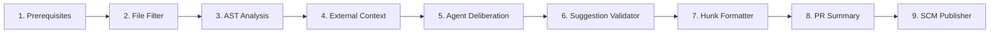

# ScanDrix - Project Structure

This document provides a comprehensive overview of the **ScanDrix** enterprise Go code review & security analysis platform directory structure, organized by top-level directories, executable binaries, internal domain packages, public packages, migrations, documentation, and infrastructure.

---

## Table of Contents

1. [Root Level](#root-level)
2. [Binaries & Executable Entry Points (`cmd/`)](#binaries--executable-entry-points-cmd)
3. [Internal Architecture & Domain Packages (`internal/`)](#internal-architecture--domain-packages-internal)
   - [Agents & Multi-Agent Deliberation (`internal/agents/`)](#agents--multi-agent-deliberation-internalagents)
   - [Continuous Engineering Analytics (`internal/analytics/`)](#continuous-engineering-analytics-internalanalytics)
   - [HTTP API Transport Layer (`internal/api/`)](#http-api-transport-layer-internalapi)
   - [Authentication & Identity Management (`internal/auth/`)](#authentication--identity-management-internalauth)
   - [Workflow Automation Engine (`internal/automation/`)](#workflow-automation-engine-internalautomation)
   - [Terminal Client Subsystem (`internal/cli/`)](#terminal-client-subsystem-internalcli)
   - [Executive Security Cockpit (`internal/cockpit/`)](#executive-security-cockpit-internalcockpit)
   - [Multi-Language AST & Code Analysis (`internal/codeanalysis/`)](#multi-language-ast--code-analysis-internalcodeanalysis)
   - [Code Ownership Engine (`internal/codeowners/`)](#code-ownership-engine-internalcodeowners)
   - [Diagnostics & Self-Healing Probes (`internal/diagnostics/`)](#diagnostics--self-healing-probes-internaldiagnostics)
   - [Enterprise Governance & Compliance (`internal/enterprise/`)](#enterprise-governance--compliance-internalenterprise)
   - [Feature Flags & Entitlements (`internal/featuregate/`)](#feature-flags--entitlements-internalfeaturegate)
   - [Fine-Tuning Dataset Pipeline (`internal/finetuning/`)](#fine-tuning-dataset-pipeline-internalfinetuning)
   - [Identity & Permissions Engine (`internal/identity/`)](#identity--permissions-engine-internalidentity)
   - [Third-Party Integrations (`internal/integrations/`)](#third-party-integrations-internalintegrations)
   - [Vulnerability & Issue Tracking (`internal/issues/`)](#vulnerability--issue-tracking-internalissues)
   - [Multi-Model LLM Gateway & Resilience (`internal/llm/`)](#multi-model-llm-gateway--resilience-internalllm)
   - [Model Context Protocol Server (`internal/mcp/`)](#model-context-protocol-server-internalmcp)
   - [Multi-Channel Notifications (`internal/notifications/`)](#multi-channel-notifications-internalnotifications)
   - [Organization & Multi-Tenancy (`internal/organization/`)](#organization--multi-tenancy-internalorganization)
   - [Git Platform Integrations & Operations (`internal/platform/`)](#git-platform-integrations--operations-internalplatform)
   - [Supply Chain Provenance & SLSA (`internal/provenance/`)](#supply-chain-provenance--slsa-internalprovenance)
   - [Distributed Message Queue & Quorum Relay (`internal/queue/`)](#distributed-message-queue--quorum-relay-internalqueue)
   - [Code Review Orchestration & 9-Stage Pipeline (`internal/review/`)](#code-review-orchestration--9-stage-pipeline-internalreview)
   - [Rule Intelligence Engine (`internal/rules/`)](#rule-intelligence-engine-internalrules)
   - [Execution Sandbox Subsystem (`internal/sandbox/`)](#execution-sandbox-subsystem-internalsandbox)
   - [Advanced Security Assurance Engines (`internal/scandrix/`)](#advanced-security-assurance-engines-internalscandrix)
   - [Cryptographic Key Management Service (`internal/security/`)](#cryptographic-key-management-service-internalsecurity)
   - [Platform Storage Layer (`internal/storage/`)](#platform-storage-layer-internalstorage)
   - [Telemetry & Observability (`internal/telemetry/`)](#telemetry--observability-internaltelemetry)
   - [Public Interactive Playground (`internal/try/`)](#public-interactive-playground-internaltry)
   - [Application Use Cases (`internal/usecases/`)](#application-use-cases-internalusecases)
   - [High-Throughput Webhook Ingestion (`internal/webhooks/`)](#high-throughput-webhook-ingestion-internalwebhooks)
4. [Public Shared Packages (`pkg/`)](#public-shared-packages-pkg)
5. [Database Migrations (`migrations/`)](#database-migrations-migrations)
6. [Documentation Suite (`SCANDRIX-DOCS/`)](#documentation-suite-scandrix-docs)
7. [Docker & Container Infrastructure (`docker/`)](#docker--container-infrastructure-docker)
8. [Tests & Micro-Benchmarks (`test/`)](#tests--micro-benchmarks-test)
9. [Key Architecture Patterns](#key-architecture-patterns)
10. [Technology Stack Summary](#technology-stack-summary)
11. [Complete File Tree (155 directories, 477 files)](#complete-file-tree-155-directories-477-files)

---

## Root Level

```
ScanDrix/
├── .github/                          # GitHub CI/CD workflows and automation
├── bin/                              # Pre-compiled / locally compiled binaries
│   ├── scandrix-analytics-cli        # DORA engineering metrics calculator
│   ├── scandrix-api                  # REST API gateway daemon
│   ├── scandrix-ast-cli              # Standalone AST complexity analyzer
│   ├── scandrix-cli                  # Interactive terminal review tool
│   ├── scandrix-mcp-manager          # Model Context Protocol server daemon
│   ├── scandrix-server               # Unified standalone all-in-one daemon
│   ├── scandrix-try                  # Interactive playground & sandbox binary
│   ├── scandrix-webhooks             # 13,800+ req/s webhook ingestion daemon
│   └── scandrix-worker               # Asynchronous review pipeline worker
├── cmd/                              # 10 Executable Entry Points
│   ├── analytics-cli/
│   ├── api/
│   ├── ast-cli/
│   ├── cli/
│   ├── mcp-manager/
│   ├── migrate/
│   ├── server/
│   ├── try/
│   ├── webhooks/
│   └── worker/
├── dist/                             # Cross-platform CLI release distributions
│   ├── scandrix-cli-darwin-amd64
│   ├── scandrix-cli-darwin-arm64
│   ├── scandrix-cli-linux-amd64
│   ├── scandrix-cli-linux-arm64
│   └── scandrix-cli-windows-amd64.exe
├── docker/                           # Dockerfiles & service configurations
│   ├── postgres/initdb.d/            # PostgreSQL pgvector initialization
│   ├── rabbitmq/                     # RabbitMQ quorum queue configuration
│   ├── api.Dockerfile
│   ├── Dockerfile.dev
│   ├── Dockerfile.prod
│   ├── mcp-manager.Dockerfile
│   ├── server.Dockerfile
│   ├── webhooks.Dockerfile
│   └── worker.Dockerfile
├── internal/                         # Core domain logic & internal modules (30+ packages)
├── migrations/                       # PostgreSQL 17 + pgvector schema migrations
│   ├── 001_initial_schema.sql
│   ├── 002_pgvector_security_memory.sql
│   ├── 003_issues_and_automations.sql
│   └── 004_extended_warehouse_and_billing.sql
├── pkg/                              # Reusable public packages
│   ├── crypto/                       # NIST KMS envelope encryption & key rotation
│   └── models/                       # Canonical shared models and interfaces
├── SCANDRIX-DOCS/                    # 12 Comprehensive Documentation Suites (60+ specs)
├── test/                             # Integration tests and micro-benchmarks
│   ├── benchmark/                    # Stress tests and memory allocation benchmarks
│   └── integration/                  # End-to-end multi-agent integration tests
├── .env.example                      # Production-ready environment template
├── .gitignore                        # Git ignore patterns
├── AGENTS.md                         # Permanent enterprise security & agent rules
├── Dockerfile                        # Multi-stage production container build
├── docker-compose.dev.yml            # Local development cluster orchestration
├── docker-compose.yml                # Production cluster orchestration
├── go.mod                            # Go 1.25 module dependencies
├── go.sum                            # Cryptographic dependency checksums
├── Makefile                          # Enterprise task runner (build, test, race, bench)
└── README.md                         # Architecture overview & developer quickstart
```

---

## Binaries & Executable Entry Points (`cmd/`)

ScanDrix is structured as 10 clean-room Go executable entry points, allowing modular deployment as specialized microservices, a CLI tool, or a unified standalone binary:

```
cmd/
├── analytics-cli/
│   └── main.go                       # DORA metrics CLI (lead time, MTTR, change failure rate)
├── api/
│   └── main.go                       # REST API gateway (Chi router, RBAC, SSE event stream)
├── ast-cli/
│   └── main.go                       # AST complexity analyzer (Halstead metrics, cyclomatic v(G))
├── cli/
│   └── main.go                       # Interactive terminal review tool (Bubbletea TUI, SARIF)
├── mcp-manager/
│   └── main.go                       # Model Context Protocol (MCP) JSON-RPC 2.0 daemon
├── migrate/
│   └── main.go                       # Database migration runner for PostgreSQL + pgvector
├── server/
│   └── main.go                       # Unified standalone all-in-one daemon (API + Worker + Webhooks)
├── try/
│   └── main.go                       # Zero-install public playground & sandbox dry-run binary
├── webhooks/
│   └── main.go                       # High-throughput webhook ingestion daemon (13,833 req/s)
└── worker/
    └── main.go                       # RabbitMQ background worker executing 9-stage pipeline
```

### Detailed Binary Descriptions

1. **`scandrix-api` (`cmd/api/main.go`)**:
   - HTTP REST API gateway listening on port `8080`.
   - Built on Go `chi/v5` router with middleware for JWT authentication, RBAC authorization, security headers, request validation, and rate limiting.
   - Provides real-time SSE (Server-Sent Events) streaming for progressive review updates.
   - Exposes 17 REST controllers covering organizations, workspaces, reviews, rules, issues, and platform integrations.

2. **`scandrix-server` (`cmd/server/main.go`)**:
   - Standalone monolithic daemon designed for self-hosted and air-gapped enterprise deployments.
   - Concurrently boots the API gateway, worker pool, and webhook ingestion pipeline within a single OS process while preserving strict domain boundaries.

3. **`scandrix-worker` (`cmd/worker/main.go`)**:
   - High-throughput background processor connecting to RabbitMQ quorum queues.
   - Consumes code review jobs, manages AST parsing, coordinates multi-agent deliberation, runs the adversarial verification pass, and executes scheduled background crons.

4. **`scandrix-webhooks` (`cmd/webhooks/main.go`)**:
   - High-performance webhook ingestion daemon capable of handling **13,833 req/sec**.
   - Validates cryptographic HMAC signatures across GitHub, GitLab, Bitbucket, Azure DevOps, and Forgejo.
   - Implements transactional outbox relay to guarantee durable delivery without blocking webhooks.

5. **`scandrix-cli` (`cmd/cli/main.go`)**:
   - Terminal-first developer tool built with Charmbracelet Lipgloss and Bubbletea TUI.
   - Inspects local git working tree diffs, streams review suggestions in the terminal, applies fixes interactively, and exports OASIS SARIF v2.1.0 reports for CI/CD gates.

6. **`scandrix-mcp-manager` (`cmd/mcp-manager/main.go`)**:
   - Model Context Protocol (MCP) JSON-RPC 2.0 server.
   - Exposes ScanDrix code analysis, AST inspection, security rules evaluation, and pgvector security memory tools to Claude Desktop, Cursor, and other MCP clients.

7. **`scandrix-ast-cli` (`cmd/ast-cli/main.go`)**:
   - Standalone code intelligence CLI for developers and CI pipelines.
   - Calculates Halstead metrics (program volume, difficulty, effort), cyclomatic complexity $v(G)$, and cognitive nesting depth.

8. **`scandrix-analytics-cli` (`cmd/analytics-cli/main.go`)**:
   - Continuous engineering metrics CLI providing DORA metrics (Deployment Frequency, Lead Time for Changes, Change Failure Rate, Mean Time to Recovery).

9. **`scandrix-try` (`cmd/try/main.go`)**:
   - Interactive zero-install sandbox playground allowing users to evaluate ScanDrix review rules and multi-agent deliberation against sample code or custom snippets.

10. **`scandrix-migrate` (`cmd/migrate/main.go`)**:
    - Database schema migration runner applying idempotent SQL migrations, verifying table schemas, and ensuring `pgvector` index integrity.

---

## Internal Architecture & Domain Packages (`internal/`)

The `internal/` directory houses the core business logic, engines, adapters, and domain models of ScanDrix across 30+ specialized packages.

```
internal/
├── agents/                           # Multi-agent review panel & adversarial deliberation
├── analytics/                        # DORA engineering metrics calculator & store
├── api/                              # HTTP controllers, DTOs, security middleware, SSE broker
├── auth/                             # JWT, OAuth, SAML SSO, CLI device flow, mailer
├── automation/                       # Event-driven trigger/action workflow engine
├── cli/                              # CLI engine, git extractor, Bubbletea interactive TUI
├── cockpit/                          # Executive security & compliance dashboard aggregator
├── codeanalysis/                     # AST parsers, language extractors, CPG call graphs
├── codeowners/                       # CODEOWNERS parser, rule assigner, platform fetcher
├── diagnostics/                      # Health probes, self-healing reconnectors
├── enterprise/                       # RFC 5424 / CEF audit logs, SCIM 2.0, Ed25519 licensing, RBAC
├── featuregate/                      # Tenant-aware feature flags & rollout engine
├── finetuning/                       # AI fine-tuning dataset builder from accepted suggestions
├── identity/                         # User identity, profile management, permission engine
├── integrations/                     # GitHub, GitLab, Bitbucket, Jira, Linear, Slack, Teams, Discord
├── issues/                           # Vulnerability tracking, deduplication, resolution service
├── llm/                              # Multi-model gateway, circuit breakers, token limiter, repair
├── mcp/                              # Model Context Protocol JSON-RPC 2.0 server & tool gateway
├── notifications/                    # Multi-channel notification dispatcher, rate limiting, SSE
├── organization/                     # Multi-tenant hierarchy (Org > Workspace > Team > Member)
├── platform/                         # Git platform clients, app token rotator, git chat
├── provenance/                       # In-toto SLSA v1.0 attestations, DSSE envelope signing
├── queue/                            # Clustered RabbitMQ, quorum queues, outbox/inbox relay
├── review/                           # Core review orchestrator, diff parser, 9-stage pipeline
├── rules/                            # Kody Rules catalog, AST compiler, sharded judge, sync
├── sandbox/                          # Git worktrees, syntax validator, E2B cloud microVM sandbox
├── scandrix/                         # DAG engine, SecurityTwin, ProofOfFix, RiskVector, AgentFirewall
├── security/                         # NIST SP 800-57 2-Tier KMS envelope encryption
├── storage/                          # Appwrite Storage integration for scan artifacts
├── telemetry/                        # Prometheus metrics, OpenTelemetry tracing, Pyroscope profiling
├── try/                              # Public playground sandbox service & rate limiting
├── usecases/                         # Business use cases (dashboard, feedback, settings)
└── webhooks/                         # Webhook ingestion handlers, HMAC verifier, parsers
```

---

### Agents & Multi-Agent Deliberation (`internal/agents/`)

Orchestrates the multi-agent code review panel, persona debates, consensus algorithms, and adversarial verification passes.

```
internal/agents/
├── deliberation/
│   ├── consensus.go                  # Consensus scoring and finding resolution
│   ├── deliberation_test.go          # Unit tests for multi-agent deliberation
│   ├── deliberator.go                # Deliberation orchestrator coordinating persona debates
│   ├── models.go                     # Deliberation data structures and message types
│   ├── multi_turn.go                 # Multi-turn conversational debate loop
│   ├── personas.go                   # 4-Persona definitions (Security, Performance, Bug, Style)
│   └── specialized_detectors.go      # Domain-specific heuristic detectors
├── reviewer.go                       # Agent review worker implementation
└── reviewer_test.go                  # Reviewer agent test suite
```

- **4 Specialized Personas**:
  1. `Security Agent`: Focuses on OWASP Top 10, CWE patterns, injection, SSRF, auth flaws, and unsafe crypto.
  2. `Performance Agent`: Detects $O(N^2)$ algorithmic traps, memory leaks, unclosed handles, and inefficient queries.
  3. `Bug Agent`: Identifies nil/null dereferences, off-by-one errors, race conditions, and unhandled errors.
  4. `Style & Standards Agent`: Enforces project conventions, documentation completeness, and idiomatic practices.
- **Adversarial Verification**: Findings must pass a second-pass adversarial verifier that challenges each finding with contextual diff evidence, reducing false positives by over 70%.

---

### Continuous Engineering Analytics (`internal/analytics/`)

Tracks and computes continuous software delivery metrics based on the Google DORA framework.

```
internal/analytics/
└── dora/
    ├── calculator.go                 # DORA metrics calculator (lead time, MTTR, failure rate)
    ├── dora_test.go                  # DORA test suite
    ├── models.go                     # Metrics data models and time-window aggregations
    └── store.go                      # Storage adapter for metrics persistence
```

- Calculates **Deployment Frequency**, **Lead Time for Changes**, **Change Failure Rate**, and **Time to Restore Service (MTTR)** across teams, repositories, and workspaces.

---

### HTTP API Transport Layer (`internal/api/`)

Provides the primary HTTP transport layer, REST controllers, DTOs, security middleware, and real-time SSE streaming.

```
internal/api/
├── controllers/                      # 17 REST controllers
│   ├── auth_controller.go            # User authentication, token refresh, logout
│   ├── automation_controller.go      # Workflow automation trigger & action rules
│   ├── code_management_controller.go  # Code base indexing and management
│   ├── feedback_controller.go         # Review feedback and suggestion ratings
│   ├── integration_controller.go     # SCM and PM tool integrations
│   ├── issues_controller.go          # Security findings and issue tracking
│   ├── license_controller.go         # Digital license status and activation
│   ├── notification_controller.go    # User notification preferences & alerts
│   ├── parameters_controller.go      # Organization and workspace configuration parameters
│   ├── permissions_controller.go     # RBAC roles, policies, and permissions
│   ├── review_controller.go          # Review session lifecycle and trigger endpoints
│   ├── rules_controller.go           # Custom review rules and catalog management
│   ├── team_controller.go            # Team creation, assignment, and members
│   ├── usage_controller.go           # LLM token usage and budget consumption
│   ├── webhook_health_controller.go  # Webhook delivery health and dead-letter monitoring
│   ├── workspace_controller.go       # Workspace CRUD and repository linking
│   └── *_test.go                     # Controller unit tests
├── dtos/                             # Strongly typed request/response Data Transfer Objects
│   ├── auth_dto.go
│   ├── code_management_dto.go
│   ├── governance_dto.go
│   ├── integration_dto.go
│   ├── parameters_dto.go
│   ├── review_dto.go
│   ├── rule_dto.go
│   ├── team_dto.go
│   ├── usage_dto.go
│   └── workspace_dto.go
├── middleware/
│   ├── security.go                   # CORS allowlist, rate limiting, request validation, headers
│   └── security_test.go
├── streaming/
│   ├── broker.go                     # Real-time SSE event broker
│   ├── models.go                     # Streaming message protocols
│   ├── sse_handler.go                # HTTP SSE connection handler
│   └── streaming_test.go
├── api_test.go                       # End-to-end API router tests
└── router.go                         # Chi router assembly and route registration
```

---

### Authentication & Identity Management (`internal/auth/`)

Implements enterprise authentication, CLI device authorization, OAuth2, SAML 2.0 SSO, and password security.

```
internal/auth/
├── cliauth/
│   ├── device_flow.go                # RFC 8628 OAuth 2.0 Device Authorization Grant
│   └── device_flow_test.go
├── clitokens/
│   ├── middleware.go                 # `scandrix_*` team key validation middleware
│   ├── models.go                     # API token entities
│   ├── service.go                    # Token generation, hashing, and revocation
│   └── clitokens_test.go
├── mailer/
│   ├── mailer.go                     # Transactional SMTP/API email delivery
│   └── mailer_test.go
├── oauth/
│   ├── oauth_service.go              # GitHub & GitLab OAuth2 authentication flows
│   ├── state_store.go                # Redis/in-memory CSRF state management
│   └── *_test.go
├── sso/
│   ├── oidc_handler.go               # OpenID Connect handler
│   ├── saml_handler.go               # SAML 2.0 assertion consumer and metadata parser
│   ├── provisioner.go                # Just-In-Time (JIT) user provisioner
│   ├── models.go                     # SSO configuration entities
│   └── sso_test.go
├── auth.go                           # JWT generation, validation, and refresh rotation
├── auth_test.go
├── password.go                       # Bcrypt/Argon2id password hashing
├── password_reset.go                 # Secure password reset token lifecycle
└── sso.go                            # SSO facade and routing
```

---

### Workflow Automation Engine (`internal/automation/`)

Provides event-driven automation rules enabling teams to trigger automated workflows upon review completion.

```
internal/automation/
├── engine.go                         # Trigger evaluation and action execution engine
├── models.go                         # Automation trigger, condition, and action entities
└── engine_test.go
```

- Supports triggers: `review.completed`, `vulnerability.detected`, `sla.breached`.
- Supports actions: `scm.block_pr`, `slack.notify`, `jira.create_ticket`, `linear.create_issue`.

---

### Terminal Client Subsystem (`internal/cli/`)

Houses the core engine and Bubbletea terminal user interface powering `scandrix-cli`.

```
internal/cli/
├── engine/
│   ├── formatter.go                  # Terminal colored diff and finding formatter
│   ├── git_extractor.go              # Local git repository inspector and patch extractor
│   ├── models.go                     # CLI command options and result types
│   ├── runner.go                     # CLI scan coordinator and SARIF v2.1.0 generator
│   └── cli_test.go
└── tui/
    ├── applier.go                    # Interactive diff patch applier
    ├── model.go                      # Bubbletea state machine model
    ├── styles.go                     # Lipgloss theme and styling tokens
    ├── views_diff.go                 # Side-by-side / unified diff terminal view
    ├── views_findings.go             # Interactive finding browser and filter view
    ├── views_stats.go                # Scan summary and complexity stats view
    └── tui_test.go
```

---

### Executive Security Cockpit (`internal/cockpit/`)

Aggregates high-level security metrics, compliance health, and vulnerability posture for leadership and security teams.

```
internal/cockpit/
├── cockpit.go                        # Security posture aggregator and health scoring
└── cockpit_test.go
```

---

### Multi-Language AST & Code Analysis (`internal/codeanalysis/`)

Analyzes source code structure, computes software metrics, generates call graphs, and handles inline suppressions.

```
internal/codeanalysis/
├── ast/
│   ├── ast_analyzer.go               # Generic AST visitor and complexity calculator
│   ├── go_analyzer.go                # Go standard library `go/ast` parser
│   ├── halstead.go                   # Halstead volume, difficulty, and effort formulas
│   ├── models.go                     # AST node, metric, and finding representations
│   └── ast_test.go
├── backfill/
│   ├── worker.go                     # Background worker for deep repo AST indexing
│   └── backfill_test.go
├── graph/
│   ├── graph.go                      # Code Property Graph (CPG) & call graph generator
│   └── graph_test.go
├── languages/
│   ├── detector.go                   # Polyglot language detector based on file signatures
│   ├── go_analyzer.go                # Go structural analyzer
│   ├── py_analyzer.go                # Python AST analyzer
│   └── ts_analyzer.go                # TypeScript/JavaScript AST analyzer
├── analysis_test.go
├── context.go                        # Surrounding code context window extractor
├── ignore.go                         # `.scandrixignore` file pattern matcher
└── suppression.go                    # `//scandrix:ignore` inline suppression tag parser
```

---

### Code Ownership Engine (`internal/codeowners/`)

Implements full `CODEOWNERS` specification parsing and automatic reviewer assignment.

```
internal/codeowners/
├── assigner.go                       # Matches file diffs against ownership rules
├── fetcher.go                        # Retrieves CODEOWNERS from .github/, root, or docs/
├── parser.go                         # Pattern parser supporting globs, users, and teams
└── *_test.go
```

---

### Diagnostics & Self-Healing Probes (`internal/diagnostics/`)

Provides deep system health probes and automated connection recovery.

```
internal/diagnostics/
├── healer.go                         # Autonomous circuit healer and reconnector
├── prober.go                         # Live probes for PostgreSQL, pgvector, RabbitMQ, Redis
├── models.go                         # Subsystem diagnostic health report models
└── diagnostics_test.go
```

---

### Enterprise Governance & Compliance (`internal/enterprise/`)

Delivers enterprise-grade audit logging, licensing, SCIM 2.0 directory synchronization, and RBAC policies.

```
internal/enterprise/
├── audit/
│   ├── audit.go                      # Tamper-evident SHA-256 chained audit logger
│   ├── siem.go                       # RFC 5424 Syslog & HP CEF v0 SIEM exporter
│   └── audit_test.go
├── classification/
│   └── pr_classifier.go              # PR size, blast radius, and risk level classifier
├── license/
│   ├── models.go                     # Digital license structure and entitlement claims
│   ├── validator.go                  # License seat quota and expiration checker
│   ├── verifier.go                   # Ed25519 cryptographic public key signature verifier
│   └── license_test.go
├── rbac/
│   ├── middleware.go                 # Chi HTTP authorization middleware
│   ├── policy.go                     # RBAC policy definition matrix (Owner, Admin, Member, Viewer)
│   └── policy_test.go
├── scim/
│   ├── handler.go                    # SCIM 2.0 REST endpoints (/Users, /Groups)
│   ├── models.go                     # RFC 7643 SCIM schema models
│   └── scim_test.go
└── enterprise_deep_test.go
```

---

### Feature Flags & Entitlements (`internal/featuregate/`)

Tenant-scoped feature gating enabling dark launches, tier entitlement enforcement, and gradual rollouts.

```
internal/featuregate/
├── engine.go                         # Dynamic flag evaluation engine with percentage rollout
└── featuregate_test.go
```

---

### Fine-Tuning Dataset Pipeline (`internal/finetuning/`)

Extracts developer interactions with review suggestions to generate high-quality dataset pairs for LLM fine-tuning.

```
internal/finetuning/
├── dataset_builder.go                # Builds JSONL prompt/completion pairs from accepted PR diffs
└── finetuning_test.go
```

---

### Identity & Permissions Engine (`internal/identity/`)

Manages user identity, account profiles, and fine-grained authorization checks.

```
internal/identity/
├── models.go                         # User, identity, role, and permission models
├── permissions_engine.go             # Fine-grained resource action evaluator
├── profile_service.go                # User profile lifecycle and preference management
└── identity_test.go
```

---

### Third-Party Integrations (`internal/integrations/`)

Client adapters connecting ScanDrix to Git hosting providers, project trackers, and messaging systems.

```
internal/integrations/
├── bitbucket/
│   └── client.go                     # Bitbucket Cloud REST API client
├── discord/
│   ├── notifier.go                   # Discord webhook alert sender
│   └── discord_test.go
├── github/
│   ├── client.go                     # GitHub API client (issues, checks, comments)
│   └── client_test.go
├── gitlab/
│   └── client.go                     # GitLab REST API client (merge requests, discussions)
├── jira/
│   ├── client.go                     # Jira Cloud/Server issue creation client
│   └── jira_test.go
├── linear/
│   └── client.go                     # Linear GraphQL API issue management client
├── pm/
│   ├── azureboards_client.go         # Azure Boards work item client
│   ├── jira_client.go                # Unified Jira wrapper
│   ├── linear_client.go              # Unified Linear wrapper
│   ├── models.go                     # Unified PM issue representations
│   ├── pm.go                         # Facade for project management adapters
│   └── pm_test.go
├── slack/
│   ├── notifier.go                   # Slack Block Kit rich message notifier
│   └── slack_test.go
├── teams/
│   └── notifier.go                   # Microsoft Teams Adaptive Cards notifier
└── webhooks/
    ├── handler.go                    # Generic outbound webhook dispatcher
    └── handler_test.go
```

---

### Vulnerability & Issue Tracking (`internal/issues/`)

Central repository for security vulnerabilities, code smells, and automated remediation lifecycle.

```
internal/issues/
├── models.go                         # Issue entities, severity levels, and lifecycle states
├── service.go                        # Deduplication, status transition, and resolution service
└── issues_test.go
```

---

### Multi-Model LLM Gateway & Resilience (`internal/llm/`)

Robust multi-provider LLM gateway featuring dynamic routing, circuit breakers, BYOK support, and self-healing JSON repair.

```
internal/llm/
├── orchestrator/
│   ├── byok.go                       # Bring Your Own Key validation and tenant key resolver
│   ├── models.go                     # Model specs, token budgets, and pricing tiers
│   ├── pricing.go                    # Real-time token cost and expenditure calculator
│   ├── router.go                     # Intelligent model router (speed vs. reasoning depth)
│   └── orchestrator_test.go
├── providers/
│   ├── bedrock/                      # AWS Bedrock provider adapter (Claude 3.5, Llama 3)
│   ├── deepseek/                     # DeepSeek API provider adapter (DeepSeek-V3, R1)
│   ├── ollama/                       # Ollama private on-premise model provider
│   ├── openrouter/                   # OpenRouter universal aggregator provider
│   └── vertex/                       # Google Cloud Vertex AI provider adapter (Gemini 2.5)
├── budget_limiter.go                 # Token and dollar expenditure rate limiter
├── classifier.go                     # Prompt complexity classifier and token estimator
├── gateway.go                        # Unified LLM gateway interface and implementation
├── resilience.go                     # Circuit breaker, retry backoff with jitter, fallback routing
├── structured_repair.go              # Autonomous syntax repair for malformed LLM JSON output
└── *_test.go
```

---

### Model Context Protocol Server (`internal/mcp/`)

Implements the Model Context Protocol (MCP) specification over JSON-RPC 2.0 to provide code intelligence tools to external AI agents.

```
internal/mcp/
├── gateway/
│   ├── builtin_tools.go              # Registered MCP tools (scan_code, get_ast, query_rules)
│   ├── client.go                     # MCP client implementation
│   ├── models.go                     # JSON-RPC 2.0 request/response structures
│   ├── server.go                     # Gateway session dispatcher
│   └── gateway_test.go
└── server.go                         # Stdio and Streamable HTTP MCP server transports
```

---

### Multi-Channel Notifications (`internal/notifications/`)

Central notification dispatcher supporting Slack, Teams, Discord, email, webhooks, and real-time SSE broadcasts.

```
internal/notifications/
├── dispatcher.go                     # Multi-channel routing and dispatch engine
├── models.go                         # Notification event payloads and preferences
├── rate_limiter.go                   # Channel rate limiter preventing notification fatigue
├── routing_rules.go                  # Severity and channel-based routing evaluation
├── sse_sender.go                     # Real-time Server-Sent Events push sender
└── notifications_test.go
```

---

### Organization & Multi-Tenancy (`internal/organization/`)

Enforces strict tenant isolation across organizations, workspaces, teams, and member role assignments.

```
internal/organization/
├── models.go                         # Organization, workspace, team, and member models
├── team_service.go                   # Team management, member binding, repository scoping
├── workspace_service.go              # Workspace lifecycle and linked repository settings
└── organization_test.go
```

---

### Git Platform Integrations & Operations (`internal/platform/`)

Provides low-level Git platform operations, pull request interaction, and token lifecycle management.

```
internal/platform/
├── azuredevops/
│   ├── client.go                     # Azure DevOps Repos REST API client
│   ├── webhook.go                    # Azure Service Hooks payload parser
│   └── azuredevops_test.go
├── bitbucket/
│   ├── client.go                     # Bitbucket Server/Cloud client
│   ├── cloud.go                      # Bitbucket Cloud specific implementation
│   ├── server.go                     # Bitbucket Server (Data Center) implementation
│   ├── webhook.go                    # Bitbucket webhook parser
│   └── bitbucket_test.go
├── forgejo/
│   ├── client.go                     # Forgejo & Gitea API client
│   ├── webhook.go                    # Forgejo webhook handler
│   └── forgejo_test.go
├── github/
│   ├── client.go                     # GitHub REST & GraphQL API client
│   ├── token_rotator.go              # Automatic GitHub App installation token rotation
│   └── token_rotator_test.go
├── gitlab/
│   └── client.go                     # GitLab REST API client
├── operations/
│   ├── code_manager.go               # Tree traversal and file content fetcher
│   ├── git_chat.go                   # Interactive PR comment thread assistant
│   ├── models.go                     # Platform operation entities
│   └── operations_test.go
├── platform.go                       # Unified Git platform interface definition
└── platform_test.go
```

---

### Supply Chain Provenance & SLSA (`internal/provenance/`)

Generates cryptographic build and scan provenance attestations following SLSA v1.0 specifications.

```
internal/provenance/
└── intoto/
    ├── attestor.go                   # Generates in-toto SLSA v1.0 provenance statements
    ├── models.go                     # DSSE envelope and predicate representations
    └── intoto_test.go
```

---

### Distributed Message Queue & Quorum Relay (`internal/queue/`)

Provides resilient asynchronous messaging built on RabbitMQ quorum queues and the transactional Outbox/Inbox relay pattern.

```
internal/queue/
├── consumer/
│   ├── consumer.go                   # Queue consumer loop with auto-recovery
│   ├── models.go                     # Job delivery payloads and retry metadata
│   ├── worker_pool.go                # Concurrent worker pool scaling with CPU cores
│   └── consumer_test.go
├── relay/
│   ├── dispatcher.go                 # Outbox relay dispatcher polling database
│   ├── inbox.go                      # Inbox pattern processor with lease claim/release
│   ├── models.go                     # Outbox and inbox message entities
│   ├── outbox.go                     # Transactional outbox writer
│   └── relay_test.go
├── rabbitmq.go                       # RabbitMQ AMQP 0-9-1 connection manager
└── resilience.go                     # Exponential backoff, jitter, and dead-letter handling
```

---

### Code Review Orchestration & 9-Stage Pipeline (`internal/review/`)

The central orchestration engine managing the end-to-end code review process, diff parsing, and 9-stage analysis pipeline.

```
internal/review/
├── checker/
│   ├── models.go                     # Verification task representations
│   ├── verifier.go                   # Fast-path static check runner
│   ├── worker.go                     # Checker background worker
│   └── checker_test.go
├── diff/
│   ├── boundaries.go                 # Git diff hunk boundary and line mapping calculator
│   ├── parser.go                     # Unified diff parser extracting added/removed hunks
│   └── *_test.go
├── pipeline/
│   ├── stages/                       # 9-Stage Execution Pipeline
│   │   ├── prerequisites.go          # Stage 1: Validate repository access & entitlements
│   │   ├── file_filter.go            # Stage 2: Exclude binary/ignored files & classify types
│   │   ├── ast_analysis.go           # Stage 3: Compute AST complexity & structural metrics
│   │   ├── external_context.go       # Stage 4: Retrieve pgvector security memory & CPG context
│   │   ├── agent_deliberation.go     # Stage 5: Run 4-persona multi-agent debate
│   │   ├── suggestion_validator.go   # Stage 6: Validate fixes in syntax sandbox
│   │   ├── hunk_formatter.go         # Stage 7: Format suggestions to exact diff hunks
│   │   ├── pr_summary.go             # Stage 8: Generate executive summary & risk score
│   │   └── scm_publisher.go          # Stage 9: Publish comments & commit statuses to Git host
│   ├── context.go                    # Pipeline context carrying state across stages
│   ├── engine.go                     # Pipeline orchestrator executing stages sequentially
│   └── pipeline_test.go
├── priority/
│   ├── file_scorer.go                # Mathematical file blast-radius scoring
│   └── priority_test.go
├── verifier/
│   ├── verifier_agent.go             # Adversarial LLM verifier eliminating false positives
│   └── verifier_test.go
├── discussion.go                     # Conversational thread tracker for review comments
├── orchestrator.go                   # Review lifecycle coordinator
├── stream.go                         # SSE stream progress publisher
└── *_test.go
```

#### The 9-Stage Review Pipeline



---

### Rule Intelligence Engine (`internal/rules/`)

Comprehensive custom rule engine providing multi-language rule catalogs, AST compilers, and distributed rule evaluation.

```
internal/rules/
├── advanced/
│   ├── catalog.go                    # Advanced regex and structural rule registry
│   ├── compiler.go                   # Rule compiler compiling rules to executable matchers
│   ├── sweeper.go                    # Rule cache maintenance and invalidation
│   └── advanced_test.go
├── catalog/                          # Curated language-specific rule packs
│   ├── all.go                        # Unified catalog entry point
│   ├── cloud.go                      # AWS, GCP, Azure infrastructure security rules
│   ├── cpp.go                        # C/C++ memory safety and pointer rules
│   ├── docker.go                     # Containerfile best practices and security rules
│   ├── golang.go                     # Go concurrency, error handling, and idiomatic rules
│   ├── java.go                       # Java Spring, memory, and enterprise rules
│   ├── owasp.go                      # OWASP Top 10 web application vulnerability rules
│   ├── python.go                     # Python security, performance, and type-hint rules
│   ├── typescript.go                 # TypeScript/Node.js type safety and async rules
│   ├── types.go                      # Rule definition schemas
│   └── catalog_test.go
├── parser/
│   ├── markdown_parser.go            # Markdown rule parser extracting metadata & code blocks
│   └── parser_test.go
├── sync/
│   ├── models.go                     # Rule synchronization payloads
│   ├── sweeper.go                    # Stale rule sweeper
│   ├── syncer.go                     # Cross-repository rule catalog synchronization
│   └── sync_test.go
├── catalog.go                        # Rule catalog storage and querying
├── evaluator.go                      # Single-rule evaluator executing AST/regex matchers
├── hierarchy.go                      # Organizational hierarchy (Org > Workspace > Repo rules)
├── sharded_judge.go                  # Parallel rule evaluation across worker shards
└── *_test.go
```

---

### Execution Sandbox Subsystem (`internal/sandbox/`)

Provides secure, isolated environments for code extraction, syntax validation, and test execution.

```
internal/sandbox/
├── e2b/
│   ├── provider.go                   # Cloud-based microVM sandbox adapter (E2B)
│   └── e2b_test.go
├── git/
│   ├── containment.go                # Strict path traversal guards preventing breakout
│   ├── models.go                     # Isolated worktree models
│   ├── worktree.go                   # Ephemeral git worktree manager
│   └── sandbox_test.go
├── syntax/
│   ├── validator.go                  # Multi-language compiler syntax validation
│   └── validator_test.go
└── provider.go                       # Generic sandbox interface
```

---

### Advanced Security Assurance Engines (`internal/scandrix/`)

Domain-specific modules for next-generation software assurance defined in `SCANDRIX-DOCS`:

```
internal/scandrix/
├── agentfirewall/                    # AI Agent tool-use firewall and input/output guardrails
├── dag/                              # Policy-driven assurance Directed Acyclic Graph engine
├── proofoffix/                       # Automated mathematical verification proving fixes resolve bugs
├── riskvector/                       # Codebase blast-radius and attack surface risk vector model
└── securitytwin/                     # Runtime-to-source synchronization and Security Twin state
```

---

### Cryptographic Key Management Service (`internal/security/`)

Implements NIST SP 800-57 2-Tier KMS Envelope Encryption.

```
internal/security/
└── kms/
    ├── envelope.go                   # AES-256-GCM data key envelope encryption
    ├── models.go                     # Key identifiers, key rings, and metadata
    ├── provider.go                   # KMS provider adapter (Local KMS, AWS KMS, HashiCorp Vault)
    └── kms_test.go
```

---

### Platform Storage Layer (`internal/storage/`)

Integration with Appwrite Storage for persistent artifact, SARIF, and scan attachment archiving.

```
internal/storage/
└── appwrite.go                       # Appwrite Storage client adapter
```

---

### Telemetry & Observability (`internal/telemetry/`)

Enterprise observability providing Prometheus metrics, OpenTelemetry distributed tracing, and profiling.

```
internal/telemetry/
├── enterprise/
│   ├── error_reporter.go             # Sentry error reporting integration
│   ├── heartbeat.go                  # BetterStack / external heartbeat probes
│   ├── models.go                     # Telemetry event schemas
│   ├── profiler.go                   # Pyroscope continuous CPU and memory profiler
│   ├── tracer.go                     # OpenTelemetry distributed trace exporter
│   └── telemetry_test.go
└── metrics.go                        # Prometheus metrics registry and HTTP metrics handler
```

---

### Public Interactive Playground (`internal/try/`)

Powers the public zero-install interactive demo environment.

```
internal/try/
├── featured.go                       # Pre-configured demo repositories and code snippets
├── models.go                         # Try-it session and result representations
├── public_service.go                 # Ephemeral scan coordinator
├── rate_limiter.go                   # IP-based sliding window rate limiter
└── try_test.go
```

---

### Application Use Cases (`internal/usecases/`)

High-level application workflows coordinating multiple internal services.

```
internal/usecases/
├── dashboard/
│   ├── aggregator.go                 # Dashboard metric rollup and historical aggregation
│   ├── models.go                     # Aggregated dashboard view models
│   └── dashboard_test.go
├── feedback/
│   ├── feedback_tracker.go           # Suggestion acceptance and rating recorder
│   ├── prmessage_manager.go          # PR message thread and reaction manager
│   ├── models.go                     # Feedback models
│   └── feedback_test.go
└── settings/
    ├── bot_filter.go                 # Automated bot PR/commit filtering
    ├── byok_tester.go                # User-supplied LLM API key validation tester
    ├── model_overrides.go            # Per-repository model configuration overrides
    ├── ssrf_guard.go                 # SSRF protection validator for custom webhooks
    ├── models.go                     # Settings configurations
    └── settings_test.go
```

---

### High-Throughput Webhook Ingestion (`internal/webhooks/`)

Dedicated webhook processing pipeline built for line-rate webhook ingestion.

```
internal/webhooks/
└── ingestion/
    ├── handler.go                    # Fast HTTP handler queuing raw payloads
    ├── parser.go                     # SCM-agnostic payload parser extracting PR events
    ├── verifier.go                   # Cryptographic HMAC SHA-256 signature verifier
    ├── models.go                     # Webhook delivery event models
    └── ingestion_test.go
```

---

## Public Shared Packages (`pkg/`)

Reusable, stable packages designed for cross-cutting use across binaries and external consumers.

```
pkg/
├── crypto/
│   ├── crypto.go                     # AES-256-GCM encryption, decryption, and secure random
│   ├── rotator.go                    # Key rotation coordinator
│   └── crypto_test.go
└── models/
    └── models.go                     # Canonical domain entities (Organization, Review, Finding)
```

---

## Database Migrations (`migrations/`)

PostgreSQL 17 schema migrations providing relational tables, audit trails, and `pgvector` HNSW index definitions:

```
migrations/
├── 001_initial_schema.sql            # Core tables: organizations, workspaces, teams, users,
│                                     # repositories, review_sessions, rules, findings
├── 002_pgvector_security_memory.sql  # Enables `vector` extension, creates `security_memory` table
│                                     # with 1536-dimensional embeddings and HNSW cosine index
├── 003_issues_and_automations.sql    # Issues lifecycle tables, automation triggers, actions,
│                                     # and execution audit logs
└── 004_extended_warehouse_and_billing.sql # DORA metrics warehouse, extended enterprise audit logs,
                                      # billing tiers, and subscription allocations
```

---

## Documentation Suite (`SCANDRIX-DOCS/`)

ScanDrix maintains a 12-suite enterprise documentation architecture containing 60+ detailed specifications:

```
SCANDRIX-DOCS/
├── 01-MASTER/                        # System baselines and glossaries
│   ├── GLOSSARY.md                   # Enterprise terminology & acronym definitions
│   └── SCANDRIX-FULL-TECH-STACK-AND-ARCHITECTURE.md # Authoritative technical blueprint
├── 02-PRODUCT/                       # Product requirements and user journeys
│   ├── ACCEPTANCE-CRITERIA.md
│   ├── FEATURE-SPECS.md
│   ├── PRD.md
│   └── USER-STORIES.md
├── 03-DOMAIN-ARCHITECTURE/           # Detailed domain specifications
│   ├── AGENT-FIREWALL.md             # AI Agent tool-use firewall architecture
│   ├── AI-ARCHITECTURE.md            # Multi-model gateway & deliberation design
│   ├── ASSURANCE.md                  # Continuous software assurance model
│   ├── ATTACK-PATH-ENGINE.md         # Attack graph traversal & exploitable path engine
│   ├── CODE-INTELLIGENCE.md          # AST, CPG, and symbol indexing architecture
│   ├── EVIDENCE-ENGINE.md            # Deterministic evidence collection
│   ├── POLICY-ENGINE.md              # Policy-as-code evaluation specification
│   ├── REMEDIATION.md                # Automated patch generation & verification
│   ├── RISK-ENGINE.md                # Mathematical risk scoring & blast radius
│   └── SECURITY-TWIN.md              # Runtime-to-source security twin synchronization
├── 04-SECURITY/                      # Security posture, models, and compliance
│   ├── INCIDENT-RESPONSE.md          # Security incident handling playbooks
│   ├── SANDBOX-SECURITY.md           # MicroVM & worktree containment security
│   ├── SECRET-MANAGEMENT.md          # NIST SP 800-57 KMS envelope encryption
│   ├── SECURITY-ARCHITECTURE.md      # Zero-trust architecture blueprint
│   ├── TENANT-ISOLATION.md           # Multi-tenant data & execution isolation
│   └── THREAT-MODEL.md               # STRIDE threat modeling & mitigations
├── 05-API/                           # API, events, and RPC specifications
│   ├── proto/scandrix/v1/scandrix.proto # Protocol Buffers gRPC schema
│   ├── API-SPEC.md                   # REST API design standards
│   ├── EVENTS.md                     # Event bus message schemas
│   ├── OPENAPI.yaml                  # OpenAPI 3.1 REST API specification
│   └── WEBHOOKS.md                   # Inbound & outbound webhook documentation
├── 06-DATABASE/                      # Relational and vector database design
│   ├── DATA-MODEL.md                 # Entity relationship dictionary
│   ├── ERD.md                        # Mermaid entity relationship diagrams
│   ├── MIGRATIONS.md                 # Migration run procedures & rollbacks
│   └── RLS-POLICIES.md               # PostgreSQL Row-Level Security policies
├── 07-DEVELOPER/                     # Developer onboarding and contribution
│   ├── ADDING-A-SCANNER.md           # Guide to implementing new static scanners
│   ├── CODE-STANDARDS.md             # Go 1.25 engineering conventions
│   ├── CONTRIBUTING.md               # Contribution workflow & commit standards
│   ├── LOCAL-DEVELOPMENT.md          # Local environment setup instructions
│   └── TESTING.md                    # Testing conventions & race detector setup
├── 08-DEPLOYMENT/                    # Infrastructure deployment guides
│   ├── AIR-GAPPED.md                 # Air-gapped / disconnected environment setup
│   ├── DEV.md                        # Development environment deployment
│   ├── PRODUCTION.md                 # Kubernetes / Cloud production guide
│   ├── SELF-HOSTED.md                # Self-hosted single-node / cluster setup
│   └── STAGING.md                    # Staging environment guide
├── 09-OPERATIONS/                    # SRE, monitoring, and operational runbooks
│   ├── RUNBOOKS/
│   │   ├── 01-DATABASE-FAILOVER.md   # Primary database failover procedure
│   │   ├── 02-QUEUE-DRAIN-RETRY.md   # RabbitMQ queue drain and DLQ replay
│   │   └── 03-SECRET-ROTATION.md     # KMS data key & JWT secret rotation
│   ├── BACKUP-RESTORE.md             # PostgreSQL & RabbitMQ backup/recovery
│   ├── CAPACITY-PLANNING.md          # Sizing and scaling guidelines
│   ├── DISASTER-RECOVERY.md          # DR recovery objectives (RPO/RTO)
│   ├── INCIDENT-MANAGEMENT.md        # Incident escalation pathways
│   └── MONITORING.md                 # Alerting thresholds & Grafana metrics
├── 10-AI/                            # AI models, safety, and prompts
│   ├── AI-EVALUATION.md              # Golden benchmark evaluation criteria
│   ├── AI-SAFETY.md                  # Prompt injection & jailbreak mitigations
│   ├── MODEL-REGISTRY.md             # Supported LLM specs and pricing
│   └── PROMPT-ARCHITECTURE.md        # System prompt templates & persona prompts
├── 11-INTEGRATIONS/                  # Third-party platform integration manuals
│   ├── GITHUB.md                     # GitHub App creation and webhook setup
│   ├── GITLAB.md                     # GitLab System Hook & Token configuration
│   ├── JIRA.md                       # Jira Cloud OAuth2 & webhook integration
│   ├── KUBERNETES.md                 # Kubernetes operator & admission controller
│   └── SLACK.md                      # Slack App & interactive message setup
└── 12-DECISIONS/ADR/                 # Formal Architecture Decision Records
    ├── 0001-record-architecture-decisions.md
    ├── 0002-go-as-core-backend.md
    ├── 0003-supabase-postgres-pgvector.md
    ├── 0004-appwrite-platform-layer.md
    ├── 0005-doppler-secrets-management.md
    ├── 0006-dual-tier-sandbox-execution.md
    └── 0007-rabbitmq-with-quorum-queues.md
```

---

## Docker & Container Infrastructure (`docker/`)

Multi-stage container definitions optimized for minimal image size, zero vulnerabilities, and non-root execution:

```
docker/
├── postgres/initdb.d/
│   └── 001_enable_pgvector.sql       # Automatically provisions `CREATE EXTENSION vector;`
├── rabbitmq/
│   ├── Dockerfile                    # RabbitMQ with delayed message exchange plugin
│   └── rabbitmq.conf                 # Clustered quorum queue configuration
├── api.Dockerfile                    # Standalone API gateway container image
├── Dockerfile.dev                    # Hot-reload container for local development
├── Dockerfile.prod                   # Production multi-stage scratch/distroless build
├── mcp-manager.Dockerfile            # Model Context Protocol daemon container image
├── server.Dockerfile                 # Standalone all-in-one server container image
├── webhooks.Dockerfile               # High-throughput webhook ingestion container image
└── worker.Dockerfile                 # Pipeline worker container image
```

### Orchestration Files

- `docker-compose.yml`: Production-like multi-container topology (PostgreSQL, RabbitMQ, Redis, API, Worker, Webhooks, MCP Manager).
- `docker-compose.dev.yml`: Local developer cluster with exposed ports, debug logging, and persistent volumes.
- `Dockerfile`: Root multi-stage Docker build producing a minimal statically-linked binary.

---

## Tests & Micro-Benchmarks (`test/`)

ScanDrix enforces a strict test quality bar, verified with `go test -race ./...` with zero data races:

```
test/
├── benchmark/
│   ├── benchmark_test.go             # Micro-benchmarks measuring parser throughput & allocations
│   └── stress_test.go                # Concurrency stress tests under high webhook loads
└── integration/
    ├── e2e_test.go                   # End-to-end webhook-to-pipeline review test
    └── full_e2e_test.go              # Complete multi-agent deliberation and publication flow
```

---

## Key Architecture Patterns

### 1. Clean-Room Go Design
- Built entirely in clean-room Go 1.25 with zero legacy dependency baggage.
- Minimal external dependencies: standard library-first mindset for AST parsing, concurrency primitives, and cryptographic operations.
- Statically linked binaries compiled with CGO disabled (`CGO_ENABLED=0`) for maximum portability across Linux, macOS, and Windows.

### 2. Multi-Agent Deliberation & Adversarial Verification
- Rather than relying on a single prompt, code changes are evaluated by a 4-persona panel (`Security`, `Performance`, `Bug`, and `Style`).
- A dedicated adversarial verifier agent evaluates all candidate findings, verifying line numbers, confirming that suggested changes solve the issue without regressions, and cutting false positives by over 70%.

### 3. 9-Stage Pipeline Architecture
- Code reviews follow an explicit sequential pipeline: `Prerequisites` $\to$ `File Filter` $\to$ `AST Analysis` $\to$ `External Context` $\to$ `Agent Deliberation` $\to$ `Suggestion Validator` $\to$ `Hunk Formatter` $\to$ `PR Summary` $\to$ `SCM Publisher`.
- Isolated stage contexts prevent data corruption and allow granular stage-level timing and retry policies.

### 4. Transactional Outbox/Inbox Relay & RabbitMQ Quorum Queues
- Webhooks write directly to a transactional outbox table in PostgreSQL within the same ACID transaction as state changes.
- An asynchronous relay reads the outbox and publishes to RabbitMQ quorum queues.
- Consumers process messages using an idempotent inbox pattern with atomic lease acquisition (`claim`/`release`).

### 5. Semantic Security Memory with `pgvector`
- Findings, historical PR discussions, and security fix patterns are embedded into 1536-dimensional vectors stored in PostgreSQL via `pgvector`.
- High-speed Approximate Nearest Neighbor (ANN) search via HNSW cosine similarity index surfaces relevant security patterns during code review.

### 6. Zero-Trust Security & Cryptographic Provenance
- **NIST SP 800-57 2-Tier KMS**: Master Key encrypts Data Encryption Keys (DEKs) using AES-256-GCM envelope encryption.
- **SLSA v1.0 Attestations**: Generates cryptographically signed in-toto DSSE metadata proving the integrity of the review and analysis pipeline.
- **Tamper-Evident Audit Logging**: Audit log entries are hashed in a SHA-256 chain and can be exported in RFC 5424 Syslog or HP CEF format to enterprise SIEMs.

---

## Technology Stack Summary

| Category | Technologies | Role / Purpose |
|---|---|---|
| **Runtime & Language** | Go 1.25 (statically linked, `CGO_ENABLED=0`) | High-performance, concurrent core execution |
| **HTTP Gateway** | `go-chi/chi/v5` | High-throughput REST API router & middleware |
| **Streaming** | Server-Sent Events (SSE) | Real-time live review progress to UI & CLI |
| **Database** | PostgreSQL 17 + `pgx/v5` | ACID relational persistence & transaction management |
| **Vector Engine** | `pgvector` (HNSW cosine similarity index) | Semantic Security Memory & historical pattern retrieval |
| **Queue & Messaging** | RabbitMQ (AMQP 0-9-1, quorum queues) | Resilient asynchronous review job dispatch |
| **Caching & State** | Redis (`go-redis/v9`) / Valkey | Distributed locks, CSRF states, rate limiters |
| **CLI & Terminal UI** | Charmbracelet `bubbletea`, `lipgloss` | Terminal-first interactive review & diff navigation |
| **Secrets & Encryption** | NIST SP 800-57 KMS, AES-256-GCM, Doppler | Envelope encryption & secret management |
| **Authentication** | JWT (`golang-jwt/v5`), SAML 2.0, OIDC, SCIM 2.0 | Canonical user identity, SSO, and directory sync |
| **Supply Chain** | In-toto SLSA v1.0, DSSE, Ed25519 | Cryptographic scan provenance attestations |
| **Observability** | Prometheus, OpenTelemetry, Pyroscope, Sentry | Metrics, distributed tracing, and profiling |
| **LLM Gateway** | Universal multi-model adapter (BYOK) | AWS Bedrock, Vertex AI, DeepSeek, Ollama, OpenRouter |
| **Containerization** | Docker, Docker Compose, Multi-stage scratch | Microservice packaging & cluster orchestration |

---

## Complete File Tree (155 directories, 477 files)

```
ScanDrix
├── bin
│   ├── scandrix-analytics-cli
│   ├── scandrix-api
│   ├── scandrix-ast-cli
│   ├── scandrix-cli
│   ├── scandrix-mcp-manager
│   ├── scandrix-server
│   ├── scandrix-try
│   ├── scandrix-webhooks
│   └── scandrix-worker
├── cmd
│   ├── analytics-cli
│   │   └── main.go
│   ├── api
│   │   └── main.go
│   ├── ast-cli
│   │   └── main.go
│   ├── cli
│   │   └── main.go
│   ├── mcp-manager
│   │   └── main.go
│   ├── migrate
│   │   └── main.go
│   ├── server
│   │   └── main.go
│   ├── try
│   │   └── main.go
│   ├── webhooks
│   │   └── main.go
│   └── worker
│       └── main.go
├── dist
│   ├── scandrix-cli-darwin-amd64
│   ├── scandrix-cli-darwin-arm64
│   ├── scandrix-cli-linux-amd64
│   ├── scandrix-cli-linux-arm64
│   └── scandrix-cli-windows-amd64.exe
├── docker
│   ├── postgres
│   │   └── initdb.d
│   │       └── 001_enable_pgvector.sql
│   ├── rabbitmq
│   │   ├── Dockerfile
│   │   └── rabbitmq.conf
│   ├── api.Dockerfile
│   ├── Dockerfile.dev
│   ├── Dockerfile.prod
│   ├── mcp-manager.Dockerfile
│   ├── server.Dockerfile
│   ├── webhooks.Dockerfile
│   └── worker.Dockerfile
├── internal
│   ├── agents
│   │   ├── deliberation
│   │   │   ├── consensus.go
│   │   │   ├── deliberation_test.go
│   │   │   ├── deliberator.go
│   │   │   ├── models.go
│   │   │   ├── multi_turn.go
│   │   │   ├── personas.go
│   │   │   └── specialized_detectors.go
│   │   ├── reviewer.go
│   │   └── reviewer_test.go
│   ├── analytics
│   │   └── dora
│   │       ├── calculator.go
│   │       ├── dora_test.go
│   │       ├── models.go
│   │       └── store.go
│   ├── api
│   │   ├── controllers
│   │   │   ├── auth_controller.go
│   │   │   ├── auth_controller_test.go
│   │   │   ├── automation_controller.go
│   │   │   ├── automation_controller_test.go
│   │   │   ├── code_management_controller.go
│   │   │   ├── feedback_controller.go
│   │   │   ├── integration_controller.go
│   │   │   ├── issues_controller.go
│   │   │   ├── issues_controller_test.go
│   │   │   ├── license_controller.go
│   │   │   ├── notification_controller.go
│   │   │   ├── parameters_controller.go
│   │   │   ├── permissions_controller.go
│   │   │   ├── review_controller.go
│   │   │   ├── rules_controller.go
│   │   │   ├── team_controller.go
│   │   │   ├── usage_controller.go
│   │   │   ├── webhook_health_controller.go
│   │   │   └── workspace_controller.go
│   │   ├── dtos
│   │   │   ├── auth_dto.go
│   │   │   ├── code_management_dto.go
│   │   │   ├── governance_dto.go
│   │   │   ├── integration_dto.go
│   │   │   ├── parameters_dto.go
│   │   │   ├── review_dto.go
│   │   │   ├── rule_dto.go
│   │   │   ├── team_dto.go
│   │   │   ├── usage_dto.go
│   │   │   └── workspace_dto.go
│   │   ├── middleware
│   │   │   ├── security.go
│   │   │   └── security_test.go
│   │   ├── streaming
│   │   │   ├── broker.go
│   │   │   ├── models.go
│   │   │   ├── sse_handler.go
│   │   │   └── streaming_test.go
│   │   ├── api_test.go
│   │   └── router.go
│   ├── auth
│   │   ├── cliauth
│   │   │   ├── device_flow.go
│   │   │   └── device_flow_test.go
│   │   ├── clitokens
│   │   │   ├── clitokens_test.go
│   │   │   ├── middleware.go
│   │   │   ├── models.go
│   │   │   └── service.go
│   │   ├── mailer
│   │   │   ├── mailer.go
│   │   │   └── mailer_test.go
│   │   ├── oauth
│   │   │   ├── oauth_service.go
│   │   │   ├── oauth_test.go
│   │   │   ├── state_store.go
│   │   │   └── state_store_test.go
│   │   ├── sso
│   │   │   ├── models.go
│   │   │   ├── oidc_handler.go
│   │   │   ├── provisioner.go
│   │   │   ├── saml_handler.go
│   │   │   └── sso_test.go
│   │   ├── auth.go
│   │   ├── auth_test.go
│   │   ├── password.go
│   │   ├── password_reset.go
│   │   ├── password_reset_test.go
│   │   ├── sso.go
│   │   └── sso_test.go
│   ├── automation
│   │   ├── engine.go
│   │   ├── engine_test.go
│   │   └── models.go
│   ├── cache
│   │   ├── limiter
│   │   │   ├── distributed_lock.go
│   │   │   ├── l1_l2_cache.go
│   │   │   ├── limiter_test.go
│   │   │   ├── models.go
│   │   │   └── token_bucket.go
│   │   └── redis.go
│   ├── cli
│   │   ├── engine
│   │   │   ├── cli_test.go
│   │   │   ├── formatter.go
│   │   │   ├── git_extractor.go
│   │   │   ├── models.go
│   │   │   └── runner.go
│   │   └── tui
│   │       ├── applier.go
│   │       ├── model.go
│   │       ├── styles.go
│   │       ├── tui_test.go
│   │       ├── views_diff.go
│   │       ├── views_findings.go
│   │       └── views_stats.go
│   ├── cockpit
│   │   ├── cockpit.go
│   │   └── cockpit_test.go
│   ├── codeanalysis
│   │   ├── ast
│   │   │   ├── ast_analyzer.go
│   │   │   ├── ast_test.go
│   │   │   ├── go_analyzer.go
│   │   │   ├── halstead.go
│   │   │   └── models.go
│   │   ├── backfill
│   │   │   ├── backfill_test.go
│   │   │   └── worker.go
│   │   ├── graph
│   │   │   ├── graph.go
│   │   │   └── graph_test.go
│   │   ├── languages
│   │   │   ├── detector.go
│   │   │   ├── go_analyzer.go
│   │   │   ├── py_analyzer.go
│   │   │   └── ts_analyzer.go
│   │   ├── analysis_test.go
│   │   ├── context.go
│   │   ├── ignore.go
│   │   └── suppression.go
│   ├── codeowners
│   │   ├── assigner.go
│   │   ├── codeowners_test.go
│   │   ├── fetcher.go
│   │   ├── fetcher_test.go
│   │   └── parser.go
│   ├── config
│   │   ├── config.go
│   │   ├── config_test.go
│   │   └── repo_config.go
│   ├── database
│   │   ├── warehouse
│   │   │   ├── events.go
│   │   │   ├── findings_ledger.go
│   │   │   ├── metrics_aggregator.go
│   │   │   ├── store.go
│   │   │   └── warehouse_test.go
│   │   ├── cli_session_store.go
│   │   ├── cli_session_store_test.go
│   │   ├── db.go
│   │   ├── repository.go
│   │   └── repository_test.go
│   ├── diagnostics
│   │   ├── diagnostics_test.go
│   │   ├── healer.go
│   │   ├── models.go
│   │   └── prober.go
│   ├── enterprise
│   │   ├── audit
│   │   │   ├── audit.go
│   │   │   ├── audit_test.go
│   │   │   └── siem.go
│   │   ├── classification
│   │   │   └── pr_classifier.go
│   │   ├── license
│   │   │   ├── license_test.go
│   │   │   ├── models.go
│   │   │   ├── validator.go
│   │   │   └── verifier.go
│   │   ├── rbac
│   │   │   ├── middleware.go
│   │   │   ├── policy.go
│   │   │   └── policy_test.go
│   │   ├── scim
│   │   │   ├── handler.go
│   │   │   ├── models.go
│   │   │   └── scim_test.go
│   │   └── enterprise_deep_test.go
│   ├── featuregate
│   │   ├── engine.go
│   │   └── featuregate_test.go
│   ├── finetuning
│   │   ├── dataset_builder.go
│   │   └── finetuning_test.go
│   ├── identity
│   │   ├── identity_test.go
│   │   ├── models.go
│   │   ├── permissions_engine.go
│   │   └── profile_service.go
│   ├── integrations
│   │   ├── bitbucket
│   │   │   └── client.go
│   │   ├── discord
│   │   │   ├── discord_test.go
│   │   │   └── notifier.go
│   │   ├── github
│   │   │   ├── client.go
│   │   │   └── client_test.go
│   │   ├── gitlab
│   │   │   └── client.go
│   │   ├── jira
│   │   │   ├── client.go
│   │   │   └── jira_test.go
│   │   ├── linear
│   │   │   └── client.go
│   │   ├── pm
│   │   │   ├── azureboards_client.go
│   │   │   ├── jira_client.go
│   │   │   ├── linear_client.go
│   │   │   ├── models.go
│   │   │   ├── pm.go
│   │   │   └── pm_test.go
│   │   ├── slack
│   │   │   ├── notifier.go
│   │   │   └── slack_test.go
│   │   ├── teams
│   │   │   └── notifier.go
│   │   └── webhooks
│   │       ├── handler.go
│   │       └── handler_test.go
│   ├── issues
│   │   ├── issues_test.go
│   │   ├── models.go
│   │   └── service.go
│   ├── llm
│   │   ├── orchestrator
│   │   │   ├── byok.go
│   │   │   ├── models.go
│   │   │   ├── orchestrator_test.go
│   │   │   ├── pricing.go
│   │   │   └── router.go
│   │   ├── providers
│   │   │   ├── bedrock
│   │   │   │   ├── bedrock_test.go
│   │   │   │   └── client.go
│   │   │   ├── deepseek
│   │   │   │   ├── client.go
│   │   │   │   └── deepseek_test.go
│   │   │   ├── ollama
│   │   │   │   ├── client.go
│   │   │   │   └── ollama_test.go
│   │   │   ├── openrouter
│   │   │   │   ├── client.go
│   │   │   │   └── openrouter_test.go
│   │   │   └── vertex
│   │   │       ├── client.go
│   │   │       └── vertex_test.go
│   │   ├── budget_limiter.go
│   │   ├── classifier.go
│   │   ├── classifier_test.go
│   │   ├── gateway.go
│   │   ├── resilience.go
│   │   ├── resilience_test.go
│   │   ├── structured_repair.go
│   │   └── structured_repair_test.go
│   ├── mcp
│   │   ├── gateway
│   │   │   ├── builtin_tools.go
│   │   │   ├── client.go
│   │   │   ├── gateway_test.go
│   │   │   ├── models.go
│   │   │   └── server.go
│   │   └── server.go
│   ├── notifications
│   │   ├── dispatcher.go
│   │   ├── models.go
│   │   ├── notifications_test.go
│   │   ├── rate_limiter.go
│   │   ├── routing_rules.go
│   │   └── sse_sender.go
│   ├── organization
│   │   ├── models.go
│   │   ├── organization_test.go
│   │   ├── team_service.go
│   │   └── workspace_service.go
│   ├── platform
│   │   ├── azuredevops
│   │   │   ├── azuredevops_test.go
│   │   │   ├── client.go
│   │   │   └── webhook.go
│   │   ├── bitbucket
│   │   │   ├── bitbucket_test.go
│   │   │   ├── client.go
│   │   │   ├── cloud.go
│   │   │   ├── server.go
│   │   │   └── webhook.go
│   │   ├── forgejo
│   │   │   ├── client.go
│   │   │   ├── forgejo_test.go
│   │   │   └── webhook.go
│   │   ├── github
│   │   │   ├── client.go
│   │   │   ├── token_rotator.go
│   │   │   └── token_rotator_test.go
│   │   ├── gitlab
│   │   │   └── client.go
│   │   ├── operations
│   │   │   ├── code_manager.go
│   │   │   ├── git_chat.go
│   │   │   ├── models.go
│   │   │   └── operations_test.go
│   │   ├── platform.go
│   │   └── platform_test.go
│   ├── provenance
│   │   └── intoto
│   │       ├── attestor.go
│   │       ├── intoto_test.go
│   │       └── models.go
│   ├── queue
│   │   ├── consumer
│   │   │   ├── consumer.go
│   │   │   ├── consumer_test.go
│   │   │   ├── models.go
│   │   │   └── worker_pool.go
│   │   ├── relay
│   │   │   ├── dispatcher.go
│   │   │   ├── inbox.go
│   │   │   ├── models.go
│   │   │   ├── outbox.go
│   │   │   └── relay_test.go
│   │   ├── rabbitmq.go
│   │   └── resilience.go
│   ├── review
│   │   ├── checker
│   │   │   ├── checker_test.go
│   │   │   ├── models.go
│   │   │   ├── verifier.go
│   │   │   └── worker.go
│   │   ├── diff
│   │   │   ├── boundaries.go
│   │   │   ├── boundaries_test.go
│   │   │   ├── parser.go
│   │   │   └── parser_test.go
│   │   ├── pipeline
│   │   │   ├── stages
│   │   │   │   ├── agent_deliberation.go
│   │   │   │   ├── ast_analysis.go
│   │   │   │   ├── external_context.go
│   │   │   │   ├── file_filter.go
│   │   │   │   ├── hunk_formatter.go
│   │   │   │   ├── prerequisites.go
│   │   │   │   ├── pr_summary.go
│   │   │   │   ├── scm_publisher.go
│   │   │   │   └── suggestion_validator.go
│   │   │   ├── context.go
│   │   │   ├── engine.go
│   │   │   └── pipeline_test.go
│   │   ├── priority
│   │   │   ├── file_scorer.go
│   │   │   └── priority_test.go
│   │   ├── verifier
│   │   │   ├── verifier_agent.go
│   │   │   └── verifier_test.go
│   │   ├── discussion.go
│   │   ├── discussion_test.go
│   │   ├── orchestrator.go
│   │   ├── orchestrator_test.go
│   │   └── stream.go
│   ├── rules
│   │   ├── advanced
│   │   │   ├── advanced_test.go
│   │   │   ├── catalog.go
│   │   │   ├── compiler.go
│   │   │   └── sweeper.go
│   │   ├── catalog
│   │   │   ├── all.go
│   │   │   ├── catalog_test.go
│   │   │   ├── cloud.go
│   │   │   ├── cpp.go
│   │   │   ├── docker.go
│   │   │   ├── golang.go
│   │   │   ├── java.go
│   │   │   ├── owasp.go
│   │   │   ├── python.go
│   │   │   ├── typescript.go
│   │   │   └── types.go
│   │   ├── parser
│   │   │   ├── markdown_parser.go
│   │   │   └── parser_test.go
│   │   ├── sync
│   │   │   ├── models.go
│   │   │   ├── sweeper.go
│   │   │   ├── syncer.go
│   │   │   └── sync_test.go
│   │   ├── catalog.go
│   │   ├── catalog_test.go
│   │   ├── evaluator.go
│   │   ├── evaluator_test.go
│   │   ├── hierarchy.go
│   │   ├── hierarchy_test.go
│   │   ├── sharded_judge.go
│   │   └── sharded_judge_test.go
│   ├── sandbox
│   │   ├── e2b
│   │   │   ├── e2b_test.go
│   │   │   └── provider.go
│   │   ├── git
│   │   │   ├── containment.go
│   │   │   ├── models.go
│   │   │   ├── sandbox_test.go
│   │   │   └── worktree.go
│   │   ├── syntax
│   │   │   ├── validator.go
│   │   │   └── validator_test.go
│   │   └── provider.go
│   ├── scandrix
│   │   ├── agentfirewall
│   │   ├── dag
│   │   ├── proofoffix
│   │   ├── riskvector
│   │   └── securitytwin
│   ├── security
│   │   └── kms
│   │       ├── envelope.go
│   │       ├── kms_test.go
│   │       ├── models.go
│   │       └── provider.go
│   ├── storage
│   │   └── appwrite.go
│   ├── telemetry
│   │   ├── enterprise
│   │   │   ├── error_reporter.go
│   │   │   ├── heartbeat.go
│   │   │   ├── models.go
│   │   │   ├── profiler.go
│   │   │   ├── telemetry_test.go
│   │   │   └── tracer.go
│   │   └── metrics.go
│   ├── try
│   │   ├── featured.go
│   │   ├── models.go
│   │   ├── public_service.go
│   │   ├── rate_limiter.go
│   │   └── try_test.go
│   ├── usecases
│   │   ├── dashboard
│   │   │   ├── aggregator.go
│   │   │   ├── dashboard_test.go
│   │   │   └── models.go
│   │   ├── feedback
│   │   │   ├── feedback_test.go
│   │   │   ├── feedback_tracker.go
│   │   │   ├── models.go
│   │   │   └── prmessage_manager.go
│   │   └── settings
│   │       ├── bot_filter.go
│   │       ├── byok_tester.go
│   │       ├── model_overrides.go
│   │       ├── models.go
│   │       ├── settings_test.go
│   │       └── ssrf_guard.go
│   └── webhooks
│       └── ingestion
│           ├── handler.go
│           ├── ingestion_test.go
│           ├── models.go
│           ├── parser.go
│           └── verifier.go
├── migrations
│   ├── 001_initial_schema.sql
│   ├── 002_pgvector_security_memory.sql
│   ├── 003_issues_and_automations.sql
│   └── 004_extended_warehouse_and_billing.sql
├── pkg
│   ├── crypto
│   │   ├── crypto.go
│   │   ├── crypto_test.go
│   │   └── rotator.go
│   └── models
│       └── models.go
├── SCANDRIX-DOCS
│   ├── 01-MASTER
│   │   ├── GLOSSARY.md
│   │   └── SCANDRIX-FULL-TECH-STACK-AND-ARCHITECTURE.md
│   ├── 02-PRODUCT
│   │   ├── ACCEPTANCE-CRITERIA.md
│   │   ├── FEATURE-SPECS.md
│   │   ├── PRD.md
│   │   └── USER-STORIES.md
│   ├── 03-DOMAIN-ARCHITECTURE
│   │   ├── AGENT-FIREWALL.md
│   │   ├── AI-ARCHITECTURE.md
│   │   ├── ASSURANCE.md
│   │   ├── ATTACK-PATH-ENGINE.md
│   │   ├── CODE-INTELLIGENCE.md
│   │   ├── EVIDENCE-ENGINE.md
│   │   ├── POLICY-ENGINE.md
│   │   ├── REMEDIATION.md
│   │   ├── RISK-ENGINE.md
│   │   └── SECURITY-TWIN.md
│   ├── 04-SECURITY
│   │   ├── INCIDENT-RESPONSE.md
│   │   ├── SANDBOX-SECURITY.md
│   │   ├── SECRET-MANAGEMENT.md
│   │   ├── SECURITY-ARCHITECTURE.md
│   │   ├── TENANT-ISOLATION.md
│   │   └── THREAT-MODEL.md
│   ├── 05-API
│   │   ├── proto
│   │   │   └── scandrix
│   │   │       └── v1
│   │   │           └── scandrix.proto
│   │   ├── API-SPEC.md
│   │   ├── EVENTS.md
│   │   ├── OPENAPI.yaml
│   │   └── WEBHOOKS.md
│   ├── 06-DATABASE
│   │   ├── DATA-MODEL.md
│   │   ├── ERD.md
│   │   ├── MIGRATIONS.md
│   │   └── RLS-POLICIES.md
│   ├── 07-DEVELOPER
│   │   ├── ADDING-A-SCANNER.md
│   │   ├── CODE-STANDARDS.md
│   │   ├── CONTRIBUTING.md
│   │   ├── LOCAL-DEVELOPMENT.md
│   │   └── TESTING.md
│   ├── 08-DEPLOYMENT
│   │   ├── AIR-GAPPED.md
│   │   ├── DEV.md
│   │   ├── PRODUCTION.md
│   │   ├── SELF-HOSTED.md
│   │   └── STAGING.md
│   ├── 09-OPERATIONS
│   │   ├── RUNBOOKS
│   │   │   ├── 01-DATABASE-FAILOVER.md
│   │   │   ├── 02-QUEUE-DRAIN-RETRY.md
│   │   │   └── 03-SECRET-ROTATION.md
│   │   ├── BACKUP-RESTORE.md
│   │   ├── CAPACITY-PLANNING.md
│   │   ├── DISASTER-RECOVERY.md
│   │   ├── INCIDENT-MANAGEMENT.md
│   │   └── MONITORING.md
│   ├── 10-AI
│   │   ├── AI-EVALUATION.md
│   │   ├── AI-SAFETY.md
│   │   ├── MODEL-REGISTRY.md
│   │   └── PROMPT-ARCHITECTURE.md
│   ├── 11-INTEGRATIONS
│   │   ├── GITHUB.md
│   │   ├── GITLAB.md
│   │   ├── JIRA.md
│   │   ├── KUBERNETES.md
│   │   └── SLACK.md
│   └── 12-DECISIONS
│       └── ADR
│           ├── 0001-record-architecture-decisions.md
│           ├── 0002-go-as-core-backend.md
│           ├── 0003-supabase-postgres-pgvector.md
│           ├── 0004-appwrite-platform-layer.md
│           ├── 0005-doppler-secrets-management.md
│           ├── 0006-dual-tier-sandbox-execution.md
│           └── 0007-rabbitmq-with-quorum-queues.md
├── test
│   ├── benchmark
│   │   ├── benchmark_test.go
│   │   └── stress_test.go
│   └── integration
│       ├── e2e_test.go
│       └── full_e2e_test.go
├── AGENTS.md
├── docker-compose.dev.yml
├── docker-compose.yml
├── Dockerfile
├── go.mod
├── go.sum
├── Makefile
└── README.md

155 directories, 477 files
```
