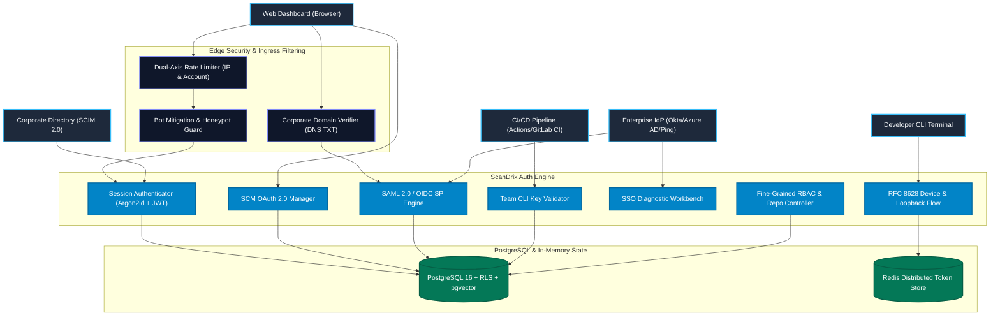
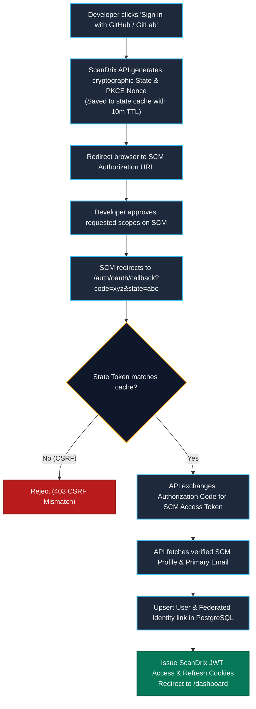
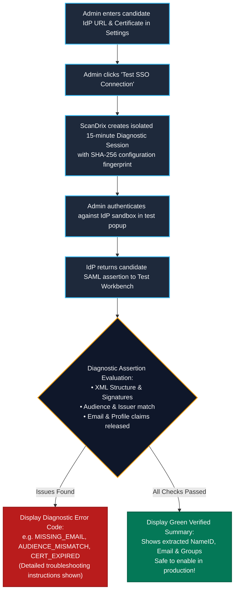
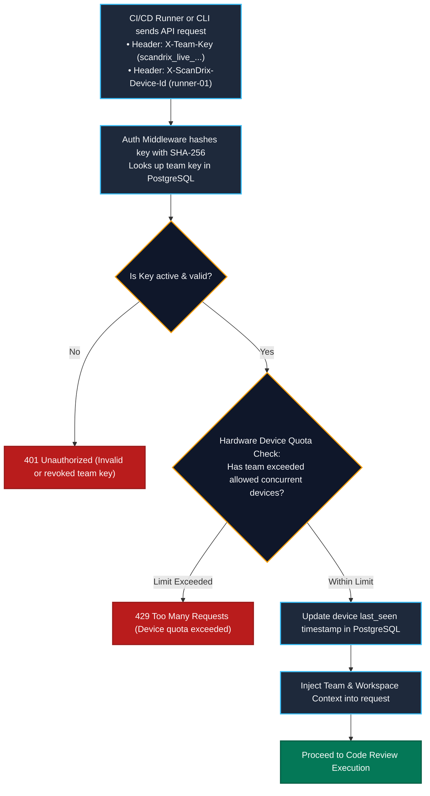
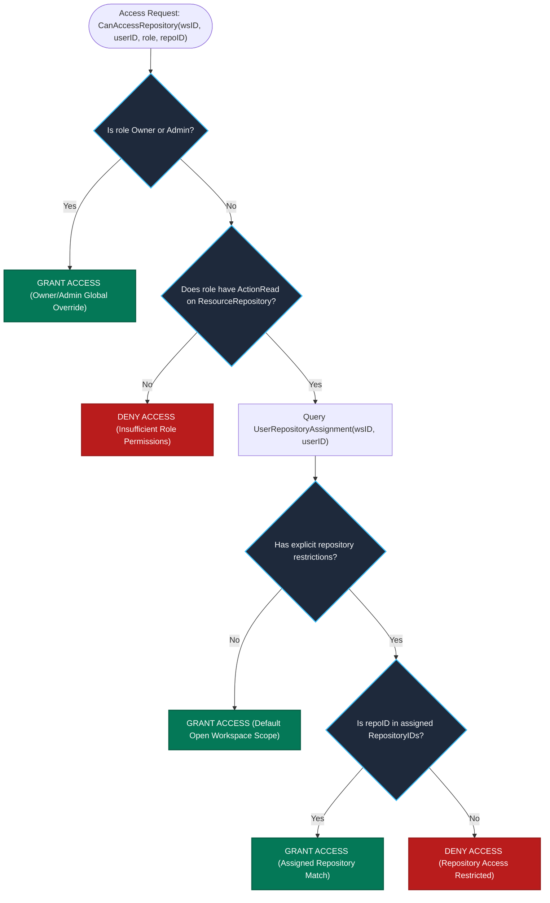
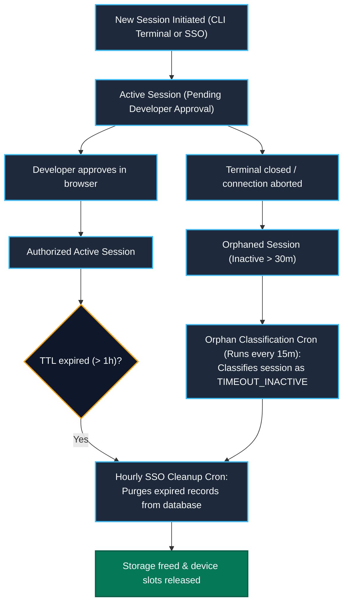

# 🔐 ScanDrix Enterprise Authentication Architecture & Workflows

This document details the complete end-to-end authentication, authorization, identity federation, and session management architecture in **ScanDrix**. ScanDrix implements a zero-trust, defense-in-depth model complying with **OWASP ASVS v4.0.3 Level 3** and strict enterprise operational security principles.

---

## 📑 Table of Contents

1. [Architectural Overview & Identity Hierarchy](#1-architectural-overview--identity-hierarchy)
2. [Flow 1: Web User Session & Password Authentication](#2-flow-1-web-user-session--password-authentication)
3. [Flow 2: SCM OAuth 2.0 Integration (GitHub & GitLab)](#3-flow-2-scm-oauth-20-integration-github--gitlab)
4. [Flow 3: CLI Device Flow (RFC 8628) & Local Loopback Auth](#4-flow-3-cli-device-flow-rfc-8628--local-loopback-auth)
5. [Flow 4: Enterprise Single Sign-On (SAML 2.0 & OIDC)](#5-flow-4-enterprise-single-sign-on-saml-20--oidc)
6. [Flow 5: SSO Connection Diagnostic Test Workbench (Sandbox)](#6-flow-5-sso-connection-diagnostic-test-workbench-sandbox)
7. [Flow 6: Team CLI API Keys & CI/CD Pipelines](#7-flow-6-team-cli-api-keys--cicd-pipelines)
8. [Flow 7: Fine-Grained Per-User Repository Access Control (RBAC)](#8-flow-7-fine-grained-per-user-repository-access-control-rbac)
9. [Flow 8: SCIM 2.0 Automated Directory Sync](#9-flow-8-scim-20-automated-directory-sync)
10. [Flow 9: Delegated Support & Helpdesk Tokens](#10-flow-9-delegated-support--helpdesk-tokens)
11. [Flow 10: Background Session Cleanup & Orphan Classification](#11-flow-10-background-session-cleanup--orphan-classification)
12. [Enterprise Security & ASVS Compliance Matrix](#12-enterprise-security--asvs-compliance-matrix)

---

## 1. Architectural Overview & Identity Hierarchy

ScanDrix supports multi-channel identity ingress across developers, automated runners, enterprise directories, and external contractors:

---

## 2. Flow 1: Web User Session & Password Authentication

### Overview
Direct web user authentication uses memory-hard **Argon2id** password hashing with cryptographically signed, short-lived JWT access tokens and sliding refresh tokens stored in secure, tamper-proof HTTP cookies.

### Security Controls Applied:
- **Argon2id Hashing:** Configured with 64MB memory, 3 iterations, and 4 parallel lanes (RFC 9106 / ASVS V2.4) with seamless transparent migration from legacy Bcrypt.
- **Constant-Time Anti-Enumeration:** Failed logins for non-existent users execute authentic dummy verification matching the active work factor to eliminate timing side-channels (CWE-208).
- **Dual-Axis Rate Limiting:** Throttles requests by both client IP (sliding token bucket) and target email to thwart distributed credential stuffing.
- **Anti-Abuse Registration:** Turnstile challenge verification, hidden honeypot fields, and automated rejection of 100+ disposable email domains (`mailinator.com`, `tempmail.com`, etc.).
- **Email Confirmation:** High-entropy HMAC-SHA256 tokens sent via SMTP when email verification is enforced.
- **Fail-Safe Cookies:** `HttpOnly`, `Secure`, `SameSite=Lax` cookies with dynamic secure flags matching TLS deployment status.

```mermaid
flowchart TD
    subgraph Reg [Part A: User Registration & Verification]
        R1["User enters Email, Password & Turnstile"] --> R2{"Honeypot filled OR<br/>Disposable Email?"}
        R2 -- Yes --> R_Deny["Reject (400 Bad Request)"]
        R2 -- No --> R3["Hash password with Argon2id<br/>(64MB, 3 iterations, 4 lanes)"]
        R3 --> R4["Insert user into PostgreSQL<br/>(email_verified = false)"]
        R4 --> R5["Send confirmation email with HMAC token"]
        R5 --> R6["User clicks verification link"]
        R6 --> R7["API marks email_verified = true"]
    end

    subgraph Login [Part B: Login & Session Issuance]
        L1["User submits Email & Password"] --> L2{"Rate Limit Check<br/>(Dual IP & Email buckets)"}
        L2 -- Exceeded --> L_Throttle["Reject (429 Too Many Requests)"]
        L2 -- Pass --> L3["Query User by Email in PostgreSQL"]
        L3 --> L4{"User exists?"}
        L4 -- No --> L_Dummy["Run Dummy Argon2id Verification<br/>(Constant-time anti-enumeration)"] --> L_AuthFail["Reject (401 Invalid Credentials)"]
        L4 -- Yes --> L5{"Argon2id Verify(password, hash)"}
        L5 -- Fail --> L_AuthFail
        L5 -- Success --> L6["Generate JWT Session<br/>• Access Token (15m TTL)<br/>• Refresh Token (7d sliding)"]
        L6 --> L7["Set HttpOnly, Secure Cookies & Redirect to Dashboard"]
    end

    classDef step fill:#1e293b,stroke:#38bdf8,stroke-width:2px,color:#f8fafc;
    classDef decision fill:#0f172a,stroke:#f59e0b,stroke-width:2px,color:#f8fafc;
    classDef pass fill:#047857,stroke:#065f46,stroke-width:2px,color:#ffffff;
    classDef fail fill:#b91c1c,stroke:#991b1b,stroke-width:2px,color:#ffffff;

    class R1,R3,R4,R5,R6,L1,L3,L6 step;
    class R7,L7 pass;
    class R_Deny,L_Throttle,L_Dummy,L_AuthFail fail;
    class R2,L2,L4,L5 decision;
```

---

## 3. Flow 2: SCM OAuth 2.0 Integration (GitHub & GitLab)

### Overview
Developers can authenticate and link their source code management (SCM) profiles seamlessly via GitHub and GitLab OAuth 2.0 with cryptographic state validation preventing CSRF attacks.

---

## 4. Flow 3: CLI Device Flow (RFC 8628) & Local Loopback Auth

### Overview
Developers interact with ScanDrix from local terminals and headless servers. ScanDrix provides two automated CLI authentication mechanisms:
1. **Interactive Loopback Flow (Local Workstation):** CLI spawns a local ephemeral HTTP listener on `127.0.0.1:<random_port>` and opens the browser.
2. **RFC 8628 Device Authorization Flow (Headless / SSH Terminal):** Displays an 8-character user code and verification URL. The user authorizes the terminal from any web browser.

```mermaid
flowchart TD
    subgraph OptionA [Option A: Interactive Workstation - Local Loopback]
        A1["Developer runs 'scandrix auth login'"] --> A2["CLI opens local ephemeral port on 127.0.0.1:54321<br/>Opens browser to https://app.scandrix.com/cli/authorize"]
        A2 --> A3["Browser displays CLI Approval Prompt to user"]
        A3 --> A4["Developer clicks 'Approve CLI Terminal'"]
        A4 --> A5["Web App POSTs authorization to local CLI listener:<br/>http://127.0.0.1:54321/callback?token=jwt"]
        A5 --> A6["CLI saves token to ~/.scandrix/config.json (chmod 0600)<br/>Kills local listener & prints 'Authenticated!'"]
    end

    subgraph OptionB [Option B: Headless Terminal / SSH - RFC 8628 Device Flow]
        B1["Developer runs 'scandrix auth login --headless'"] --> B2["CLI requests device session from ScanDrix API"]
        B2 --> B3["API generates User Code (e.g. ABCD-1234)<br/>CLI prints: 'Visit app.scandrix.com/cli/authorize and enter code'"]
        B3 --> B4["CLI polls API every 5 seconds (/cli/auth/login-poll)"]
        B3 --> B5["Developer visits URL in any browser & approves code ABCD-1234"]
        B5 --> B6["API updates session to 'authorized'"]
        B6 --> B4
        B4 --> B7["Poll returns active JWT session tokens"]
        B7 --> B8["CLI securely stores token in ~/.scandrix/config.json"]
    end

    classDef step fill:#1e293b,stroke:#38bdf8,stroke-width:2px,color:#f8fafc;
    classDef pass fill:#047857,stroke:#065f46,stroke-width:2px,color:#ffffff;

    class A1,A2,A3,A4,A5,B1,B2,B3,B4,B5,B6,B7 step;
    class A6,B8 pass;
```

---

## 5. Flow 4: Enterprise Single Sign-On (SAML 2.0 & OIDC)

### Overview
ScanDrix provides single sign-on federation with enterprise Identity Providers (Okta, Microsoft Entra ID / Azure AD, PingIdentity, Google Workspace).

### Domain Ownership Prerequisite (Anti-Hijacking):
Before an organization can enforce SSO for `@company.com`, an administrator must prove corporate ownership via a **DNS TXT record challenge**:
- TXT Record: `scandrix-domain-verification=<48_char_hex_token>`
- Host: `_scandrix-challenge.company.com`

```mermaid
flowchart TD
    subgraph Phase1 [Step 1: Domain Ownership Verification - One-Time Admin Setup]
        D1["1. Corporate Admin requests verification for 'enterprise.com'"] --> D2["2. ScanDrix API returns challenge token:<br/>'scandrix-domain-verification=d41d8cd...'"]
        D2 --> D3["3. Admin creates DNS TXT record at:<br/>_scandrix-challenge.enterprise.com"]
        D3 --> D4["4. Admin clicks 'Verify Domain' in Settings"]
        D4 --> D5["5. ScanDrix queries Authoritative DNS Nameservers"]
        D5 --> D6{"TXT record matches challenge?"}
        D6 -- Yes --> D7["Domain marked as VERIFIED in PostgreSQL<br/>(SSO unlocked for @enterprise.com)"]
        D6 -- No --> D_Fail["Verification failed: TXT record not found or propagating"]
    end

    subgraph Phase2 [Step 2: Single Sign-On Authentication - Employee Login]
        S1["1. Employee enters company email 'jane@enterprise.com'"] --> S2["2. ScanDrix detects verified corporate domain & redirects to SSO"]
        S2 --> S3["3. Employee redirected to Corporate IdP (Okta / Azure AD / Ping)"]
        S3 --> S4["4. Employee logs in with corporate credentials + MFA"]
        S4 --> S5["5. IdP signs SAML Assertion with corporate X.509 key<br/>and POSTs back to ScanDrix callback"]
        S5 --> S6{"ScanDrix Security Validations:<br/>• Anti-XSW check (single assertion)<br/>• Validate XMLDSig signature with IdP certificate<br/>• Verify AudienceRestriction & timestamps"}
        S6 -- Valid --> S7["JIT Provisioning: Sync User & Roles in PostgreSQL"]
        S7 --> S8["Issue Secure Session Cookie & Open Enterprise Dashboard"]
        S6 -- Invalid --> S_Deny["Access Denied: SAML signature or audience invalid"]
    end

    classDef step fill:#1e293b,stroke:#38bdf8,stroke-width:2px,color:#f8fafc;
    classDef decision fill:#0f172a,stroke:#f59e0b,stroke-width:2px,color:#f8fafc;
    classDef pass fill:#047857,stroke:#065f46,stroke-width:2px,color:#ffffff;
    classDef fail fill:#b91c1c,stroke:#991b1b,stroke-width:2px,color:#ffffff;

    class D1,D2,D3,D4,D5,S1,S2,S3,S4,S5,S7 step;
    class D6,S6 decision;
    class D7,S8 pass;
    class D_Fail,S_Deny fail;
```

---

## 6. Flow 5: SSO Connection Diagnostic Test Workbench (Sandbox)

### Overview
To prevent administrators from locking out active enterprise users with misconfigured IdP settings, ScanDrix provides an **isolated 15-minute diagnostic test workbench** ([`test_session.go`](internal/auth/sso/test_session.go)).

### Diagnostic Capabilities:
- **Sandbox Isolation:** Test sessions are completely decoupled from production authentication.
- **SHA-256 Fingerprinting:** Detects configuration changes between test iterations.
- **Diagnostic Error Taxonomy:** Accurately classifies failure modes:
  - `INVALID_ASSERTION`: Malformed XML or missing required SAML elements.
  - `EXPIRED_ASSERTION`: Condition timestamp in the past.
  - `AUDIENCE_MISMATCH`: Assertion targeted at wrong Service Provider.
  - `MISSING_EMAIL_ATTRIBUTE`: IdP failed to release email claim.
  - `DOMAIN_MISMATCH`: Identity email domain does not match verified corporate domains.
  - `SIGNATURE_VERIFICATION_FAILED`: Invalid signature or untrusted IdP certificate.

---

## 7. Flow 6: Team CLI API Keys & CI/CD Pipelines

### Overview
Automated CI/CD pipelines (GitHub Actions, GitLab CI, Jenkins, Azure Pipelines) and shared terminal runners authenticate via high-entropy Team CLI keys using either the `X-Team-Key` header or `Authorization: Bearer scandrix_*`.

### Security Controls:
- **Entropy & Prefixes:** Keys follow `scandrix_<workspace_prefix>_<64_char_hex>` format.
- **Hardware Device Tracking:** Headers `X-ScanDrix-Device-Id` and `X-ScanDrix-Device-Token` bind executions to authorized machines.
- **Device Limits:** Enforces maximum concurrent hardware devices per team license (rejecting unauthorized worker sprawl).
- **Constant-Time Verification:** Key hashes are evaluated via `crypto/subtle.ConstantTimeCompare` to eliminate timing side-channels.

---

## 8. Flow 7: Fine-Grained Per-User Repository Access Control (RBAC)

### Overview
ScanDrix enforces a hybrid role-based access control (RBAC) and fine-grained per-user repository boundary model ([`repository_assignment.go`](internal/enterprise/rbac/repository_assignment.go)):
- **Global Owner & Admin Bypass:** Users with role `owner` or `admin` maintain unrestricted access to all repositories.
- **Default Workspace Scope:** Unassigned standard members retain visibility across default workspace repositories.
- **Strict Boundary Enforcement:** Once an administrator assigns explicit repository IDs to a user, that user is strictly restricted to those exact repositories.

---

## 9. Flow 8: SCIM 2.0 Automated Directory Sync

### Overview
Enterprise directories (Okta, Azure AD, OneLogin) automatically provision, update, and deprovision employees in real-time via the standardized RFC 7644 SCIM 2.0 protocol.

```mermaid
flowchart TD
    subgraph Onboarding [Employee Onboarding - Auto-Provisioning]
        SC1["Enterprise Directory (Okta / Azure AD)<br/>POST /scim/v2/Users with Bearer Token"] --> SC2["ScanDrix SCIM Handler verifies SCIM_BEARER_TOKEN"]
        SC2 --> SC3["Check if user email already exists in workspace"]
        SC3 --> SC4["Insert new user into PostgreSQL & assign default MEMBER role"]
        SC4 --> SC5["Return 201 Created with SCIM User Resource"]
    end

    subgraph Offboarding [Employee Offboarding - Instant Deprovisioning]
        SO1["Enterprise Directory sends deactivation:<br/>PATCH /scim/v2/Users/{id} (active=false)"] --> SO2["ScanDrix marks user active=false in PostgreSQL"]
        SO2 --> SO3["Immediately revoke all active JWT tokens & sessions"]
        SO3 --> SO4["Return 200 OK (Employee access terminated instantly)"]
    end

    classDef step fill:#1e293b,stroke:#38bdf8,stroke-width:2px,color:#f8fafc;
    classDef pass fill:#047857,stroke:#065f46,stroke-width:2px,color:#ffffff;

    class SC1,SC2,SC3,SC4,SO1,SO2,SO3 step;
    class SC5,SO4 pass;
```

---

## 10. Flow 9: Delegated Support & Helpdesk Tokens

### Overview
When enterprise customers require customer support troubleshooting, administrators can generate cryptographically signed, short-lived **Helpdesk Delegation Tokens** ([`helpdesk.go`](internal/auth/helpdesk.go)).
- **Cryptographic Assurance:** Signed using asymmetric **RSA-2048** private keys.
- **Strict Scope Limitation:** Scoped to read-only diagnostic telemetry without granting code modification access.
- **Immutable Expiration:** Maximum TTL of 60 minutes with full audit logging in `audit_logs`.

---

## 11. Flow 10: Background Session Cleanup & Orphan Classification

### Overview
Background cron jobs run continuously to prune expired session states and prevent database bloating or resource exhaustion:

---

## 12. Enterprise Security & ASVS Compliance Matrix

| Security Domain | Standard / Rule | ScanDrix Implementation | File Reference |
| :--- | :--- | :--- | :--- |
| **Password Storage** | OWASP ASVS V2.4 | Argon2id (64MB / 3 iterations / 4 threads) with transparent Bcrypt migration | [`internal/auth/password.go`](internal/auth/password.go) |
| **Session Cookies** | OWASP ASVS V3.4 | `HttpOnly`, `Secure`, `SameSite=Lax`, strict path binding | [`internal/api/controllers/auth_controller.go`](internal/api/controllers/auth_controller.go) |
| **Brute-Force Guard** | OWASP ASVS V2.2 | Dual-Axis Rate Limiting by client IP and account target | [`internal/api/controllers/auth_security.go`](internal/api/controllers/auth_security.go) |
| **SAML Signature Defense** | CWE-347 / CWE-1390 | Anti-XML Signature Wrapping (XSW), C14N namespace propagation & X.509 cert | [`internal/auth/sso/saml_handler.go`](internal/auth/sso/saml_handler.go) |
| **SSO Domain Hijacking** | RFC 1035 / RFC 1123 | Live DNS TXT record challenge (`scandrix-domain-verification`) | [`internal/auth/sso/domain_verifier.go`](internal/auth/sso/domain_verifier.go) |
| **IdP Sandbox Isolation** | Enterprise QA | 15-minute diagnostic test workbench with SHA-256 fingerprints | [`internal/auth/sso/test_session.go`](internal/auth/sso/test_session.go) |
| **Repository Boundaries** | OWASP ASVS V4.1 | Fine-grained per-user repo assignment with PostgreSQL RLS persistence | [`internal/enterprise/rbac/repository_assignment.go`](internal/enterprise/rbac/repository_assignment.go) |
| **Automated Provisioning**| RFC 7644 | SCIM 2.0 endpoint for real-time user sync & deprovisioning | [`internal/enterprise/scim/handler.go`](internal/enterprise/scim/handler.go) |
| **Hardware Device Quota** | Enterprise License | Tracking hardware IDs with maximum machine limits per team | [`internal/auth/device_quota.go`](internal/auth/device_quota.go) |
| **Timing Side-Channels** | CWE-208 | `crypto/subtle.ConstantTimeCompare` and `auth.DummyVerify` anti-enumeration | [`internal/auth/password.go`](internal/auth/password.go) |
