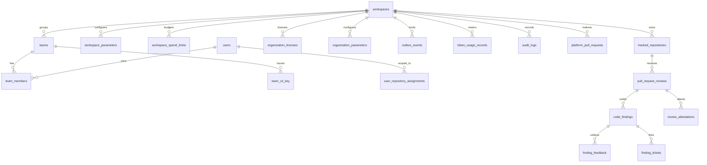

# Data Model (schema, relations, isolation)

Tables created by migrations `001`–`038`, applied in order by `cmd/migrate` with `schema_migrations` tracking. This is the human-readable map; the SQL is authoritative. Migration policy: `operations/upgrade-migration.md`.

## 1. Tenancy spine

`workspace_id` is the tenant key everywhere. `users` ↔ `workspaces` is many-to-many through `team_members` (a person can belong to several workspaces with different roles).

## 2. Table inventory by domain

| Domain | Tables | Notes |
|---|---|---|
| Tenancy & identity | `workspaces`, `account_profiles`, `users`, `teams`, `team_members`, `user_repository_assignments`, `scim_groups`, `scim_group_members`, `scim_tenant_tokens` | roles canonical in `pkg/models.UserRole` |
| Repos & reviews | `tracked_repositories`, `pull_request_reviews`, `code_findings`, `review_attestations`, `review_rules`, `platform_pull_requests` | findings carry category/severity/confidence |
| Rules (Drixy) | `drixy_rules`, `drixy_rule_likes`, `drixy_embedding_vectors`, `buckets` (JSON data) | pgvector embeddings, HNSW index |
| Messaging | `outbox_events`, `inbox_records` | reliability spine — see `event-catalog.md` |
| Licensing & billing | `organization_licenses`, `organization_billing_seats`, `plan_configurations`, `billing_transactions`, `workspace_spend_limits`, `token_usage_records`, `sso_configs` | plans integrity validated by migration 032 |
| Audit & compliance | `audit_logs` (+ SIEM export) | hash-chained at the exporter |
| Config | `parameters`, `workspace_parameters`, `organization_parameters`, `global_parameters` | three scopes: global → workspace → org |
| Integrations | `integration_connections`, `pm_auto_ticket_configs`, `notification_channels` | secrets stored encrypted (`INTEGRATION_ENCRYPTION_KEY`) |
| Automation & issues | `workflow_automations`, `automation_execution_logs`, `tracked_issues` | |
| AST & memory | `code_ast_nodes`, `code_ast_edges`, `security_memory` | vector(1536) + HNSW |
| Analytics | `warehouse_domain_events`, `analytics_pull_request_events`, `materialized_dora_daily_rollups` | Partitioned warehouse & DORA rollups implemented in migration 038 |
| CLI & sessions | `team_cli_key`, `cli_auth_sessions`, `cli_devices`, `auth` | `scandrix_`-prefixed keys |
| Sandbox | `sandbox_leases` | reaper/idle-kill crons |
| MCP (separate schema) | `mcp-manager.mcp_connections`, `.mcp_integrations`, `.mcp_integration_oauth` | own schema, not RLS'd with app tenant |

## 3. Row-Level Security (the isolation contract)

- **43 RLS-protected tables**, each with at least one policy. Verified: 0 with RLS enabled and
  no policy. Migrations 033–036 added `users`, `scim_groups`, `scim_group_members`, the outbox
  `visibility_timeout` column, and the `warehouse_domain_events` system-worker branch.
- **Migrations 033–036** are the least-privilege work: `users` RLS, the outbox claim-tracking
  fix, persistent SCIM groups, and the DORA rollup policy repair.
- New tables must enable **and** `FORCE` RLS, and ship with a policy.

### Who connects as what

| Role | Used by | Properties |
|---|---|---|
| `scandrix_app` (owner) | `scandrix-migrate` only | superuser; required for `CREATE EXTENSION` |
| `scandrix_runtime` | api, webhooks, worker | `NOSUPERUSER`, `NOBYPASSRLS` — RLS is actually enforced |

Compose builds the runtime DSN from `SCANDRIX_RUNTIME_USER` / `SCANDRIX_RUNTIME_PASSWORD`
and **fails to start** if the password is unset. At the time of writing, zero services hold a
superuser connection; verify with the `pg_stat_activity` query in
`docs/LEAST_PRIVILEGE_ROLLOUT.md` §5.

### Two contexts, and the silent-zero failure

A query must declare which context it runs in:

| Context | Helper | Grants |
|---|---|---|
| Tenant-scoped | `Client.ExecWithTenant(ctx, wsID, fn)` | `app.current_tenant_id` |
| System worker | `Client.ExecAsSystem(ctx, fn)` | `app.is_system_worker` |

A query in neither context **matches zero rows without erroring** under `scandrix_runtime`.
That is why the conversion was done per call site rather than by convention.

- `global_parameters`, `warehouse_domain_events`, `outbox_events`, `sandbox_leases`,
  `sso_configs`, `scim_groups` carry a system-worker branch because a background job needs it.
- **28 tables deliberately do not.** Most are only touched inside a request that already has a
  tenant; granting the branch would add privilege nothing uses. A table gets one when a named
  background job needs it, and the migration comment records which job.
- `mcp-manager.*` tables are outside app tenancy (separate schema, own service).

### Known gap

**19 live repositories (150 bare-pool call sites) still bypass this contract**, in
`core/repositories`, `organization/infrastructure/repositories`,
`platformdata/infrastructure/repositories` and `notifications/infrastructure/repositories`.
They hold a raw `*pgxpool.Pool` and never set either GUC. Under `scandrix_runtime` their reads
return zero rows and their writes are rejected.

This is a real enforcement gap, not a style note. It is inventoried and ratcheted by
`internal/database/rls_bypass_test.go`, which fails if the set grows, and detailed in
`docs/LEAST_PRIVILEGE_ROLLOUT.md` §R3. `internal/database` — the layer used by the composition
roots — is fully converted and enforced by the same test.

## 4. Data flow for a review

`webhooks` → `outbox_events` (PENDING) → relay publishes → `inbox_records` claim (PROCESSING) → `pull_request_reviews` + `code_findings` (+ `review_attestations`) → `token_usage_records` → ack, `inbox_records` COMPLETED. Every hop is workspace-scoped and idempotent.

## 5. Growth & retention

- Retention purge and zero-retention mode are **SPECCED** (`enterprise/PRD.md` REQ-8.2) — today rows persist until an operator deletes them.
- Warehouse partitioning and `materialized_dora_daily_rollups` are **IMPLEMENTED** (Phase 5 migration `038_partitioned_analytics_dora.sql`).
- Index hygiene (HNSW params, partition pruning, bloat) is verified by CI checks per `enterprise/IMPLEMENTATION.md`; today the RLS-on-every-table check is the one that must never regress.
