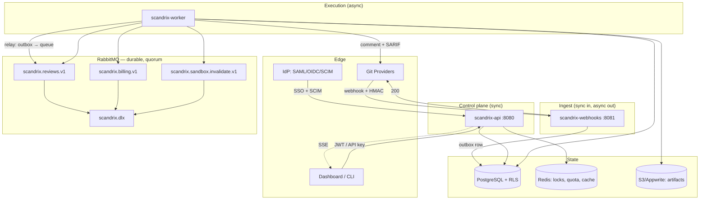

# System Architecture Overview

Whole-system map: what runs, what owns what, and where the sync/async lines are. Enterprise EE specifics live in `enterprise/TRD.md`; this doc is the anatomy of the product as built.

Legend: **[BUILT]** ships · **[PARTIAL]** wired but incomplete · **[SPECCED]** contracted in `enterprise/IMPLEMENTATION.md`, not built.

## 1. Runtime components (13 `cmd/` packages, 10 built into release images)

| Binary | Built | Port | Role | Sync/Async |
|---|---|---|---|---|
| `scandrix-api` | ✅ | `PORT` (8080) | REST + SSE control plane: auth, orgs, teams, rules, repos, reviews admin, analytics reads, SCIM, license, billing webhooks | sync (HTTP) |
| `scandrix-webhooks` | ✅ | `WEBHOOKS_PORT` (8081) | SCM webhook ingestion (GitHub/GitLab/Bitbucket/Azure/Forgejo), HMAC verify → outbox write → 200 | sync ingress, async handoff |
| `scandrix-worker` | ✅ | `WORKER_HEALTH_PORT` (8082) | Review execution, outbox relay, billing + sandbox consumers, maintenance crons, beacon | async |
| `scandrix-server` | ✅ | `PORT` (8080) | **Monolith**: API + webhooks handlers + sandbox pool + 12 crons in one process. Docker `ENTRYPOINT` default. | mixed |
| `scandrix-migrate` | ✅ | — | Ordered, transactional migration runner | one-shot job |
| `scandrix-cli` / `scandrix` | ✅ | — | Same Cobra tree: auth, review, rules, config, TUI, PR ops, subscribe | local CLI |
| `scandrix-mcp-manager` | ✅ | flag (3101 in cluster compose) | MCP server registry, own `mcp-manager` schema | sync (HTTP + stdio fallback) |
| `scandrix-ast-cli` | ✅ | — | Local AST/diff inspection, enqueues `ast.graph.build` | local CLI |
| `scandrix-analytics-cli` | ✅ | — | Warehouse report queries | local CLI |
| `scandrix-try` | ✅ | 8082 (hardcoded) | Public rate-limited playground | sync (open CORS) |
| `scandrix-devserver` | ❌ dev | — | In-memory verification server, demo session | dev only |
| `scandrix-envcheck` | ❌ dev | — | Pre-flight env validator (JWT/DB/RMQ/Redis required) | one-shot |
| `scandrix-keygen` | ✅ | — | License authority: issue/verify envelope tokens | one-shot |

`scandrix-try` (8082) and the worker health port (8082 default) collide in a naive single-host run — set `WORKER_HEALTH_PORT` when co-locating. Known and unfixed; tracked in `operations/runbooks.md` scope.

## 2. Container view

## 3. Request paths

**PR review (async, the hot path):**
`SCM webhook` → `webhooks` HMAC verify → dedup key `repo:pr:sha` (Redis lock + inbox) → `outbox_events` row → 200 to SCM → worker outbox relay publishes `scandrix.reviews.v1` (priority by plan tier) → review consumer (prefetch 16, worker pool) → inbox claim → orchestrator (diff → AST → rules → LLM fan-out → sandbox if enabled) → PG write + SCM comment + artifact → ack.

**Dashboard read (sync):** browser → `/api/proxy/api/v1/*` (dashboard) → `api` → RLS-scoped PG → JSON. SSE for live review progress.

**SCIM (sync):** IdP → `/scim/v2/*` on `api` → bearer compare → provisioning + deprovisioning (session revocation). Seat quota code exists but is **unwired** (WORKFLOWS §5).

**License (boot-time):** `api` (and `server` **[PARTIAL]** — see `enterprise/IMPLEMENTATION.md`) reads `SCANDRIX_LICENSE_KEY|SCANDRIX_LICENSE_FILE`, verifies Ed25519, resolves entitlement; invalid config = fail boot.

## 4. Data ownership per service

| Service | Writes | Reads |
|---|---|---|
| `api` | orgs, teams, members, rules, repos, parameters, licenses, seats, audit, SCIM users, analytics reads | everything it owns (RLS-scoped) |
| `webhooks` | `outbox_events`, inbox dedup keys | Redis locks |
| `worker` | reviews, findings, issues, token usage, rules learning, audit, outbox relay state | diffs via SCM, rules, licenses (quota) |
| `mcp-manager` | `mcp-manager.*` schema | own schema |
| `migrate` | schema only | schema |

Single-writer discipline per table is the rule that keeps the outbox/inbox guarantees meaningful; violations show up as duplicate reviews, not as errors.

## 5. Sync vs async boundary rules

- **Sync** for anything a human is waiting on: dashboard reads, auth, SCIM (IdP timeouts are short), config writes.
- **Async** for anything with a retry budget: review execution, billing lifecycle, sandbox invalidation, analytics rollups.
- **Never** call a worker-owned table from a request handler expecting fresh worker state — use the outbox/event, not the row.
- **Never** put an unbounded operation on the request path (full-repo scans, multi-provider fan-out); those belong on `worker` with a queue entry.

See `event-catalog.md` for payloads and `data-model.md` for the tables behind this map.
