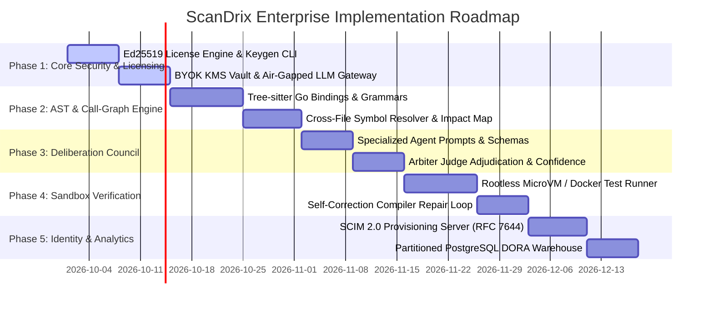

# ScanDrix Enterprise Edition — Engineering Implementation Plan
**Version:** 2.0 Enterprise  
**Status:** Engineering Execution Roadmap  
**Target:** Clean-Room Go 1.25 Implementation  
**Confidentiality:** Proprietary & Confidential — ScanDrix  

---

## 1. Roadmap & Milestone Overview

This document specifies the phased engineering implementation roadmap to build and activate the ScanDrix Enterprise Edition modules in native Go.



---

## 2. Phase-by-Phase Technical Blueprint

### Phase 1: Asymmetric Cryptographic Licensing & Air-Gapped BYOK

#### Objectives:
1. Provide a standalone offline license key generation CLI (`cmd/scandrix-keygen`).
2. Extend `internal/enterprise/license/` (validator/loader/entitlement/resolver) with `KeyID` rotation-ring verification and optional hardware-fingerprint binding — no new `verifier.go`; that name is retired.
3. Support local LLMs (vLLM, Ollama, DeepSeek-R1) via standard OpenAI-compatible HTTP interface without external telemetry egress (new provider under the existing `internal/llm` gateway, not a parallel tree).

#### File Inventory (paths must exist or be created here — no parallel duplicates):
* **[NEW]** `cmd/scandrix-keygen/main.go` — CLI for the ScanDrix authority to issue signed tokens. Emits **only** the envelope format from `license.IssueLicense` (base64 of JSON `SignedLicenseToken`); dot-joined output is forbidden.
* **[MODIFY]** `internal/enterprise/license/models.go` — add `KeyID`, `HardwareFingerprint` (omitempty, backward compatible); set `LicenseGracePeriod = 7*24h`.
* **[MODIFY]** `internal/enterprise/license/validator.go` — key-ID ring selection + fingerprint enforcement.
* **[MODIFY]** `internal/enterprise/license/loader.go` — `SCANDRIX_HARDWARE_FINGERPRINT` wiring.
* **[MODIFY]** `internal/enterprise/license/*_test.go` — rotation overlap, fingerprint accept/reject, grace boundary.
* **[NEW]** sovereign provider inside `internal/llm` (gateway option, e.g. local endpoint transport) — not `internal/llm/providers/sovereign/` from scratch unless the gateway cannot carry it.
* **[MODIFY]** `internal/core/crypto/crypto_service.go` — multi-tenant KMS/Vault envelope encryption for BYOK (extend; do not add `kms_byok.go` beside it).

#### Implementation Contract (`cmd/scandrix-keygen/main.go`):
Authority tooling calls `license.IssueLicense(payload, privKey)` and prints the returned token verbatim:
```go
token, err := license.IssueLicense(license.LicensePayload{
    LicenseID:           uuid.New(),
    CustomerName:        *customer,
    CustomerID:          cid,
    Tier:                license.NormalizeTier(license.LicenseTier(*tier)),
    IssuedAt:            time.Now().UTC(),
    ExpiresAt:           time.Now().UTC().AddDate(0, 0, *days),
    MaxSeats:            *seats,
    MaxRepositories:     0, // unlimited
    Features:            enterpriseFeatures, // code FeatureFlag values, see PRD REQ-7.2 table
    KeyID:               *keyID,             // rotation identifier, "" = primary key
    HardwareFingerprint: *hardware,         // "" = unbound
}, privKey)
if err != nil { /* fail, non-zero exit */ }
fmt.Println(token) // envelope format — loads via LicenseManager.LoadLicense unmodified
```
A `verify` subcommand loads the token through `NewManagerFromEnv` + `LoadLicense` as the acceptance check. The prior draft contract (manual `payload.signature` dot-format) is withdrawn: tokens in that shape are rejected.

---

### Phase 2: Tree-sitter AST & Call-Graph Impact Extractor

#### Step 0 (blocking decision, before any parser work):
CGO vs pure-Go. The production `Dockerfile` builds with `CGO_ENABLED=0` and no CGO exists in the tree: either (a) enable CGO in the builder stage with an `amd64/arm64` matrix and per-language grammar vendoring, or (b) select pure-Go parsers per language. Decision recorded in the phase kickoff note with the chosen matrix. Parse-success acceptance (either path): ≥99% of files <500KB parse without error on the golden corpus; failures degrade to diff-only context with a label, never a silent skip.

#### Objectives:
1. Parse pull request files into concrete syntax trees in memory without shell-outs.
2. Extract modified function, method, and struct declarations.
3. Traverse repository files to map all call sites calling modified symbols.

#### File Inventory (extend existing engines — no parallel trees):
* **[MODIFY]** `internal/codeanalysis/ast/` — add Tree-sitter grammar loading to the existing analyzer (no standalone `treesitter_engine.go` beside it unless the current engine cannot carry it).
* **[MODIFY]** `internal/review/` + `internal/codeanalysis/` — cross-file symbol index and `AnalyzeDiff(ctx, repoID, diffText) → ImpactReport` impact analysis wired into the orchestrator's context bundle (WORKFLOWS §1, step L), not a separate `callgraph/` product.

#### Implementation Contract (`impact_analyzer.go`):
```go
package callgraph

import (
	"context"
)

type SymbolChange struct {
	SymbolName string `json:"symbol_name"`
	FilePath   string `json:"file_path"`
	OldSignature string `json:"old_signature"`
	NewSignature string `json:"new_signature"`
	IsBreaking bool   `json:"is_breaking"`
}

type CallSite struct {
	CallerFile string `json:"caller_file"`
	LineNumber int    `json:"line_number"`
	Snippet    string `json:"snippet"`
}

type ImpactReport struct {
	ModifiedSymbols []SymbolChange `json:"modified_symbols"`
	AffectedFiles   []string       `json:"affected_files"`
	CallSites       []CallSite     `json:"call_sites"`
}

type ImpactAnalyzer interface {
	AnalyzeDiff(ctx context.Context, repoID string, diffText string) (*ImpactReport, error)
}
```

---

### Phase 3: Adversarial Multi-Agent Deliberation Council

#### Objectives:
1. Dispatch parallel Goroutine workers for Architect, Security, and Performance agents.
2. Implement the Arbiter Judge to cross-examine candidate issues, eliminate subjective nits, and filter scores < 0.92.

#### File Inventory (extend `internal/review/` — the `aiengine/` package exists; add the council there):
* **[MODIFY]** `internal/review/aiengine/` — deliberation orchestrator + Architect / AppSec / Performance specialists + Arbiter Judge (fan-out below), reusing `context_pack_assembler.go` and `llm_response_processor.go`. No `internal/review/aiengine/multiagent/` parallel package.

#### Implementation Contract (`orchestrator.go`):
```go
package multiagent

import (
	"context"
	"sync"
)

type MultiAgentOrchestrator struct {
	architect   *ArchitectAgent
	appSec      *AppSecAgent
	performance *PerformanceAgent
	arbiter     *ArbiterJudge
}

func (o *MultiAgentOrchestrator) Deliberate(ctx context.Context, input ReviewInput) (*AdjudicatedReview, error) {
	var wg sync.WaitGroup
	var rawFindings []RawFinding
	var mu sync.Mutex

	agents := []ReviewSpecialist{o.architect, o.appSec, o.performance}
	wg.Add(len(agents))

	for _, agent := range agents {
		go func(a ReviewSpecialist) {
			defer wg.Done()
			findings, err := a.Analyze(ctx, input)
			if err == nil {
				mu.Lock()
				rawFindings = append(rawFindings, findings...)
				mu.Unlock()
			}
		}(agent)
	}

	wg.Wait()

	// Arbiter cross-examines all findings
	return o.arbiter.Adjudicate(ctx, input, rawFindings)
}
```

---

### Phase 4: Sandboxed Suggestion Execution Runner (MicroVM)

#### Objectives:
1. Apply the candidate git patch in a rootless, network-isolated container.
2. Run build & test suites.
3. Automatically repair compilation errors via a 2-iteration feedback loop before posting to PR.

#### File Inventory (extend the existing sandbox subsystem — no `executor/verifier/repair` parallel tree):
* **[MODIFY]** `internal/sandbox/` (+ `internal/core/repositories` sandbox-lease repo) — rootless container runner honoring TRD §3.2 (uid 10001, 1024MB/1vCPU/15s, `--net=none`, RO rootfs + tmpfs `/workspace`), patch-apply + build/test verification, and the ≤2-attempt self-correction loop feeding compiler logs back to the Arbiter.

---

### Phase 5: SCIM 2.0 Directory Sync & DORA Analytics Warehouse

#### Objectives:
1. Implement standard RFC 7644 SCIM 2.0 endpoints for automated user provisioning.
2. Deploy partitioned PostgreSQL tables for high-throughput DORA metric rollups.

#### File Inventory (extend existing services — no parallel controllers):
* **[IMPLEMENTED]** `internal/enterprise/scim/handler.go` — PostgreSQL persistence for users, groups, and tokens (`scim_users`, `scim_groups`, `scim_tenant_tokens` in migrations `035` and `037`), seat-quota 409 enforcement, wired via `BindTenant` in `cmd/api/main.go` and `cmd/server/main.go`.
* **[IMPLEMENTED]** `internal/api/controllers/sso_config_controller.go` — per-workspace persistence to `sso_configs` table (migration `031`) with verified IDP enforcement.
* **[IMPLEMENTED]** migration `038_partitioned_analytics_dora.sql` — range-partitioned `analytics_pull_request_events` (monthly partitions) + `materialized_dora_daily_rollups` with strict Row-Level Security (`scandrix_runtime` least privilege).
* **[IMPLEMENTED]** `internal/database/dora_repository.go` + `internal/cron/dora_aggregator.go` — 4-pillar DORA aggregation from real warehouse events, adhering strictly to Master Rule 2.7 (nil pointers + explicit `unavailable` reasons when unmeasured).

---

## 3. Verification & Quality Gates

Every phase must pass automated verification before being promoted:

```bash
# 1. Verify Go compilation across all daemons (+ keygen once Phase 1 lands it)
go build -o /dev/null ./cmd/api
go build -o /dev/null ./cmd/worker
go build -o /dev/null ./cmd/webhooks
go build -o /dev/null ./cmd/scandrix-keygen

# 2. Run unit and integration test matrix
go test -v -race -timeout 120s ./internal/enterprise/... ./internal/review/...

# 3. Static security analysis
gosec -quiet ./internal/enterprise/... ./internal/api/... ./internal/auth/...

# 4. License compliance check (tool: go-licenses; allowlist: no AGPL/CPAL in
#    commercial binaries). Fails the phase on any unapproved license.
go-licenses check ./cmd/... --allowed=MIT,Apache-2.0,BSD-2-Clause,BSD-3-Clause,ISC,MPL-2.0

# 5. Eval gate (Phases 2-4, and before quoting any §6 quality number):
#    frozen golden PR corpus with ground-truth labels; precision/recall from
#    CI; threshold + corpus version recorded with the number. Unmeasured
#    quality claims stay out of releases and customer material.
go test ./evals/... -run 'TestGolden|TestPrecision|TestRecall'

# 6. Egress audit gate (Phase 1 air-gap work): automated test asserting no
#    outbound calls outside the allowlist with AIR_GAPPED enforcement on and
#    all three off-switches set; quarterly re-run recorded per PRD §6.
go test ./internal/... -run 'TestAirGappedEgress'
```
