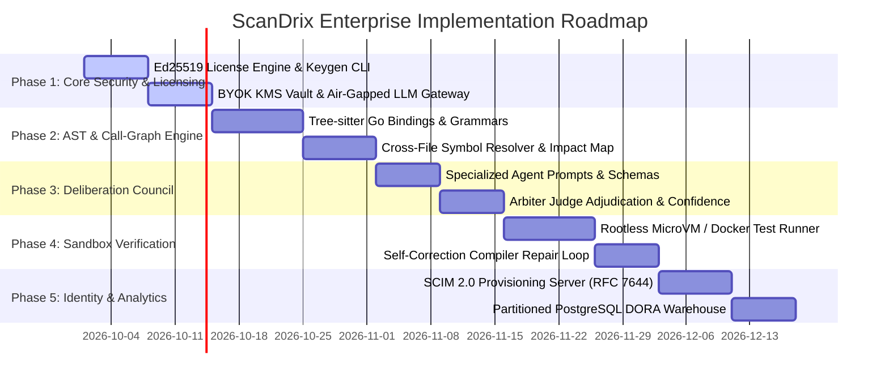

# ScanDrix Enterprise Edition — Engineering Implementation Plan
**Version:** 2.0 Enterprise  
**Status:** Engineering Execution Roadmap  
**Target:** Clean-Room Go 1.25 Implementation  
**Confidentiality:** Proprietary & Confidential — ScanDrix  

---

## 1. Roadmap & Milestone Overview

This document specifies the phased engineering implementation roadmap to build and activate the ScanDrix Enterprise Edition modules in native Go.



---

## 2. Phase-by-Phase Technical Blueprint

### Phase 1: Asymmetric Cryptographic Licensing & Air-Gapped BYOK

#### Objectives:
1. Provide a standalone offline license key generation CLI (`cmd/scandrix-keygen`).
2. Implement compile-time public-key verification in `internal/enterprise/license/verifier.go`.
3. Support local LLMs (vLLM, Ollama, DeepSeek-R1) via standard OpenAI-compatible HTTP interface without external telemetry egress.

#### File Inventory:
* **[NEW]** `cmd/scandrix-keygen/main.go` — CLI for ScanDrix authority to issue signed tokens.
* **[MODIFY]** [ScanDrix/internal/enterprise/license/verifier.go](file:///home/tarun/Videos/kodus-ai/ScanDrix/internal/enterprise/license/verifier.go) — Asymmetric Ed25519 verification.
* **[NEW]** `internal/llm/providers/sovereign/local_provider.go` — Air-gapped local LLM provider.
* **[NEW]** `internal/core/crypto/kms_byok.go` — Multi-tenant AWS KMS / Vault envelope encryption.

#### Implementation Contract (`cmd/scandrix-keygen/main.go`):
```go
package main

import (
	"crypto/ed25519"
	"encoding/base64"
	"encoding/json"
	"flag"
	"fmt"
	"os"
	"time"

	"github.com/google/uuid"
	"github.com/scandrix/backend/internal/enterprise/license"
)

func main() {
	customer := flag.String("customer", "", "Customer Organization Name")
	seats := flag.Int("seats", 100, "Maximum Developer Seats")
	days := flag.Int("days", 365, "Validity duration in days")
	privKeyB64 := flag.String("privkey", "", "Master Ed25519 Private Key Base64")
	flag.Parse()

	if *customer == "" || *privKeyB64 == "" {
		fmt.Println("Usage: scandrix-keygen -customer <name> -privkey <b64> -seats <num> -days <num>")
		os.Exit(1)
	}

	privBytes, _ := base64.StdEncoding.DecodeString(*privKeyB64)
	privKey := ed25519.PrivateKey(privBytes)

	claims := license.LicensePayload{
		LicenseID:       uuid.New(),
		CustomerName:    *customer,
		CustomerID:      uuid.New().String(),
		Tier:            license.TierEnterprise,
		IssuedAt:        time.Now().UTC(),
		ExpiresAt:       time.Now().UTC().AddDate(0, 0, *days),
		MaxSeats:        *seats,
		MaxRepositories: 0, // unlimited
		Features: []string{
			string(license.FeatureSSOSAML),
			string(license.FeatureSCIM),
			string(license.FeatureAuditWarehouse),
			string(license.FeatureMultiAgentDeliberation),
			string(license.FeatureBYOK),
			string(license.FeatureAirGapped),
			string(license.FeatureDORAMetrics),
		},
	}

	payloadJSON, _ := json.Marshal(claims)
	signature := ed25519.Sign(privKey, payloadJSON)

	token := fmt.Sprintf("%s.%s",
		base64.StdEncoding.EncodeToString(payloadJSON),
		base64.StdEncoding.EncodeToString(signature),
	)

	fmt.Printf("\nGenerated ScanDrix Enterprise License Token:\n\n%s\n\n", token)
}
```

---

### Phase 2: Tree-sitter AST & Call-Graph Impact Extractor

#### Objectives:
1. Parse pull request files into concrete syntax trees in memory without shell-outs.
2. Extract modified function, method, and struct declarations.
3. Traverse repository files to map all call sites calling modified symbols.

#### File Inventory:
* **[NEW]** `internal/codeanalysis/ast/treesitter_engine.go` — Tree-sitter grammar loader.
* **[NEW]** `internal/codeanalysis/callgraph/symbol_indexer.go` — In-memory symbol repository indexer.
* **[NEW]** `internal/codeanalysis/callgraph/impact_analyzer.go` — Downstream breaking change detector.

#### Implementation Contract (`impact_analyzer.go`):
```go
package callgraph

import (
	"context"
)

type SymbolChange struct {
	SymbolName string `json:"symbol_name"`
	FilePath   string `json:"file_path"`
	OldSignature string `json:"old_signature"`
	NewSignature string `json:"new_signature"`
	IsBreaking bool   `json:"is_breaking"`
}

type CallSite struct {
	CallerFile string `json:"caller_file"`
	LineNumber int    `json:"line_number"`
	Snippet    string `json:"snippet"`
}

type ImpactReport struct {
	ModifiedSymbols []SymbolChange `json:"modified_symbols"`
	AffectedFiles   []string       `json:"affected_files"`
	CallSites       []CallSite     `json:"call_sites"`
}

type ImpactAnalyzer interface {
	AnalyzeDiff(ctx context.Context, repoID string, diffText string) (*ImpactReport, error)
}
```

---

### Phase 3: Adversarial Multi-Agent Deliberation Council

#### Objectives:
1. Dispatch parallel Goroutine workers for Architect, Security, and Performance agents.
2. Implement the Arbiter Judge to cross-examine candidate issues, eliminate subjective nits, and filter scores < 0.92.

#### File Inventory:
* **[NEW]** `internal/review/aiengine/multiagent/orchestrator.go` — Deliberation orchestrator.
* **[NEW]** `internal/review/aiengine/multiagent/architect_agent.go` — Lead Architect Agent.
* **[NEW]** `internal/review/aiengine/multiagent/appsec_agent.go` — Red-Team Security Agent.
* **[NEW]** `internal/review/aiengine/multiagent/performance_agent.go` — Performance Engineer Agent.
* **[NEW]** `internal/review/aiengine/multiagent/arbiter_judge.go` — Adjudication Judge.

#### Implementation Contract (`orchestrator.go`):
```go
package multiagent

import (
	"context"
	"sync"
)

type MultiAgentOrchestrator struct {
	architect   *ArchitectAgent
	appSec      *AppSecAgent
	performance *PerformanceAgent
	arbiter     *ArbiterJudge
}

func (o *MultiAgentOrchestrator) Deliberate(ctx context.Context, input ReviewInput) (*AdjudicatedReview, error) {
	var wg sync.WaitGroup
	var rawFindings []RawFinding
	var mu sync.Mutex

	agents := []ReviewSpecialist{o.architect, o.appSec, o.performance}
	wg.Add(len(agents))

	for _, agent := range agents {
		go func(a ReviewSpecialist) {
			defer wg.Done()
			findings, err := a.Analyze(ctx, input)
			if err == nil {
				mu.Lock()
				rawFindings = append(rawFindings, findings...)
				mu.Unlock()
			}
		}(agent)
	}

	wg.Wait()

	// Arbiter cross-examines all findings
	return o.arbiter.Adjudicate(ctx, input, rawFindings)
}
```

---

### Phase 4: Sandboxed Suggestion Execution Runner (MicroVM)

#### Objectives:
1. Apply the candidate git patch in a rootless, network-isolated container.
2. Run build & test suites.
3. Automatically repair compilation errors via a 2-iteration feedback loop before posting to PR.

#### File Inventory:
* **[NEW]** `internal/sandbox/executor/container_runner.go` — Rootless container executor.
* **[NEW]** `internal/sandbox/verifier/patch_verifier.go` — Patch apply and test runner.
* **[NEW]** `internal/sandbox/repair/self_correction_loop.go` — Error log feedback loop.

---

### Phase 5: SCIM 2.0 Directory Sync & DORA Analytics Warehouse

#### Objectives:
1. Implement standard RFC 7644 SCIM 2.0 endpoints for automated user provisioning.
2. Deploy partitioned PostgreSQL tables for high-throughput DORA metric rollups.

#### File Inventory:
* **[NEW]** `internal/api/controllers/scim_user_controller.go` — SCIM 2.0 `/scim/v2/Users` handler.
* **[NEW]** `internal/api/controllers/scim_group_controller.go` — SCIM 2.0 `/scim/v2/Groups` handler.
* **[NEW]** `internal/enterprise/scim/scim_service.go` — User provisioning & seat tracking logic.
* **[NEW]** `migrations/020_enterprise_partitioned_analytics.sql` — PostgreSQL range partitions & indexes.
* **[NEW]** `internal/analytics/dora_calculator.go` — DORA 4-pillar metric calculations.

---

## 3. Verification & Quality Gates

Every phase must pass automated verification before being promoted:

```bash
# 1. Verify Go compilation across all daemons
go build -o /dev/null ./cmd/api
go build -o /dev/null ./cmd/worker
go build -o /dev/null ./cmd/webhooks
go build -o /dev/null ./cmd/scandrix-keygen

# 2. Run unit and integration test matrix
go test -v -race -timeout 120s ./internal/enterprise/... ./internal/review/...

# 3. Static security analysis (gosec)
gosec -quiet ./internal/enterprise/...

# 4. License compliance check
# Ensures no third-party AGPL code is statically linked
```
