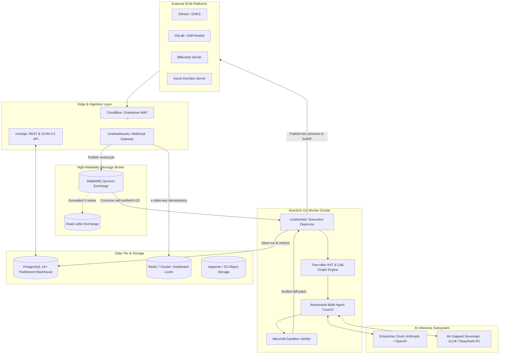
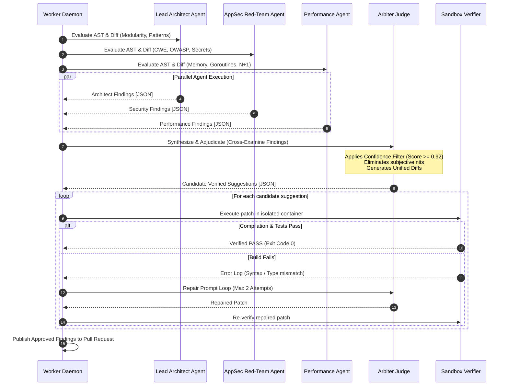

# ScanDrix Enterprise Edition — Technical Requirements Document (TRD)
**Version:** 2.0 Enterprise  
**Status:** Approved Technical Architecture  
**Target Runtime:** Go 1.25+ / Linux amd64 & arm64  
**Confidentiality:** Proprietary & Confidential — ScanDrix  

---

## 1. System Architecture & Topology

ScanDrix Enterprise is composed of four decoupled, horizontally scalable Go services communicating asynchronously over **RabbitMQ Quorum Queues** with state persistence in **PostgreSQL 16+ (pgxpool)** and ephemeral distributed state in **Redis 7+**.



---

## 2. Core Go Technical Stack & Standards

| Component | Technology | Rationale & Production Parameters |
| :--- | :--- | :--- |
| **Language & Runtime** | Go 1.25.3 | Low latency, garbage collection pauses < 1ms, native concurrency via goroutines, zero external runtime dependencies. |
| **HTTP Routing** | `go-chi/chi/v5` | Lightweight, 100% compliant with standard `net/http`, zero allocation overhead, robust middleware chaining. |
| **Database Driver** | `jackc/pgx/v5` (pgxpool) | High-performance PostgreSQL native driver with connection pooling, automatic statement preparation, and native binary protocol. |
| **Message Broker** | `rabbitmq/amqp091-go` | Enterprise Quorum queues with Raft consensus, publisher confirms, and delayed message exchange for exponential backoff retries. |
| **AST Parser** | Tree-sitter (CGO/Go bindings) | Concrete syntax tree parser generating full parse trees in < 5ms per file across 12+ programming languages. |
| **Cryptographic Engine** | `golang.org/x/crypto/ed25519` | Hardware-speed digital signatures for offline license entitlement verification; AES-256-GCM for BYOK vault encryption. |
| **Sandbox Execution** | Containerd / Firecracker MicroVM | Isolated ephemeral sandbox executing builds and tests in sub-second lifecycles with strict cgroup resource constraints. |

---

## 3. Module Specifications & Engineering Contracts

### 3.1 Module: Adversarial Multi-Agent Deliberation Council

The Deliberation Council runs three specialized agents in parallel, whose raw outputs are submitted to an Arbiter Judge.



#### Go Data Structures:
```go
package deliberation

import (
	"time"
	"github.com/google/uuid"
)

type AgentSpecialization string

const (
	SpecializationArchitect   AgentSpecialization = "ARCHITECT"
	SpecializationAppSec      AgentSpecialization = "APPSEC"
	SpecializationPerformance AgentSpecialization = "PERFORMANCE"
)

type RawFinding struct {
	SourceAgent   AgentSpecialization `json:"source_agent"`
	RuleID        string              `json:"rule_id"`
	FilePath      string              `json:"file_path"`
	StartLine     int                 `json:"start_line"`
	EndLine       int                 `json:"end_line"`
	Severity      string              `json:"severity"` // CRITICAL, HIGH, MEDIUM, LOW
	Title         string              `json:"title"`
	Description   string              `json:"description"`
	ProposedPatch string              `json:"proposed_patch"`
	Confidence    float64             `json:"confidence"` // 0.0 - 1.0
}

type AdjudicatedReview struct {
	ReviewID        uuid.UUID            `json:"review_id"`
	ApprovedIssues  []VerifiedSuggestion `json:"approved_issues"`
	SuppressedCount int                  `json:"suppressed_count"`
	DeliberationMs  int64                `json:"deliberation_ms"`
}

type VerifiedSuggestion struct {
	FindingID      uuid.UUID `json:"finding_id"`
	Category       string    `json:"category"`
	FilePath       string    `json:"file_path"`
	LineNumber     int       `json:"line_number"`
	Title          string    `json:"title"`
	Explanation    string    `json:"explanation"`
	OriginalCode   string    `json:"original_code"`
	ReplacementCode string   `json:"replacement_code"`
	SandboxStatus  string    `json:"sandbox_status"` // VERIFIED_CLEAN, COMPILE_PASSED
	Confidence     float64   `json:"confidence"`
}
```

---

### 3.2 Module: Sandboxed Suggestion Execution Runner

#### Container Execution Contract:
1. **Rootless Execution:** Containers must run under an unprivileged user (`uid=10001, gid=10001`).
2. **Resource Boundaries:** Hard memory cap of `1024 MB`, CPU quota of `1.0 vCPU`, execution timeout of `15.0 seconds`.
3. **Network Isolation:** Network disabled (`--net=none`) to prevent sandbox escaping or outbound malicious egress.
4. **Filesystem:** Read-only rootfs with an ephemeral `tmpfs` volume mounted on `/workspace`.

#### Execution Workflow in Go:
```go
package sandbox

import (
	"context"
	"os/exec"
	"time"
)

type ExecutionResult struct {
	Success      bool          `json:"success"`
	ExitCode     int           `json:"exit_code"`
	Stdout       string        `json:"stdout"`
	Stderr       string        `json:"stderr"`
	Duration     time.Duration `json:"duration"`
	CompileError bool          `json:"compile_error"`
}

type SandboxService interface {
	VerifyPatch(ctx context.Context, repoPath, patchDiff, testCommand string) (*ExecutionResult, error)
}
```

---

### 3.3 Module: Asymmetric Ed25519 Cryptographic Licensing

#### Cryptographic Architecture:
* **Algorithm:** Pure Ed25519 (RFC 8032) asymmetric digital signature.
* **Licensing Authority:** ScanDrix Master Key generates private Ed25519 signatures over canonical JSON payloads.
* **On-Premise Verification:** The ScanDrix binary holds only the public verification key embedded at compile time. It can verify licenses without network access, third-party phone-home pings, or internet access.

```mermaid
flowchart LR
    subgraph ScanDrix_HQ ["ScanDrix Security Authority"]
        Payload[License Entitlement JSON] --> Canonical[Canonical RFC 8785 JSON]
        PrivKey[(Master Ed25519 Private Key)] --> Signer[Signer Service]
        Canonical --> Signer
        Signer --> Token[Signed License Token: base64(payload).base64(signature)]
    end

    subgraph Customer_Cluster ["Air-Gapped Enterprise Server"]
        Token --> Parser[Token Splitter]
        PubKey[(Embedded Ed25519 Public Key)] --> Verifier[Cryptographic Verifier]
        Parser --> Verifier
        Verifier --> Valid{Valid Signature?}
        Valid -->|Yes| FeatureGate[Unlock Enterprise Features & Seats]
        Valid -->|No / Expired| Lockout[Gate Features & Log Tampering Alert]
    end
```

#### Go License Verifier Implementation:
```go
package license

import (
	"crypto/ed25519"
	"encoding/base64"
	"encoding/json"
	"errors"
	"fmt"
	"time"
)

// MasterPublicKeyBase64 is the embedded public key of ScanDrix Authority
const MasterPublicKeyBase64 = "MCowBQYDK2VwAyEA9rY1bH4y+ZlK3wX..."

type LicenseClaims struct {
	LicenseID       string      `json:"license_id"`
	CustomerName    string      `json:"customer_name"`
	CustomerID      string      `json:"customer_id"`
	Tier            string      `json:"tier"` // ENTERPRISE
	IssuedAt        time.Time   `json:"issued_at"`
	ExpiresAt       time.Time   `json:"expires_at"`
	MaxSeats        int         `json:"max_seats"`
	MaxRepositories int         `json:"max_repositories"`
	Features        []string    `json:"features"`
	HardwareBinding string      `json:"hardware_binding,omitempty"`
}

type LicenseVerifier struct {
	publicKey ed25519.PublicKey
}

func NewLicenseVerifier(pubKeyBase64 string) (*LicenseVerifier, error) {
	pubBytes, err := base64.StdEncoding.DecodeString(pubKeyBase64)
	if err != nil || len(pubBytes) != ed25519.PublicKeySize {
		return nil, errors.New("invalid Ed25519 public key")
	}
	return &LicenseVerifier{publicKey: pubBytes}, nil
}

func (v *LicenseVerifier) VerifyToken(payloadB64, signatureB64 string) (*LicenseClaims, error) {
	rawPayload, err := base64.StdEncoding.DecodeString(payloadB64)
	if err != nil {
		return nil, fmt.Errorf("invalid payload base64: %w", err)
	}

	rawSignature, err := base64.StdEncoding.DecodeString(signatureB64)
	if err != nil || len(rawSignature) != ed25519.SignatureSize {
		return nil, errors.New("invalid Ed25519 signature format")
	}

	if !ed25519.Verify(v.publicKey, rawPayload, rawSignature) {
		return nil, errors.New("cryptographic signature mismatch: license is invalid or forged")
	}

	var claims LicenseClaims
	if err := json.Unmarshal(rawPayload, &claims); err != nil {
		return nil, fmt.Errorf("malformed license claims: %w", err)
	}

	if time.Now().UTC().After(claims.ExpiresAt) {
		return nil, fmt.Errorf("license expired on %s", claims.ExpiresAt.Format(time.RFC3339))
	}

	return &claims, nil
}
```

---

### 3.4 Module: SCIM 2.0 Identity Directory Synchronization

ScanDrix Enterprise implements a full **RFC 7644 / RFC 7643** SCIM 2.0 server mounted on `/scim/v2/`.

#### Supported Endpoints:
* `GET  /scim/v2/Users?filter=userName eq "user@corp.com"` (Query user)
* `POST /scim/v2/Users` (Provision new developer seat)
* `GET  /scim/v2/Users/{id}` (Read user metadata)
* `PUT  /scim/v2/Users/{id}` (Update profile & roles)
* `PATCH /scim/v2/Users/{id}` (Suspend/Reactivate seat: `{"active": false}`)
* `DELETE /scim/v2/Users/{id}` (Revoke seat allocation)
* `GET  /scim/v2/Groups` (Team / RBAC synchronization)

#### SCIM User Representation:
```json
{
  "schemas": ["urn:ietf:params:scim:schemas:core:2.0:User"],
  "id": "e4f8d680-9289-4d6d-bf28-b8bc87b5a190",
  "userName": "marcus.vance@enterprise.com",
  "name": {
    "givenName": "Marcus",
    "familyName": "Vance"
  },
  "emails": [
    {
      "value": "marcus.vance@enterprise.com",
      "primary": true
    }
  ],
  "active": true,
  "roles": ["ENGINEERING_LEAD"],
  "meta": {
    "resourceType": "User",
    "created": "2026-03-01T12:00:00Z",
    "lastModified": "2026-09-23T14:30:00Z"
  }
}
```

---

### 3.5 Module: Enterprise Analytics Warehouse Schema (PostgreSQL)

To achieve microsecond query latencies over millions of historical pull requests, the database schema implements PostgreSQL **declarative time-based range partitioning**.

```sql
-- Core Pull Request Event Warehouse Table (Partitioned by Month)
CREATE TABLE IF NOT EXISTS analytics_pull_request_events (
    id UUID NOT NULL,
    workspace_id UUID NOT NULL,
    repository_id UUID NOT NULL,
    pr_number INT NOT NULL,
    pr_title TEXT NOT NULL,
    category VARCHAR(32) NOT NULL, -- feature, bug_fix, security, refactor
    author_email VARCHAR(255) NOT NULL,
    lines_added INT NOT NULL,
    lines_deleted INT NOT NULL,
    files_changed INT NOT NULL,
    turnaround_seconds INT,
    review_status VARCHAR(32) NOT NULL, -- APPROVED, CHANGES_REQUESTED, MERGED
    created_at TIMESTAMPTZ NOT NULL,
    merged_at TIMESTAMPTZ,
    PRIMARY KEY (id, created_at)
) PARTITION BY RANGE (created_at);

-- Partition Examples (Zero fragmentation, instant historical pruning)
CREATE TABLE IF NOT EXISTS analytics_pr_events_2026_q1 PARTITION OF analytics_pull_request_events
    FOR VALUES FROM ('2026-01-01 00:00:00+00') TO ('2026-04-01 00:00:00+00');

CREATE TABLE IF NOT EXISTS analytics_pr_events_2026_q2 PARTITION OF analytics_pull_request_events
    FOR VALUES FROM ('2026-04-01 00:00:00+00') TO ('2026-07-01 00:00:00+00');

CREATE TABLE IF NOT EXISTS analytics_pr_events_2026_q3 PARTITION OF analytics_pull_request_events
    FOR VALUES FROM ('2026-07-01 00:00:00+00') TO ('2026-10-01 00:00:00+00');

-- High-speed composite indexes for DORA calculations
CREATE INDEX IF NOT EXISTS idx_analytics_dora_rollup 
ON analytics_pull_request_events (workspace_id, created_at DESC, category);

CREATE INDEX IF NOT EXISTS idx_analytics_repo_velocity 
ON analytics_pull_request_events (repository_id, merged_at);

-- Row-Level Security Policy for Strict Tenant Isolation
ALTER TABLE analytics_pull_request_events ENABLE ROW LEVEL SECURITY;

CREATE POLICY tenant_isolation_analytics_pr_events ON analytics_pull_request_events
    FOR ALL
    USING (workspace_id = NULLIF(current_setting('app.current_tenant_id', true), '')::UUID);
```

---

## 4. Hardware Sizing & Capacity Guidelines

```
┌────────────────────────────────────────────────────────────────────────┐
│             ScanDrix Enterprise Cluster Sizing Matrix                  │
├─────────────────────┬──────────────┬───────────────┬───────────────────┤
│ Deployment Tier     │ Active Devs  │ Worker Nodes  │ Sizing Spec (Node)│
├─────────────────────┼──────────────┼───────────────┼───────────────────┤
│ Team Enterprise     │ 50 - 250     │ 2 Workers     │ 4 vCPU, 8 GB RAM  │
│ Commercial Scale    │ 250 - 1,000  │ 4 Workers     │ 8 vCPU, 16 GB RAM │
│ Global Monorepo     │ 1,000 - 10k+ │ 8-16 Workers  │ 16 vCPU, 32 GB RAM│
└─────────────────────┴──────────────┴───────────────┴───────────────────┘
```
