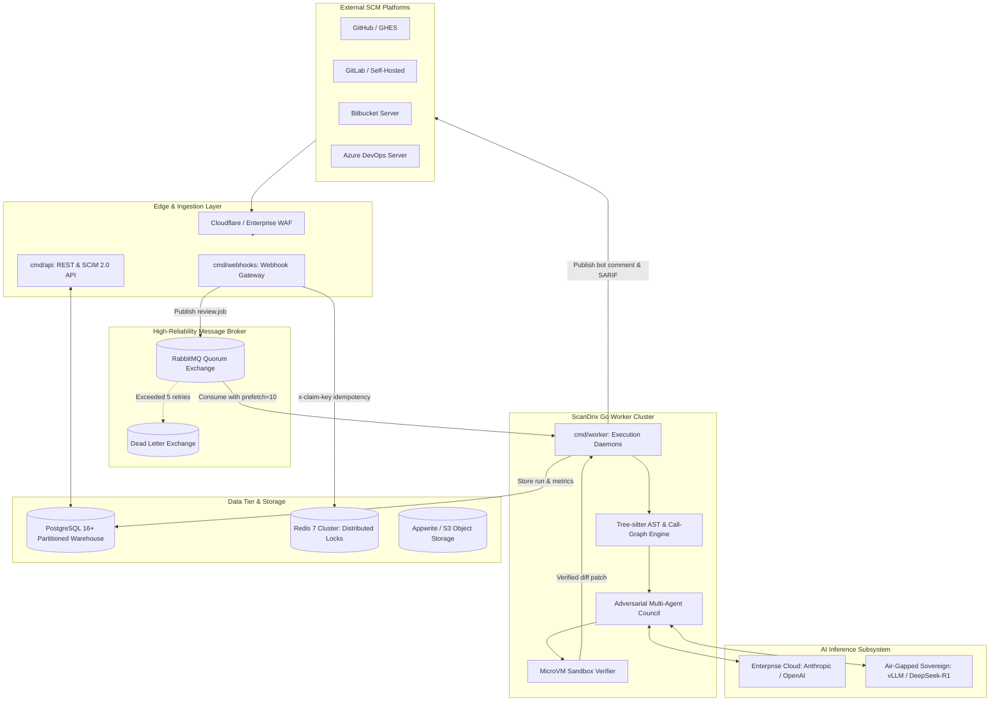
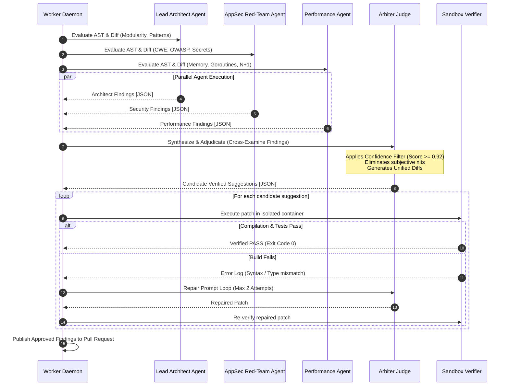
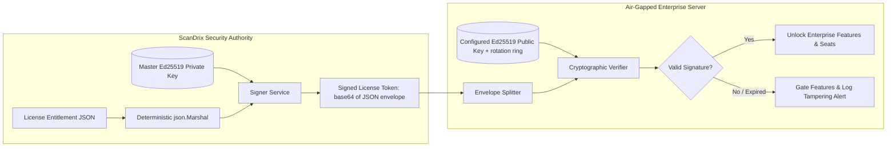

# ScanDrix Enterprise Edition — Technical Requirements Document (TRD)
**Version:** 2.0 Enterprise  
**Status:** Approved Technical Architecture  
**Target Runtime:** Go 1.25+ / Linux amd64 & arm64  
**Confidentiality:** Proprietary & Confidential — ScanDrix  

---

## 1. System Architecture & Topology

ScanDrix Enterprise is composed of four decoupled, horizontally scalable Go services communicating asynchronously over **RabbitMQ Quorum Queues** with state persistence in **PostgreSQL 16+ (pgxpool)** and ephemeral distributed state in **Redis 7+**.



---

## 2. Core Go Technical Stack & Standards

| Component | Technology | Rationale & Production Parameters |
| :--- | :--- | :--- |
| **Language & Runtime** | Go 1.25.3 | Concurrent workers via goroutines, single static binaries. GC pauses are typically sub-millisecond at these heap sizes but are **not guaranteed** — the binding numbers are the RSS/latency NFRs (PRD §5.1), not runtime internals. |
| **HTTP Routing** | `go-chi/chi/v5` | Standard `net/http`-compatible router with middleware chaining. No "zero allocation" claim — handler hot paths are profiled with `benchmem` and allocations budgeted per endpoint instead. |
| **Database Driver** | `jackc/pgx/v5` (pgxpool) | High-performance PostgreSQL native driver with connection pooling, automatic statement preparation, and native binary protocol. |
| **Message Broker** | `rabbitmq/amqp091-go` | Quorum queues (durable, replicated), persistent messages, delayed-message exchange for backoff, DLQ after 5 retries. Publisher confirms are **required but not yet verified in `internal/queue`** — SPECCED as part of the Phase 1 hardening; until then the guarantee is at-least-once with ack + dedup, per PRD §5.2. |
| **AST & Call-Graph Parser** | Pure-Go multi-language parser (`internal/codeanalysis/callgraph`) | Implemented per ADR-0003: preserves `CGO_ENABLED=0` static compilation across amd64/arm64 without CGO toolchain overhead. Parses diffs and call-sites across Go, Python, TypeScript, Rust, Java, and C/C++. |
| **Cryptographic Engine** | `golang.org/x/crypto/ed25519` | Offline license verification (Ed25519 verify is ~tens of microseconds; the <1ms P99 in PRD §6 covers the full in-memory resolution path, excluding DB plan lookups which are cached); AES-256-GCM for BYOK vault encryption. |
| **Sandbox Execution** | Containerd / Firecracker MicroVM | Isolated ephemeral sandbox per TRD §3.2. "Sub-second" applies to container spawn on warm hosts, **not** to full build+test verification, which is bounded by the 15s execution timeout and the 20s/PR sandbox slice (PRD §5.1). |

---

## 3. Module Specifications & Engineering Contracts

### 3.1 Module: Adversarial Multi-Agent Deliberation Council

The Deliberation Council runs three specialized agents in parallel, whose raw outputs are submitted to an Arbiter Judge.



#### Go Data Structures:
```go
package deliberation

import (
	"time"
	"github.com/google/uuid"
)

type AgentSpecialization string

const (
	SpecializationArchitect   AgentSpecialization = "ARCHITECT"
	SpecializationAppSec      AgentSpecialization = "APPSEC"
	SpecializationPerformance AgentSpecialization = "PERFORMANCE"
)

type RawFinding struct {
	SourceAgent   AgentSpecialization `json:"source_agent"`
	RuleID        string              `json:"rule_id"`
	FilePath      string              `json:"file_path"`
	StartLine     int                 `json:"start_line"`
	EndLine       int                 `json:"end_line"`
	Severity      string              `json:"severity"` // CRITICAL, HIGH, MEDIUM, LOW
	Title         string              `json:"title"`
	Description   string              `json:"description"`
	ProposedPatch string              `json:"proposed_patch"`
	Confidence    float64             `json:"confidence"` // 0.0 - 1.0
}

type AdjudicatedReview struct {
	ReviewID        uuid.UUID            `json:"review_id"`
	ApprovedIssues  []VerifiedSuggestion `json:"approved_issues"`
	SuppressedCount int                  `json:"suppressed_count"`
	DeliberationMs  int64                `json:"deliberation_ms"`
}

type VerifiedSuggestion struct {
	FindingID      uuid.UUID `json:"finding_id"`
	Category       string    `json:"category"`
	FilePath       string    `json:"file_path"`
	LineNumber     int       `json:"line_number"`
	Title          string    `json:"title"`
	Explanation    string    `json:"explanation"`
	OriginalCode   string    `json:"original_code"`
	ReplacementCode string   `json:"replacement_code"`
	SandboxStatus  string    `json:"sandbox_status"` // VERIFIED_CLEAN, COMPILE_PASSED
	Confidence     float64   `json:"confidence"`
}
```

---

### 3.2 Module: Sandboxed Suggestion Execution Runner

#### Container Execution Contract:
1. **Rootless Execution:** Containers must run under an unprivileged user (`uid=10001, gid=10001`).
2. **Resource Boundaries:** Hard memory cap of `1024 MB`, CPU quota of `1.0 vCPU`, execution timeout of `15.0 seconds` per attempt, max 2 repair attempts per suggestion, **20s total sandbox slice per PR** (PRD §5.1) — overflow findings post as `unverified (budget exhausted)`.
3. **Network Isolation:** Network disabled (`--net=none`).
4. **Filesystem:** Read-only rootfs with an ephemeral `tmpfs` volume mounted on `/workspace`.
5. **Degraded modes (normative):** sandbox daemon unreachable → findings post as `unverified (sandbox unavailable)`; non-buildable change (docs/config-only, unsupported language, missing toolchain) → sandbox skipped by rule with reason labeled; fully suppressed reviews still post summaries with coverage attached (PRD REQ-2.3).

#### Execution Workflow in Go:
```go
package sandbox

import (
	"context"
	"os/exec"
	"time"
)

type ExecutionResult struct {
	Success      bool          `json:"success"`
	ExitCode     int           `json:"exit_code"`
	Stdout       string        `json:"stdout"`
	Stderr       string        `json:"stderr"`
	Duration     time.Duration `json:"duration"`
	CompileError bool          `json:"compile_error"`
}

type SandboxService interface {
	VerifyPatch(ctx context.Context, repoPath, patchDiff, testCommand string) (*ExecutionResult, error)
}
```

---

### 3.3 Module: Asymmetric Ed25519 Cryptographic Licensing

#### Cryptographic Architecture:
* **Algorithm:** Pure Ed25519 (RFC 8032) asymmetric digital signature.
* **Licensing Authority:** ScanDrix Master Key generates private Ed25519 signatures over the JSON-marshaled payload (`json.Marshal` field order is deterministic for structs and is the canonical form — no separate RFC 8785 pass; signer and verifier must use the same marshaler).
* **On-Premise Verification:** The ScanDrix binary holds only the public verification key(s) loaded from `SCANDRIX_LICENSE_PUBLIC_KEY` (base64, PEM armour accepted). It verifies licenses without network access or phone-home pings.
* **Wire format (normative):** base64( JSON( `SignedLicenseToken{Payload, Signature}` ) ), where `Payload` is base64(payload JSON) and `Signature` is base64(Ed25519(payload bytes)). Configuration arrives via `SCANDRIX_LICENSE_KEY` (inline) or `SCANDRIX_LICENSE_FILE` (mounted secret) — see `.env.example`. Any keygen or doc showing a dot-joined `payload.signature` string is stale and will be rejected by `LoadLicense`.
* **Rotation (REQ-7.4):** Payloads carry optional `key_id`; the manager holds a primary key plus a `key_id → key` ring. New licenses mint under the new key while old ones still verify. Rotation procedure: generate pair → register new public key on servers (overlap window) → mint with `key_id` → retire old key after all active licenses re-issued or expired.
* **Revocation (REQ-7.4):** Expiry + re-issuance is the mechanism; a revocation list (license IDs) is checked at boot and by the daily seat-pruner. There is no OCSP-style online check (incompatible with air-gap).
* **Hardware binding (REQ-7.2):** Optional `hardware_fingerprint` (machine-id / cluster UUID), enforced only when the deployment declares the expected value; otherwise ignored for backward compatibility.
* **Failure mode:** Invalid/misconfigured license = fail boot with a clear error (`cmd/api` behavior); this is intentional fail-closed and applies identically to `cmd/server`.



#### Go License Verifier (implemented — `internal/enterprise/license/`):
Authority: `validator.go` (`LicenseManager`: `IssueLicense`/`LoadLicense` with expiry+grace, `HasFeature`/`AssertFeature`, seat/repo quotas); `loader.go` (`NewManagerFromEnv`, `SCANDRIX_LICENSE_{PUBLIC_KEY,KEY,FILE}`); `entitlement.go` (single `Entitlement` from signed-license, plan-row, or community sources); `resolver.go` (`Resolver`: signed > plan-row > community, shared by controller, feature gate, and capabilities endpoint so they cannot disagree); `plan_policy.go` (quotas + `CanAccessModel` tier→model gate with BYOK bypass). The illustrative `LicenseVerifier`/`MasterPublicKeyBase64` sketch previously shown here is superseded by these files — no placeholder keys exist in code.

Example token envelope (shape, not a real key):
```json
{
  "payload": "<base64 of LicensePayload JSON>",
  "signature": "<base64 of Ed25519 signature over the raw payload bytes>"
}
```

```mermaid
flowchart LR
    subgraph ScanDrix_HQ ["ScanDrix Security Authority"]
        Payload[License Entitlement JSON] --> Canonical[Canonical RFC 8785 JSON]
        PrivKey[(Master Ed25519 Private Key)] --> Signer[Signer Service]
        Canonical --> Signer
        Signer --> Token[Signed License Token: base64(payload).base64(signature)]
    end

    subgraph Customer_Cluster ["Air-Gapped Enterprise Server"]
        Token --> Parser[Token Splitter]
        PubKey[(Embedded Ed25519 Public Key)] --> Verifier[Cryptographic Verifier]
        Parser --> Verifier
        Verifier --> Valid{Valid Signature?}
        Valid -->|Yes| FeatureGate[Unlock Enterprise Features & Seats]
        Valid -->|No / Expired| Lockout[Gate Features & Log Tampering Alert]
    end
```

#### Rotation & revocation key ceremony (normative):
1. Generate the new pair offline (`ed25519.GenerateKey`); the private half never leaves the HSM/vault.
2. Distribute the new public key to all servers (config change; old key stays registered).
3. Mint renewed licenses with `key_id` set to the new key.
4. After every active old-key license has expired or been re-issued, remove the old public key. The overlap window must exceed the longest outstanding `ExpiresAt`.

#### Edge cases (normative):
* **Clock skew:** `LoadLicense` checks `ExpiresAt + grace` against server UTC only; `IssuedAt` is informational (no future-issue guard). Skew of minutes-to-hours is absorbed by the 7-day grace and needs no NTP hard dependency, but deployments should still run NTP — audit timestamps assume sane clocks.
* **Seat-count races:** Seat assignment/checkout across workers must be atomic in PostgreSQL (unique partial index or `SELECT … FOR UPDATE` in a single transaction) — concurrent SCIM provisions must never oversell the quota. Mechanism lands with SCIM persistence (IMPLEMENTATION Phase 5); until then the quota check is advisory.
* **Multi-instance licenses:** The signed license is global per deployment; per-workspace seat rows live in PG. Failover must not double-count: seat state restores from PG backup (REQ-8.5), never reconstructed from worker memory.

---

### 3.4 Module: SCIM 2.0 Identity Directory Synchronization

ScanDrix Enterprise implements a full **RFC 7644 / RFC 7643** SCIM 2.0 server mounted on `/scim/v2/`.

#### Supported Endpoints:
* `GET  /scim/v2/Users?filter=userName eq "user@corp.com"` (Query user)
* `POST /scim/v2/Users` (Provision new developer seat)
* `GET  /scim/v2/Users/{id}` (Read user metadata)
* `PUT  /scim/v2/Users/{id}` (Update profile & roles)
* `PATCH /scim/v2/Users/{id}` (Suspend/Reactivate seat: `{"active": false}`)
* `DELETE /scim/v2/Users/{id}` (Revoke seat allocation)
* `GET  /scim/v2/Groups` (Team / RBAC synchronization)

#### SCIM User Representation:
```json
{
  "schemas": ["urn:ietf:params:scim:schemas:core:2.0:User"],
  "id": "e4f8d680-9289-4d6d-bf28-b8bc87b5a190",
  "userName": "marcus.vance@enterprise.com",
  "name": {
    "givenName": "Marcus",
    "familyName": "Vance"
  },
  "emails": [
    {
      "value": "marcus.vance@enterprise.com",
      "primary": true
    }
  ],
  "active": true,
  "roles": ["ENGINEERING_LEAD"],
  "meta": {
    "resourceType": "User",
    "created": "2026-03-01T12:00:00Z",
    "lastModified": "2026-09-23T14:30:00Z"
  }
}
```

---

### 3.5 Module: Enterprise Analytics Warehouse Schema (PostgreSQL)

To achieve millisecond-scale dashboard latencies over millions of historical pull requests, the database schema implements PostgreSQL **declarative time-based range partitioning** (monthly partitions keep constraint-exclusion pruning effective; partitions still require routine `VACUUM`/bloat monitoring — "zero fragmentation" is not claimed).

```sql
-- Core Pull Request Event Warehouse Table (Partitioned by Month)
CREATE TABLE IF NOT EXISTS analytics_pull_request_events (
    id UUID NOT NULL,
    workspace_id UUID NOT NULL,
    repository_id UUID NOT NULL,
    pr_number INT NOT NULL,
    pr_title TEXT NOT NULL,
    category VARCHAR(32) NOT NULL, -- feature, bug_fix, security, refactor
    author_email VARCHAR(255) NOT NULL,
    lines_added INT NOT NULL,
    lines_deleted INT NOT NULL,
    files_changed INT NOT NULL,
    turnaround_seconds INT,
    review_status VARCHAR(32) NOT NULL, -- APPROVED, CHANGES_REQUESTED, MERGED
    created_at TIMESTAMPTZ NOT NULL,
    merged_at TIMESTAMPTZ,
    PRIMARY KEY (id, created_at)
) PARTITION BY RANGE (created_at);

-- Partition Examples (monthly; constraint exclusion prunes history scans)
CREATE TABLE IF NOT EXISTS analytics_pr_events_2026_q1 PARTITION OF analytics_pull_request_events
    FOR VALUES FROM ('2026-01-01 00:00:00+00') TO ('2026-04-01 00:00:00+00');

CREATE TABLE IF NOT EXISTS analytics_pr_events_2026_q2 PARTITION OF analytics_pull_request_events
    FOR VALUES FROM ('2026-04-01 00:00:00+00') TO ('2026-07-01 00:00:00+00');

CREATE TABLE IF NOT EXISTS analytics_pr_events_2026_q3 PARTITION OF analytics_pull_request_events
    FOR VALUES FROM ('2026-07-01 00:00:00+00') TO ('2026-10-01 00:00:00+00');

-- High-speed composite indexes for DORA calculations
CREATE INDEX IF NOT EXISTS idx_analytics_dora_rollup 
ON analytics_pull_request_events (workspace_id, created_at DESC, category);

CREATE INDEX IF NOT EXISTS idx_analytics_repo_velocity 
ON analytics_pull_request_events (repository_id, merged_at);

-- Row-Level Security Policy for Strict Tenant Isolation
ALTER TABLE analytics_pull_request_events ENABLE ROW LEVEL SECURITY;

CREATE POLICY tenant_isolation_analytics_pr_events ON analytics_pull_request_events
    FOR ALL
    USING (workspace_id = NULLIF(current_setting('app.current_tenant_id', true), '')::UUID);

-- Daily DORA rollups (the dashboard read path; WORKFLOWS §7 depends on this table)
CREATE TABLE IF NOT EXISTS materialized_dora_daily_rollups (
    workspace_id UUID NOT NULL,
    day DATE NOT NULL,
    deployment_frequency INT NOT NULL DEFAULT 0,
    lead_time_p50_seconds INT,
    lead_time_p90_seconds INT,
    change_failure_rate_pct NUMERIC(5,2) NOT NULL DEFAULT 0,
    mttr_seconds INT,
    review_turnaround_p50_seconds INT,
    review_turnaround_p90_seconds INT,
    suggestion_acceptance_rate_pct NUMERIC(5,2),
    PRIMARY KEY (workspace_id, day)
);

ALTER TABLE materialized_dora_daily_rollups ENABLE ROW LEVEL SECURITY;

CREATE POLICY tenant_isolation_dora_rollups ON materialized_dora_daily_rollups
    FOR ALL
    USING (workspace_id = NULLIF(current_setting('app.current_tenant_id', true), '')::UUID);
-- Refreshed by the DORA aggregator cron (6h cadence); dashboard queries hit
-- this table only, never the raw partitioned events.
```

---

## 3b. Database privilege posture

Every long-running service connects to PostgreSQL as `scandrix_runtime`
(`NOSUPERUSER`, `NOBYPASSRLS`), so row-level security is enforced rather than bypassed. Only
the one-shot migration job uses the owner role, because `CREATE EXTENSION` requires superuser.

| Service | Role |
|---|---|
| `scandrix-migrate` | `scandrix_app` (owner) |
| `scandrix-api`, `scandrix-webhooks`, `scandrix-worker` | `scandrix_runtime` |

Engineering contract:

- Every query against an RLS table states its context — `ExecWithTenant` when the caller has a
  workspace, `ExecAsSystem` for identity resolution that precedes one. A bare pool call matches
  zero rows under the runtime role without erroring, which is the specific failure this prevents.
- Adding a table means enabling **and** forcing RLS plus a policy in the same migration.
- Adding a system-worker bypass to a policy requires naming the background job that needs it in
  the migration comment. Blanket bypasses are rejected.

Rollout record, per-table inventory, credentials and rollback:
`docs/LEAST_PRIVILEGE_ROLLOUT.md`. Known remaining gaps are listed there rather than in this
document so there is one source of truth.

## 4. Hardware Sizing & Capacity Guidelines

```
┌────────────────────────────────────────────────────────────────────────┐
│             ScanDrix Enterprise Cluster Sizing Matrix                  │
├─────────────────────┬──────────────┬───────────────┬───────────────────┤
│ Deployment Tier     │ Active Devs  │ Worker Nodes  │ Sizing Spec (Node)│
├─────────────────────┼──────────────┼───────────────┼───────────────────┤
│ Team Enterprise     │ 50 - 250     │ 2 Workers     │ 4 vCPU, 8 GB RAM  │
│ Commercial Scale    │ 250 - 1,000  │ 4 Workers     │ 8 vCPU, 16 GB RAM │
│ Global Monorepo     │ 1,000 - 10k+ │ 8-16 Workers  │ 16 vCPU, 32 GB RAM│
└─────────────────────┴──────────────┴───────────────┴───────────────────┘
```
