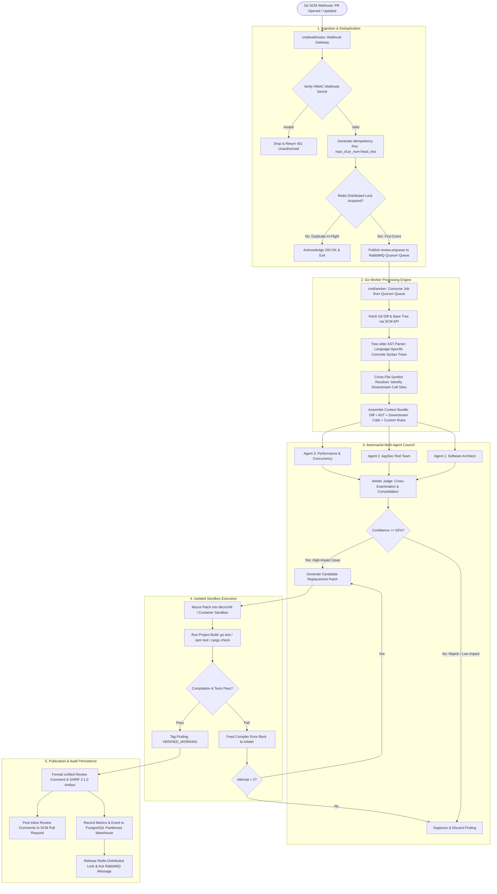
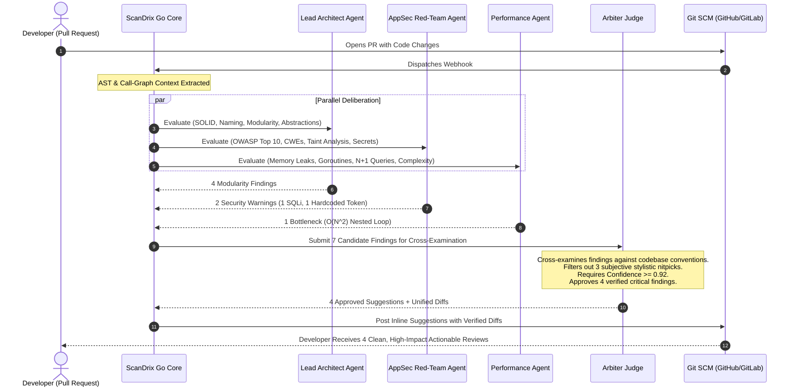
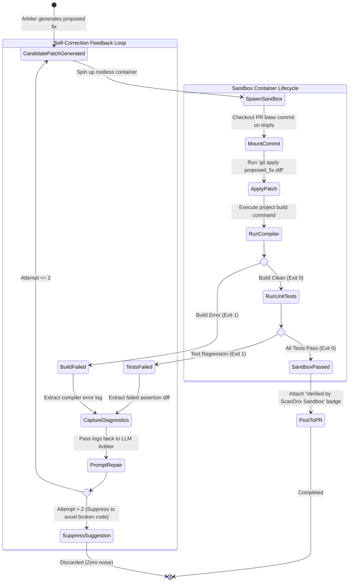
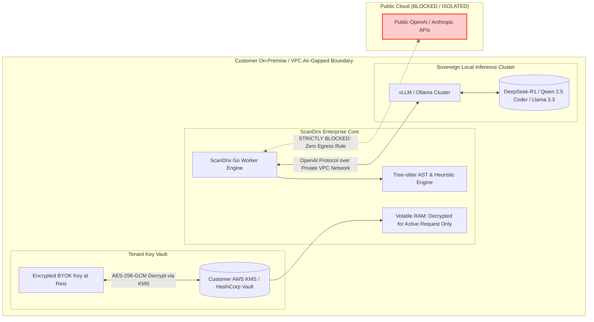
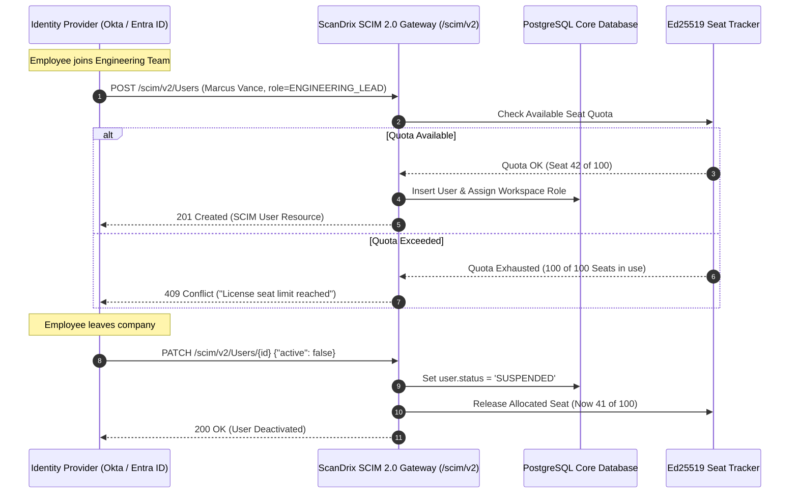
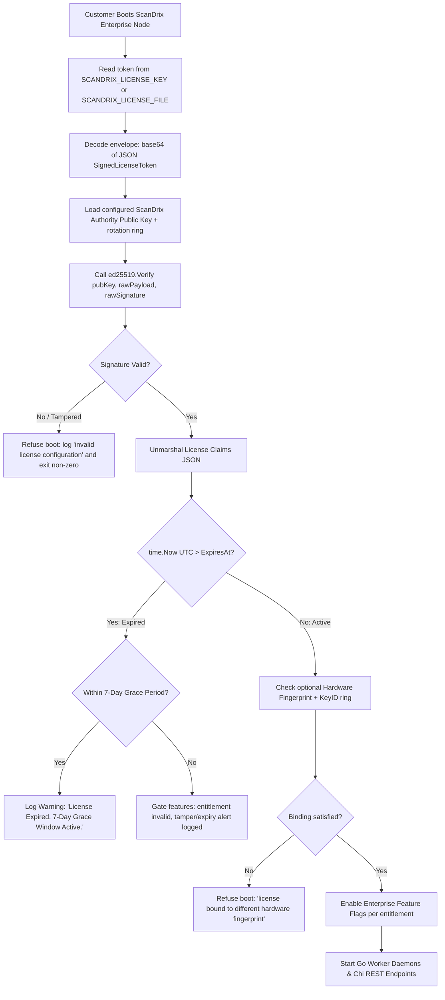

# ScanDrix Enterprise Edition — Visual Workflows & Architecture
**Version:** 2.0 Enterprise  
**Status:** Canonical Visual Reference  
**Audience:** System Architects, Staff Engineers, Enterprise DevOps  
**Confidentiality:** Proprietary & Confidential — ScanDrix  

> Conformance legend used in this doc: **[IMPLEMENTED]** = behavior exists in code today (path cited);
> **[SPECCED]** = normative target, implementation tracked in IMPLEMENTATION.md. Flows marked SPECCED
> must not be presented to customers as working.

---

## 1. End-to-End Pull Request Review Lifecycle

This diagram demonstrates the lifecycle of an incoming pull request from initial webhook trigger to verified review comment publication on GitHub, GitLab, Bitbucket, or Azure DevOps.



---

## 2. Adversarial Multi-Agent Deliberation Council

The Deliberation Council eliminates false-positive noise by requiring specialized agents to critique the pull request from distinct engineering angles before an Arbiter Judge makes the final ruling.



---

## 3. Sandboxed Suggestion Verification Loop

Candidate suggestions are executed in a microVM sandbox before posting; only passing ones earn the verified badge.

> The word "only" in the original draft ("the only platform that guarantees") is withdrawn — it is
> unmeasurable and does not belong in a production spec. The guarantee offered is the labeled one:
> `verified` means this patch passed this build+tests in this sandbox run; anything else carries its reason.



---

## 4. Air-Gapped Sovereign AI & BYOK Data Flow

For defense, banking, healthcare, and air-gapped enterprise environments, ScanDrix targets **no unlisted data leaving the customer perimeter**.

> Egress inventory (verified): self-hosted beacon honors `SCANDRIX_TELEMETRY_DISABLED`
> (`telemetry/beacon/transport.go:62-63`); Sentry activates only with `SENTRY_DSN` set
> (`core/infrastructure/config/sentry.go:28-29`); PostHog is consulted on the cloud path only
> (`featuregate/service.go`). The single `AIR_GAPPED` deny-by-default enforcement gate is **IMPLEMENTED**
> (`AirGapGate` in `internal/platform/security/airgap.go`). Air-gapped deployments combine binary enforcement
> with network perimeter controls (firewall/VPC) and quarterly egress audits.



---

## 5. Enterprise SCIM 2.0 Directory Lifecycle Flow **[IMPLEMENTED]**

Automated developer seat provisioning, role mapping, and instant deprovisioning synchronized directly with enterprise identity providers.

> Status (verified against code, production-ready): SCIM transport, constant-time bearer auth, `userName eq`
> filtering, `startIndex`/`count` pagination (capped at 100), relational PostgreSQL persistence
> (`scim_users`, `scim_groups`, `scim_group_members`, `scim_tenant_tokens` in migrations `035` and `037`),
> seat-quota enforcement (`CheckSeats` → 409 Conflict on exhaustion), and `BindTenant` wiring in
> `cmd/api/main.go` and `cmd/server/main.go` are **[IMPLEMENTED]** and certified. Production provisions
> are tenant-isolated and enforce seat limits fail-closed.



---

## 6. Offline Asymmetric Cryptographic License Check **[IMPLEMENTED with noted deltas]**

Sub-millisecond license entitlement validation without internet access.

> Normative wire details (must match `internal/enterprise/license/`):
> token = base64( JSON( `SignedLicenseToken{Payload, Signature}` ) ) read from **`SCANDRIX_LICENSE_KEY`**
> (inline) or **`SCANDRIX_LICENSE_FILE`** (mounted secret); public key from `SCANDRIX_LICENSE_PUBLIC_KEY`.
> The name `SCANDRIX_LICENSE_TOKEN` and dot-joined `payload.signature` strings appear in older revisions
> and are **retired** — tokens in that shape are rejected. Grace = **7 days** (`LicenseGracePeriod`).
> Failure mode is fail-boot with a logged error (not a panic), applied identically by `cmd/api` and `cmd/server`.



---

## 7. DORA Metrics & Engineering Intelligence Ingestion

```mermaid
flowchart LR
    subgraph Event_Sources ["Continuous Lifecycle Events"]
        PR_M[PR Merged Event]
        PR_C[PR Created Event]
        CI_F[CI Deployment Failure]
        REV_T[Review Completed Event]
    end

    subgraph Ingestion_Stream ["Async Aggregation Pipeline"]
        PR_M --> WRK[ScanDrix Analytics Ingestion Worker]
        PR_C --> WRK
        CI_F --> WRK
        REV_T --> WRK
    end

    subgraph Partitioned_Warehouse ["PostgreSQL Time-Series Warehouse"]
        WRK --> RAW[(analytics_pull_request_events Partitioned)]
        RAW --> ROLLUP[(materialized_dora_daily_rollups)]
    end

    subgraph Executive_Dashboard ["ScanDrix Analytics UI"]
        ROLLUP --> DORA_API[GET /api/v1/analytics/dora]
        DORA_API --> UI1[Deployment Frequency Graph]
        DORA_API --> UI2[Lead Time for Changes: P50/P90]
        DORA_API --> UI3[Change Failure Rate %]
        DORA_API --> UI4[Time to Restore Service MTTR]
    end

> `materialized_dora_daily_rollups` DDL lives in TRD §3.5 and is the only table the dashboard
> may read; raw-event scans are not on the dashboard path (PRD §5.1).
```
